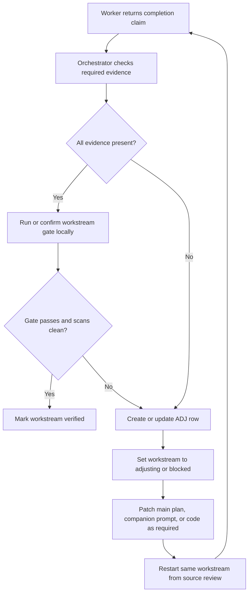
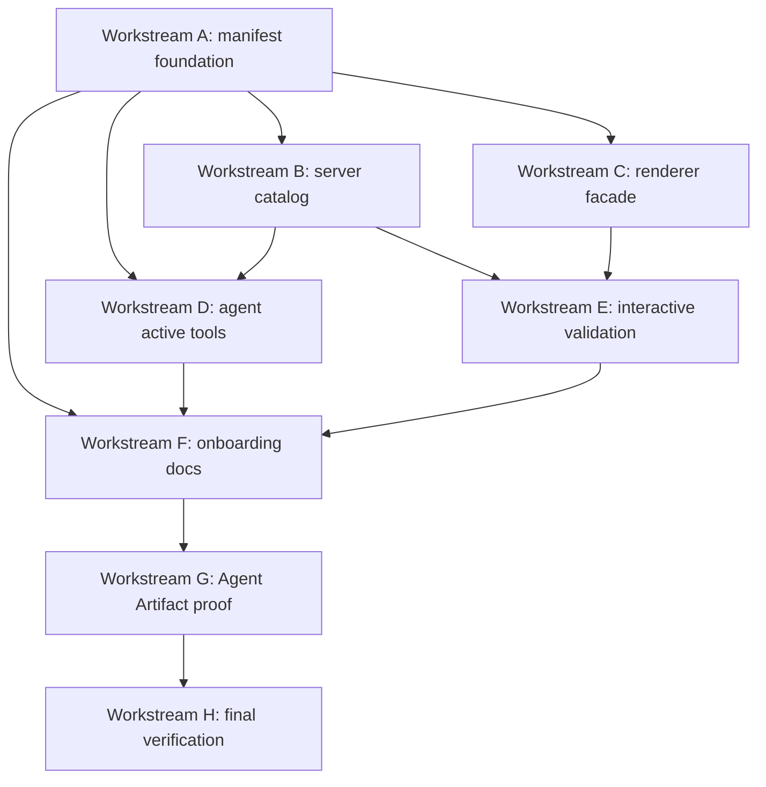

# Tool UI Manifest Runtime Codex Multi-Agent Plan

> **For Codex app orchestration:** This is a companion execution plan for `2026-05-06-tool-ui-manifest-runtime.md`. The main plan remains the implementation source of truth; this document defines how to split, sequence, review, and integrate the work across multiple Codex agents without file ownership drift.

**Goal:** Implement the Tool UI manifest/runtime adapter layer with parallel Codex workers while preserving AI SDK v6 contracts, clean npm/package boundaries, provenance requirements, and safe staging.

**Architecture:** Use the main implementation plan as the canonical task list. Run Codex workers on disjoint write sets, keep shared registry files as explicit integration choke points, and have the parent orchestrator own final review, conflict resolution, commits, and PR publication.

**Tech Stack:** Codex app worker agents, Next.js 16, React 19, Vercel AI SDK v6, Zod 4, Vitest, Testing Library, Git worktrees.

---

## How To Use This Companion Plan

Use this document when the implementation is being run by multiple Codex agents in the Codex application. Do not ask workers to freestyle from this companion alone. Each worker must also read the relevant task sections in:

```text
docs/superpowers/plans/2026-05-06-tool-ui-manifest-runtime.md
```

The parent Codex session is the orchestrator. Workers implement bounded slices and report back. The orchestrator reviews, integrates, runs gates, and decides when to commit.

## Non-Negotiables

1. Do not add `assistant-ui`, Agent Kit, or upstream Tool UI runtime wiring to the main chat runtime.
2. Prefer npm/public package exports for future community components; do not deep import `dist/*`, `internal/*`, `src/*`, or vendored package internals.
3. Validate client-resolved interactive tool output before `upsertMessage`.
4. Keep `displayAgentArtifact` docs out of `docs/architecture/OVERVIEW.md` and `GEMINI.md` until Task 7 registers the tool.
5. Do not stage broad directories such as `components/tool-ui`, `lib/tools/tool-ui`, or `lib/tools/display-agent-artifact`.
6. Workers must not revert unrelated local changes.
7. Workers should not commit unless the orchestrator explicitly changes the workflow. The parent session owns commits.

## Current Repo Start State

At the time this companion was written, the worker tree was detached and the main plan file was untracked:

```bash
git status --short --branch
```

Expected:

```text
## HEAD (no branch)
?? docs/superpowers/plans/2026-05-06-tool-ui-manifest-runtime.md
```

Before implementation, the orchestrator should create or switch to a real branch and stage both plan files intentionally:

```bash
git switch -c codex/tool-ui-manifest-runtime
git add -- \
  docs/superpowers/plans/2026-05-06-tool-ui-manifest-runtime.md \
  docs/superpowers/plans/2026-05-06-tool-ui-manifest-runtime-codex-multi-agent.md
git status --short
```

Expected: only the two plan docs are staged unless the orchestrator has deliberately included other work.

## Progress Ledger Of Record

The orchestrator must update this ledger after every worker returns and before dispatching any dependent worker. Chat summaries are not the source of truth. The source of truth is this table plus the adjustment log below.

Status values:

- `not_started`: worker has not been dispatched.
- `in_progress`: worker is currently assigned.
- `needs_review`: worker returned changes; orchestrator has not reviewed them.
- `adjusting`: workstream exposed a required plan/code adjustment.
- `verified`: ownership, tests, scans, and adjustment log are complete.
- `blocked`: a concrete blocker prevents progress.
- `superseded`: current code made this slice unnecessary; reason must be logged.

| Workstream                | Status   | Owner Agent               | Changed Files Reviewed                                                                                                                            | Required Gate                                        | Gate Result                                    | Adjustment Log IDs        | Notes                                                                                                                                                                                                                                                                                                                                                                                                                                                                                                                                                                                                                                                                                                                                                                                                                                                                                                                                                                                                                                                                                                                                                                                                                                                                                                                                                                                                                                                                                                                                                                                                                                                                                                                                                                                                                                                                                                              |
| ------------------------- | -------- | ------------------------- | ------------------------------------------------------------------------------------------------------------------------------------------------- | ---------------------------------------------------- | ---------------------------------------------- | ------------------------- | ------------------------------------------------------------------------------------------------------------------------------------------------------------------------------------------------------------------------------------------------------------------------------------------------------------------------------------------------------------------------------------------------------------------------------------------------------------------------------------------------------------------------------------------------------------------------------------------------------------------------------------------------------------------------------------------------------------------------------------------------------------------------------------------------------------------------------------------------------------------------------------------------------------------------------------------------------------------------------------------------------------------------------------------------------------------------------------------------------------------------------------------------------------------------------------------------------------------------------------------------------------------------------------------------------------------------------------------------------------------------------------------------------------------------------------------------------------------------------------------------------------------------------------------------------------------------------------------------------------------------------------------------------------------------------------------------------------------------------------------------------------------------------------------------------------------------------------------------------------------------------------------------------------------ |
| A: Manifest foundation    | verified | Codex parent orchestrator | yes: five owned files plus ledger row                                                                                                             | community + metadata tests                           | PASS: 9 tests                                  | ADJ-001                   | Source checked: yes - community-sources.ts:1-69, metadata.ts:1-100, server.ts:1-32, community-sources.test.ts:1-38, metadata.test.ts:1-74. Changed files reviewed: yes - git status shows only ledger plus untracked lib/tools/tool-ui owned files. Required gate: pass - bun run test -- --run `lib/tools/tool-ui/__tests__/community-sources.test.ts` `lib/tools/tool-ui/__tests__/metadata.test.ts` Negative scans: pass - no unsafe community imports, source placeholders, staged files, or displayAgentArtifact docs in OVERVIEW/GEMINI. Extra checks: bun typecheck, bun lint, and targeted Prettier check pass. Open adjustments: none. Decision: verified.                                                                                                                                                                                                                                                                                                                                                                                                                                                                                                                                                                                                                                                                                                                                                                                                                                                                                                                                                                                                                                                                                                                                                                                                                                                |
| B: Server catalog         | verified | Worker B                  | yes: owned files reviewed; module-contract unchanged by design                                                                                    | server catalog + module contract tests               | PASS: 48 tests                                 | none                      | Source checked: yes - server-catalog.ts:1-37, server-catalog.test.ts:1-39, display-option-list/server.ts:1-11, display-question-wizard/server.ts:1-11. Changed files reviewed: yes - only owned B files changed, module-contract had no diff and existing coverage passed. Required gate: pass - bun run test -- --run `lib/tools/tool-ui/__tests__/server-catalog.test.ts` `lib/tools/__tests__/module-contract.test.ts` Negative scans: pass - no alternate runtime wiring or deep community imports in B-owned files. Extra checks: bun typecheck, scoped eslint, scoped Prettier check. Open adjustments: none. Decision: verified.                                                                                                                                                                                                                                                                                                                                                                                                                                                                                                                                                                                                                                                                                                                                                                                                                                                                                                                                                                                                                                                                                                                                                                                                                                                                            |
| C: Renderer facade        | verified | Worker C                  | yes: owned files reviewed; existing server/render-message coverage unchanged                                                                      | registry/render-message/server-import tests          | PASS: 45 tests                                 | ADJ-002                   | Source checked: yes - renderer-catalog.tsx:1-132, registry.tsx:1-142, registry.test.tsx:1-155. Changed files reviewed: yes - C changes stayed in renderer-catalog, registry, and registry test; render-message and registry.server tests had no diff but passed. Required gate: pass - bun run test -- --run components/render-message.test.tsx components/tool-ui/registry.test.tsx components/tool-ui/registry.server.test.tsx. Negative scans: pass - registry facade has no leaflet/react-leaflet imports and no alternate runtime wiring. Extra checks: bun typecheck, bun lint, targeted Prettier check. Open adjustments: none. Decision: verified.                                                                                                                                                                                                                                                                                                                                                                                                                                                                                                                                                                                                                                                                                                                                                                                                                                                                                                                                                                                                                                                                                                                                                                                                                                                         |
| D: Agent active tools     | verified | Worker D                  | yes: seven owned files reviewed                                                                                                                   | agent registry + portability tests                   | PASS: 7 tests                                  | none                      | Source checked: yes - toolset.ts:1-113, search.ts:1-26, research.ts:1-36, build.ts:1-51, factory.ts:1-130, community-portability.test.ts:1-175, registry.test.ts:1-318. Changed files reviewed: yes - D changes stayed in owned agent files. Required gate: pass - bun run test -- --run `lib/agents/chat/__tests__/community-portability.test.ts` `lib/agents/chat/__tests__/registry.test.ts` Broader wiring: pass - server-catalog + registry + portability + researcher tests, 28 tests. Negative scans: pass - no scattered display tool literals in D source and no alternate runtime wiring. Extra checks: bun typecheck, bun lint, git diff --check for D files. Open adjustments: none. Decision: verified.                                                                                                                                                                                                                                                                                                                                                                                                                                                                                                                                                                                                                                                                                                                                                                                                                                                                                                                                                                                                                                                                                                                                                                                               |
| E: Interactive validation | verified | Worker E                  | yes: eight owned files reviewed                                                                                                                   | chat-request + tool-part + prepare-tool-result tests | PASS: 25 tests                                 | none                      | Source checked: yes - interactive-renderer-catalog.tsx:1-58, tool-part-registry.tsx:1-109, tool-part-registry.test.tsx:1-185, dynamic-tools.ts:1-102, client-output-validation.ts:1-64, prepare-tool-result-messages.ts:1-158, prepare-tool-result-messages.test.ts:1-360, chat-request.test.ts:1-169. Changed files reviewed: yes - E changes stayed in owned interactive and persistence files; factory/agent registry changes remained from D. Required gate: pass - bun run test -- --run components/chat-request.test.ts components/tool-ui/tool-part-registry.test.tsx `lib/streaming/helpers/__tests__/prepare-tool-result-messages.test.ts` `lib/agents/chat/__tests__/registry.test.ts` Negative scans: pass - no invalid wizard output fixture, no v5 args fixture, validation appears before upsertMessage, and no alternate runtime wiring. Extra checks: bun typecheck, bun lint, targeted Prettier check. Open adjustments: none. Decision: verified.                                                                                                                                                                                                                                                                                                                                                                                                                                                                                                                                                                                                                                                                                                                                                                                                                                                                                                                                                |
| F: Onboarding docs        | verified | Worker F                  | yes: three owned docs reviewed                                                                                                                    | stale-doc grep                                       | PASS: no matches                               | none                      | Source checked: yes - GENERATIVE-UI.md:130-155 and 751-835, RESEARCH-AGENT.md:235-262, FILE-INDEX.md:364-377 and 584-597. Changed files reviewed: yes - F changes stayed in docs/architecture/GENERATIVE-UI.md, docs/architecture/RESEARCH-AGENT.md, and docs/reference/FILE-INDEX.md. Required gate: pass - stale-doc grep returned no matches. Negative scans: pass - displayAgentArtifact absent from OVERVIEW.md, GEMINI.md, and F docs. Extra checks: targeted Prettier check, git diff --check, bun lint, bun typecheck. Open adjustments: none. Decision: verified.                                                                                                                                                                                                                                                                                                                                                                                                                                                                                                                                                                                                                                                                                                                                                                                                                                                                                                                                                                                                                                                                                                                                                                                                                                                                                                                                         |
| G: Agent Artifact proof   | verified | Worker G                  | yes: G-owned proof, registration, prompt, docs, type, persistence, render, and source-inventory files reviewed; earlier A-F files remain verified | proof suite + typecheck + provenance scan            | PASS: 165 tests                                | ADJ-003, ADJ-004          | Source checked: yes - agent-artifact/schema.ts:6-47, agent-artifact.tsx:51-200, display-agent-artifact/schema.ts:1-11, server.ts:1-9, result.tsx:1-26, community-sources.ts:48-88, metadata.ts:48-52, server-catalog.ts:3-29, renderer-catalog.tsx:5 and 66-68, components/tool-ui/index.ts:2-8, lib/types/agent.ts:24-77, registry.test.tsx:71-104, message-mapping-ui-message.test.ts:55-111, chat-ui-message-load.test.ts:120-199, render-message.test.tsx:1870-1912, search-mode-prompts.ts:344-346 and 731-733, OVERVIEW.md:122-253, GEMINI.md:34-35, FILE-INDEX.md:449-458/612-614/1063-1064. Changed files reviewed: yes - git status/diff inventory contains G-owned additions plus previously verified A-F changes; no unrelated out-of-scope G edits found. Required gate: pass - bun run test -- --run `lib/tools/tool-ui/__tests__/community-sources.test.ts` `lib/tools/tool-ui/__tests__/metadata.test.ts` `lib/tools/tool-ui/__tests__/server-catalog.test.ts` `lib/tools/__tests__/module-contract.test.ts` components/tool-ui/registry.test.tsx components/tool-ui/registry.server.test.tsx components/tool-ui/agent-artifact/schema.test.ts components/tool-ui/agent-artifact/agent-artifact.test.tsx lib/agents/prompts/search-mode-prompts.test.ts `lib/utils/__tests__/message-mapping-ui-message.test.ts` `lib/db/__tests__/chat-ui-message-load.test.ts` components/render-message.test.tsx, 12 files / 165 tests; bun run typecheck pass; bun lint pass; targeted Prettier pass; git diff --check pass. Negative scans: pass - provenance scan finds pinned commit/source/docs/license/copyright; placeholder/TODO notice scans clean; deep/internal community import scan clean; unsafe broad staging scan clean; invalid args/bare wizard-output fixture scan clean after ADJ-004; displayAgentArtifact appears only post-registration docs. Open adjustments: none. Decision: verified. |
| H: Final verification     | verified | Hypatia                   | yes: full planned diff inventory reviewed after ADJ-005, ADJ-006, and ADJ-007 patches                                                             | focused suite + typecheck + full test + scans        | PASS: 210 focused tests; PASS: 1383 full tests | ADJ-005, ADJ-006, ADJ-007 | Source checked: yes - validation before persistence in client-output-validation.ts:41 and prepare-tool-result-messages.ts:119/152; active tool derivation in metadata.ts:48, search.ts:21, research.ts:12, build.ts:27, and agent.ts:24-77; public barrel exports in components/tool-ui/index.ts:2-8; canonical uiMessage/reload coverage in message-mapping-ui-message.test.ts:55-111, chat-ui-message-load.test.ts:120-199, render-message.test.tsx:1870-1912; Agent Kit provenance in community-sources.ts:46-88, agent-artifact/README.md:3-18, and UPSTREAM-LICENSE.md:3-31; post-registration docs in OVERVIEW.md:122-253, GEMINI.md:34-35, RESEARCH-AGENT.md:223-276, and GENERATIVE-UI.md:144/180/196/304/586-597/865/898-899. Changed files reviewed: yes - git status/diff inventory contains only planned Tool UI manifest/runtime docs, tests, catalogs, agent wiring, persistence tests, and Agent Artifact files. Required gate: pass - focused H suite 18 files / 210 tests; bun run typecheck pass; bun lint pass; bun run test pass 162 files / 1383 tests; git diff --check pass; targeted Prettier pass. Negative scans: pass - no invalid AI SDK v5 args or bare invalid wizard output fixtures in required tests; no broad staging command matches; final staging command lists both plan docs explicitly; no placeholder/TODO/retained notice instruction in UPSTREAM-LICENSE.md; no assistant-ui/Tool UI deep/internal or vendored import matches; displayAgentArtifact docs now present in OVERVIEW, GEMINI, RESEARCH-AGENT, and GENERATIVE-UI. Open adjustments: none. Decision: verified.                                                                                                                                                                                                                                                                                                |

## Adjustment Log

Every required deviation from the main plan gets an ID. Do not hide adjustments inside a worker final response. The orchestrator records the adjustment here, then either patches the plan or explicitly marks it deferred/superseded.

Adjustment status values:

- `proposed`: worker found drift but no decision has been made.
- `accepted`: plan/code will be updated.
- `patched`: plan/code has been updated and reviewed.
- `deferred`: intentionally postponed with a reason.
- `rejected`: reviewed and found unnecessary.
- `superseded`: current implementation made the original step irrelevant.

| ID      | Found In     | Status  | Plan Impact                                                                                                                        | Code Impact                                                                                                                     | Required Action                                                                                                                 | Evidence                                                                                                                                                                   |
| ------- | ------------ | ------- | ---------------------------------------------------------------------------------------------------------------------------------- | ------------------------------------------------------------------------------------------------------------------------------- | ------------------------------------------------------------------------------------------------------------------------------- | -------------------------------------------------------------------------------------------------------------------------------------------------------------------------- |
| ADJ-001 | Workstream A | patched | Task 1 server helper snippet used a broad Zod type incompatible with AI SDK v6 tool overloads                                      | server helper now exposes typed overloads backed by FlexibleSchema implementation signatures                                    | Patched server.ts and reran focused gate, typecheck, lint, and targeted Prettier check                                          | Initial bun typecheck reported TS2769 in lib/tools/tool-ui/server.ts; final bun typecheck passed                                                                           |
| ADJ-002 | Workstream C | patched | none; worker implementation was correct but left import sorting to orchestrator verification                                       | registry.test.tsx import order was autofixed inside C ownership                                                                 | Patched registry.test.tsx and reran C gate, typecheck, full lint, targeted Prettier, and negative scans                         | Initial bun lint reported simple-import-sort/imports at components/tool-ui/registry.test.tsx:10; final bun lint passed                                                     |
| ADJ-003 | Workstream G | patched | Community-source negative import examples were adjusted so required source scans do not flag intentional bad-path fixture literals | community-sources.test.ts assembles rejected deep/local paths at runtime while still proving isPublicPackageImport rejects them | Reviewed test source, kept the runtime-assembled fixtures, and reran G proof gate plus deep-import scans                        | community-sources.test.ts:77-100 verifies public imports and rejected deep/local paths; deep/internal import scan returned no matches                                      |
| ADJ-004 | Workstream G | patched | Workstream G reload fixture needed to match the two-step question-wizard server input contract used by AI SDK v6 tool parts        | render-message.test.tsx reload fixture now uses two wizard steps and output keys for both steps                                 | Patched render-message.test.tsx and reran G proof gate, typecheck, lint, targeted Prettier, git diff --check, and fixture scans | render-message.test.tsx:1870-1912 now uses style and tone steps with output { style: 'minimal', tone: 'friendly' }; final G gate passed 165 tests                          |
| ADJ-005 | Workstream H | patched | Task 8 final explicit staging list omitted the companion ledger even though the ledger is required evidence and is changed         | main plan final staging command now includes the companion multi-agent plan path                                                | Patched the main plan staging list and reran formatting plus unsafe broad-staging scans                                         | docs/superpowers/plans/2026-05-06-tool-ui-manifest-runtime.md Step 5 now stages docs/superpowers/plans/2026-05-06-tool-ui-manifest-runtime-codex-multi-agent.md explicitly |
| ADJ-006 | Workstream H | patched | Workstream H docs verification found `displayAgentArtifact` missing from post-registration architecture docs                       | RESEARCH-AGENT active tool lists and GENERATIVE-UI display-tool/key-file references now include displayAgentArtifact            | Patched docs/architecture/RESEARCH-AGENT.md and docs/architecture/GENERATIVE-UI.md, then reran docs scans and final checks      | Hypatia reported the docs mismatch against metadata.ts:48; patched docs now list displayAgentArtifact alongside displayLinkPreview and before interactive display tools    |
| ADJ-007 | Workstream H | patched | Task 8 final explicit staging list omitted the main plan file even though ADJ-005/ADJ-007 changed it                               | main plan final staging command now includes the main plan path as well as the companion ledger                                 | Patched the main plan staging list and reran formatting, unsafe broad-staging scans, and diff whitespace checks                 | docs/superpowers/plans/2026-05-06-tool-ui-manifest-runtime.md Step 5 now stages both plan docs explicitly                                                                  |

Adjustment entry template:

```md
| ADJ-NNN | Workstream E | accepted | Task 5 fixture shape changed | update tests before validation helper | Patch main plan and tests before Workstream G | AI SDK v6 local type requires `input` |
```

## Phase Drift Checkpoints

These checkpoints prevent phase 3 from inheriting stale phase 1 assumptions.

### Checkpoint 1: After Workstream A

Before dispatching B, C, or D:

```bash
git diff --name-only
bun run test -- --run lib/tools/tool-ui/__tests__/community-sources.test.ts lib/tools/tool-ui/__tests__/metadata.test.ts
```

Required decision: if metadata names or helper signatures differ from the main plan, add an `ADJ-*` row and patch downstream worker prompts before dispatching.

### Checkpoint 2: After Workstreams B, C, And D

Before dispatching E:

```bash
bun run test -- --run \
  lib/tools/tool-ui/__tests__/server-catalog.test.ts \
  components/tool-ui/registry.test.tsx \
  components/tool-ui/registry.server.test.tsx \
  lib/agents/chat/__tests__/registry.test.ts \
  lib/agents/chat/__tests__/community-portability.test.ts
rg -n 'displayOptionList|displayQuestionWizard|getInteractiveTool' lib/tools/tool-ui lib/agents/chat components/tool-ui lib/types
```

Required decision: if interactive tool names, server output schemas, or renderer imports differ from the plan, update Workstream E ownership and tests before dispatch.

### Checkpoint 3: Before Workstream G

Before adding `displayAgentArtifact`, rebaseline the integrated manifest:

```bash
bun run test -- --run \
  lib/tools/tool-ui/__tests__/community-sources.test.ts \
  lib/tools/tool-ui/__tests__/metadata.test.ts \
  lib/tools/tool-ui/__tests__/server-catalog.test.ts \
  components/tool-ui/registry.test.tsx \
  components/tool-ui/registry.server.test.tsx \
  components/tool-ui/tool-part-registry.test.tsx \
  components/chat-request.test.ts \
  lib/streaming/helpers/__tests__/prepare-tool-result-messages.test.ts
```

Required decision: Workstream G must start from the integrated file shape, not from stale snippets in the original plan. If the file shape differs, create adjustment rows and patch the main plan first.

### Checkpoint 4: Before Final Commit

Before staging:

```bash
git status --short
git diff --name-only
rg -n 'ADJ-[0-9]+' docs/superpowers/plans/2026-05-06-tool-ui-manifest-runtime-codex-multi-agent.md
```

Required decision: every adjustment row must be `patched`, `deferred`, `rejected`, or `superseded`. No `proposed` or `accepted` adjustment can remain at final commit time.

## Completion Accounting Rules

A workstream is not complete when a worker says it is complete. It is complete only when the orchestrator records all of this in the ledger:

1. Changed files match the ownership list or an adjustment row explains the deviation.
2. Required gate passed locally or the failure is recorded as unrelated with evidence.
3. Any new drift has an `ADJ-*` row.
4. Dependent worker prompts were updated if the adjustment changes downstream work.
5. The orchestrator read the changed files and did not rely only on the worker summary.

Completion across the whole scope requires:

```text
count(workstreams where Status == verified) == 8
count(adjustments where Status in proposed, accepted) == 0
```

If those two statements are not true, the scope is not done.

## Verification And Approval Loop

Use this loop for every worker return, every verification-agent return, and every final approval. It exists to prevent the recurring failure mode where an agent claims completion from inference, labels a real defect as a follow-up, or gives another worker permission to proceed while the plan is actually incomplete.

### Required Evidence For Approval

The orchestrator may mark a workstream `verified` only when all five evidence types are present:

1. **Source evidence:** exact file paths and line references for the implemented contract.
2. **Diff evidence:** `git diff --name-only` or equivalent reviewed by the orchestrator, proving the changed files match the ownership boundary.
3. **Test evidence:** exact command output summary for the workstream gate, including pass/fail status.
4. **Negative evidence:** explicit statement that required defect scans found no stale fixtures, unsafe staging, source placeholders, or missing docs for that workstream.
5. **Adjustment evidence:** every deviation has an `ADJ-*` row with final status `patched`, `deferred`, `rejected`, or `superseded`.

If any evidence type is missing, the workstream remains `needs_review`, `adjusting`, or `blocked`. It is not `verified`.

### Invalid Completion Signals

Any of these signals immediately rejects the completion claim:

- The worker says “complete” but does not cite source files or changed files.
- The worker says tests were “not run” without a concrete blocker and still recommends proceeding.
- The worker acknowledges a defect but calls it a “follow-up” without an orchestrator-approved `deferred` adjustment row.
- The worker infers behavior from the plan instead of verifying the current source.
- The worker says a check is “likely” or “should” pass.
- The worker uses broad wording such as “all good” without commands, file evidence, and scan results.
- The worker changed files outside its ownership list without an adjustment row.
- The worker marks a workstream done while any required gate is failing.
- The worker proposes that another agent proceed while the current workstream has unresolved `proposed` or `accepted` adjustments.

### Rework Loop

When an invalid completion signal appears, the orchestrator must run this loop:



The loop ends only at `verified`, `blocked`, `rejected`, or `superseded`. It never ends at “follow-up” unless an `ADJ-*` row explicitly records `deferred`, names the owner, and explains why the remaining issue is outside the current scope.

### Defect Classification Rules

Use these classifications when a worker finds a problem:

| Worker finding                                  | Ledger status         | Adjustment status | Can dependent work proceed?                                                                 |
| ----------------------------------------------- | --------------------- | ----------------- | ------------------------------------------------------------------------------------------- |
| Failing required gate                           | adjusting             | accepted          | No                                                                                          |
| Missing source verification                     | needs_review          | proposed          | No                                                                                          |
| Defect in owned files                           | adjusting             | accepted          | No                                                                                          |
| Defect outside owned files but blocks contract  | blocked               | accepted          | No                                                                                          |
| Defect outside owned files and non-blocking     | verified or adjusting | deferred          | Yes, only after orchestrator records why                                                    |
| Plan snippet stale but implementation can adapt | adjusting             | accepted          | No, patch prompt/plan first                                                                 |
| Current code makes planned step unnecessary     | needs_review          | superseded        | Yes, after source evidence is recorded                                                      |
| Worker changed out-of-scope files               | needs_review          | proposed          | No, review and either accept with adjustment or revert only the worker's out-of-scope edits |

### Approval Prompt For Verification Agents

Use this prompt when asking a verification agent to approve a workstream:

```text
You are verifying Workstream <letter>. Do not infer completion from the worker summary. Verify from source.

Required output:
1. Source evidence: exact files and line references for the implemented contract.
2. Diff evidence: confirm changed files are inside the workstream ownership list.
3. Test evidence: list exact commands run and pass/fail status.
4. Negative evidence: list stale fixtures, unsafe staging, placeholders, missing docs, and server/client import scans relevant to this workstream.
5. Approval decision: one of verified, adjusting, blocked, rejected, superseded.

If any defect remains in the required contract, do not call it a follow-up. Mark adjusting or blocked and name the exact required fix.
```

### Approval Prompt For The Orchestrator

Before marking a workstream `verified`, the parent Codex session should answer this checklist in the ledger notes:

```text
Source checked: yes/no, files:
Changed files reviewed: yes/no, files:
Required gate: pass/fail/skipped, command:
Negative scans: pass/fail/skipped, commands:
Open adjustments: none / ADJ-...
Decision: verified / needs_review / adjusting / blocked / superseded
```

If any answer is `no`, `fail`, `skipped without blocker`, or `open adjustments`, the decision cannot be `verified`.

## Agent Roles

### Orchestrator

The parent Codex session owns:

- Branch setup and repo state checks.
- Worker dispatch prompts.
- File ownership enforcement.
- Reviewing worker changes before integration.
- Running verification gates after each merged slice.
- Final staging, commit, push, and PR.

The orchestrator should do small integration edits locally when they connect worker slices. It should not delegate the same shared file to two workers at the same time.

### Worker

A worker owns one write set and one outcome. Workers must:

- Read the main plan sections named in their prompt.
- Edit files directly in their own forked workspace.
- Avoid files outside their ownership list.
- Run the required focused tests when possible.
- Report changed files, commands run, pass/fail status, and blockers.

Worker final response format:

```text
Changed files:
- path/a.ts
- path/b.test.ts

Verification:
- PASS: bun run test -- --run ...
- SKIPPED: bun run typecheck, reason

Notes:
- Any intentional deviation from the main plan
- Any follow-up needed by the orchestrator
```

### Verification Agent

Verification agents should start read-only. They should not patch by default. Their job is to find missed contracts, stale docs, broad staging commands, invalid fixtures, or server/client import regressions.

## Dependency Graph



Only A can start first. B, C, and D can run after A lands. E should wait for B and C. F should wait for A through E. G should wait for all earlier work because it intentionally edits shared registries again.

## Shared Choke-Point Files

These files are intentionally edited by more than one phase. Do not assign them concurrently:

- `lib/tools/tool-ui/community-sources.ts`
- `lib/tools/tool-ui/metadata.ts`
- `lib/tools/tool-ui/server-catalog.ts`
- `components/tool-ui/renderer-catalog.tsx`
- `components/tool-ui/registry.test.tsx`
- `docs/reference/FILE-INDEX.md`
- `lib/agents/prompts/search-mode-prompts.ts`
- `lib/agents/prompts/search-mode-prompts.test.ts`

The orchestrator should integrate each phase before the next phase edits these files.

## Workstream A: Manifest Foundation

**Main plan coverage:** Task 1.

**Worker type:** worker.

**Owns:**

- `lib/tools/tool-ui/community-sources.ts`
- `lib/tools/tool-ui/metadata.ts`
- `lib/tools/tool-ui/server.ts`
- `lib/tools/tool-ui/__tests__/community-sources.test.ts`
- `lib/tools/tool-ui/__tests__/metadata.test.ts`

**Do not edit:**

- Agent toolsets.
- Renderer catalogs.
- Interactive continuation files.
- `displayAgentArtifact` files.

**Required gate:**

```bash
bun run test -- --run lib/tools/tool-ui/__tests__/community-sources.test.ts lib/tools/tool-ui/__tests__/metadata.test.ts
```

Expected: PASS.

**Dispatch prompt:**

```text
You are Worker A for the Tool UI manifest runtime implementation. You are not alone in the codebase; other workers may edit separate slices, so do not touch files outside your ownership.

Read docs/superpowers/plans/2026-05-06-tool-ui-manifest-runtime.md Task 1. Implement only the manifest foundation: community source inventory, metadata source of truth, server helper, and their tests.

Owned files:
- lib/tools/tool-ui/community-sources.ts
- lib/tools/tool-ui/metadata.ts
- lib/tools/tool-ui/server.ts
- lib/tools/tool-ui/__tests__/community-sources.test.ts
- lib/tools/tool-ui/__tests__/metadata.test.ts

Run:
bun run test -- --run lib/tools/tool-ui/__tests__/community-sources.test.ts lib/tools/tool-ui/__tests__/metadata.test.ts

Do not commit. Final response must list changed files, verification results, and blockers.
```

## Workstream B: Server Catalog

**Main plan coverage:** Task 2.

**Worker type:** worker.

**Depends on:** Workstream A integrated.

**Owns:**

- `lib/tools/tool-ui/server-catalog.ts`
- `lib/tools/tool-ui/__tests__/server-catalog.test.ts`
- `lib/tools/display-option-list/server.ts`
- `lib/tools/display-question-wizard/server.ts`
- `lib/tools/__tests__/module-contract.test.ts`

**Required gate:**

```bash
bun run test -- --run lib/tools/tool-ui/__tests__/server-catalog.test.ts lib/tools/__tests__/module-contract.test.ts
```

Expected: PASS.

**Dispatch prompt:**

```text
You are Worker B for the Tool UI manifest runtime implementation. You are not alone in the codebase; do not revert or overwrite changes from Worker A.

Read docs/superpowers/plans/2026-05-06-tool-ui-manifest-runtime.md Task 2. Implement only the server catalog and client-resolved display tool server helpers for displayOptionList and displayQuestionWizard.

Owned files:
- lib/tools/tool-ui/server-catalog.ts
- lib/tools/tool-ui/__tests__/server-catalog.test.ts
- lib/tools/display-option-list/server.ts
- lib/tools/display-question-wizard/server.ts
- lib/tools/__tests__/module-contract.test.ts

Run:
bun run test -- --run lib/tools/tool-ui/__tests__/server-catalog.test.ts lib/tools/__tests__/module-contract.test.ts

Do not commit. Final response must list changed files, verification results, and blockers.
```

## Workstream C: Renderer Facade

**Main plan coverage:** Task 4.

**Worker type:** worker.

**Depends on:** Workstream A integrated.

**Owns:**

- `components/tool-ui/renderer-catalog.tsx`
- `components/tool-ui/registry.tsx`
- `components/tool-ui/registry.test.tsx`
- `components/tool-ui/registry.server.test.tsx`
- `components/render-message.test.tsx`

**Required gate:**

```bash
bun run test -- --run components/render-message.test.tsx components/tool-ui/registry.test.tsx components/tool-ui/registry.server.test.tsx
```

Expected: PASS.

**Dispatch prompt:**

```text
You are Worker C for the Tool UI manifest runtime implementation. You are not alone in the codebase; do not touch agent toolsets or interactive continuation files.

Read docs/superpowers/plans/2026-05-06-tool-ui-manifest-runtime.md Task 4. Implement only the renderer catalog split and registry facade update. Preserve server-import safety with components/tool-ui/registry.server.test.tsx.

Owned files:
- components/tool-ui/renderer-catalog.tsx
- components/tool-ui/registry.tsx
- components/tool-ui/registry.test.tsx
- components/tool-ui/registry.server.test.tsx
- components/render-message.test.tsx

Run:
bun run test -- --run components/render-message.test.tsx components/tool-ui/registry.test.tsx components/tool-ui/registry.server.test.tsx

Do not commit. Final response must list changed files, verification results, and blockers.
```

## Workstream D: Agent Active Tool Wiring

**Main plan coverage:** Task 3 and the agent-factory part of Task 5.

**Worker type:** worker.

**Depends on:** Workstreams A and B integrated.

**Owns:**

- `lib/agents/chat/toolset.ts`
- `lib/agents/chat/search.ts`
- `lib/agents/chat/research.ts`
- `lib/agents/chat/build.ts`
- `lib/agents/chat/factory.ts`
- `lib/agents/chat/__tests__/community-portability.test.ts`
- `lib/agents/chat/__tests__/registry.test.ts`

**Required gate:**

```bash
bun run test -- --run lib/agents/chat/__tests__/community-portability.test.ts lib/agents/chat/__tests__/registry.test.ts
```

Expected: PASS.

**Dispatch prompt:**

```text
You are Worker D for the Tool UI manifest runtime implementation. You are not alone in the codebase; other workers own renderer and persistence files.

Read docs/superpowers/plans/2026-05-06-tool-ui-manifest-runtime.md Task 3 and the eval-mode filtering section in Task 5. Implement only metadata-derived agent active tool wiring.

Owned files:
- lib/agents/chat/toolset.ts
- lib/agents/chat/search.ts
- lib/agents/chat/research.ts
- lib/agents/chat/build.ts
- lib/agents/chat/factory.ts
- lib/agents/chat/__tests__/community-portability.test.ts
- lib/agents/chat/__tests__/registry.test.ts

Run:
bun run test -- --run lib/agents/chat/__tests__/community-portability.test.ts lib/agents/chat/__tests__/registry.test.ts

Do not commit. Final response must list changed files, verification results, and blockers.
```

## Workstream E: Interactive Continuation And Output Validation

**Main plan coverage:** Task 5 except agent-factory wiring already handled by Workstream D.

**Worker type:** worker.

**Depends on:** Workstreams B, C, and D integrated.

**Owns:**

- `components/tool-ui/interactive-renderer-catalog.tsx`
- `components/tool-ui/tool-part-registry.tsx`
- `components/tool-ui/tool-part-registry.test.tsx`
- `lib/types/dynamic-tools.ts`
- `lib/tools/tool-ui/client-output-validation.ts`
- `lib/streaming/helpers/prepare-tool-result-messages.ts`
- `lib/streaming/helpers/__tests__/prepare-tool-result-messages.test.ts`
- `components/chat-request.test.ts`

**High-risk contract:** `prepareToolResultMessages()` must validate the matched interactive tool output before mutating parts or calling `upsertMessage`.

**Required gate:**

```bash
bun run test -- --run components/chat-request.test.ts components/tool-ui/tool-part-registry.test.tsx lib/streaming/helpers/__tests__/prepare-tool-result-messages.test.ts lib/agents/chat/__tests__/registry.test.ts
```

Expected: PASS.

**Additional scans:**

```bash
rg -n 'output: \{ style: '\''minimal'\'' \}|\bargs:' components/chat-request.test.ts lib/streaming/helpers/__tests__/prepare-tool-result-messages.test.ts
rg -n 'upsertMessage' lib/streaming/helpers/prepare-tool-result-messages.ts
```

Expected: no invalid wizard output fixture, no AI SDK v5 `args` fixture, and validation appears before the persistence call.

**Dispatch prompt:**

```text
You are Worker E for the Tool UI manifest runtime implementation. You are not alone in the codebase; do not edit proof component files or docs.

Read docs/superpowers/plans/2026-05-06-tool-ui-manifest-runtime.md Task 5. Implement interactive renderer catalog routing, metadata-derived interactive part types, AI SDK v6-valid tool-result fixtures, and output validation before persistence.

Owned files:
- components/tool-ui/interactive-renderer-catalog.tsx
- components/tool-ui/tool-part-registry.tsx
- components/tool-ui/tool-part-registry.test.tsx
- lib/types/dynamic-tools.ts
- lib/tools/tool-ui/client-output-validation.ts
- lib/streaming/helpers/prepare-tool-result-messages.ts
- lib/streaming/helpers/__tests__/prepare-tool-result-messages.test.ts
- components/chat-request.test.ts

Critical requirement: prepareToolResultMessages must validate client output against the matched tool outputSchema before upsertMessage, and invalid displayOptionList/displayQuestionWizard output must not persist.

Run:
bun run test -- --run components/chat-request.test.ts components/tool-ui/tool-part-registry.test.tsx lib/streaming/helpers/__tests__/prepare-tool-result-messages.test.ts lib/agents/chat/__tests__/registry.test.ts

Do not commit. Final response must list changed files, verification results, and blockers.
```

## Workstream F: Onboarding Documentation

**Main plan coverage:** Task 6.

**Worker type:** worker.

**Depends on:** Workstreams A through E integrated.

**Owns:**

- `docs/architecture/GENERATIVE-UI.md`
- `docs/architecture/RESEARCH-AGENT.md`
- `docs/reference/FILE-INDEX.md`

**Do not edit:**

- `docs/architecture/OVERVIEW.md`
- `GEMINI.md`

Those files get `displayAgentArtifact` only after Workstream G registers the proof tool.

**Required gate:**

```bash
rg -n 'Do \*\*not\*\* start with `tool-agent`|registry registration is not enough|schema.ts` -> `server.ts`|pass user output through `addToolOutput`|strict source-separated reimplementation is required|@assistant-ui/[^` ]+/(dist|internal|src)|@tool-ui/[^` ]+/(dist|internal|src)|components/community/assistant-ui|vendor/assistant-ui' docs/architecture/GENERATIVE-UI.md docs/architecture/RESEARCH-AGENT.md docs/reference/FILE-INDEX.md
```

Expected: no stale matches except allowed text that says not to start with another runtime.

**Dispatch prompt:**

```text
You are Worker F for the Tool UI manifest runtime implementation. You are not alone in the codebase; do not edit code files.

Read docs/superpowers/plans/2026-05-06-tool-ui-manifest-runtime.md Task 6. Update only repeatable onboarding docs for the manifest-driven path. Do not add displayAgentArtifact to docs/architecture/OVERVIEW.md or GEMINI.md; that waits until the proof tool is registered in Workstream G.

Owned files:
- docs/architecture/GENERATIVE-UI.md
- docs/architecture/RESEARCH-AGENT.md
- docs/reference/FILE-INDEX.md

Run the grep command from Task 6 Step 4 and report matches.

Do not commit. Final response must list changed files, verification results, and blockers.
```

## Workstream G: Agent Artifact Proof Integration

**Main plan coverage:** Task 7.

**Worker type:** worker, but should be run after all previous work is integrated.

**Depends on:** Workstreams A through F integrated.

**Owns:**

- `components/tool-ui/agent-artifact/schema.ts`
- `components/tool-ui/agent-artifact/schema.test.ts`
- `components/tool-ui/agent-artifact/_adapter.tsx`
- `components/tool-ui/agent-artifact/agent-artifact.tsx`
- `components/tool-ui/agent-artifact/agent-artifact.test.tsx`
- `components/tool-ui/agent-artifact/index.tsx`
- `components/tool-ui/agent-artifact/README.md`
- `components/tool-ui/agent-artifact/UPSTREAM-LICENSE.md`
- `components/tool-ui/index.ts`
- `lib/tools/display-agent-artifact/schema.ts`
- `lib/tools/display-agent-artifact/server.ts`
- `lib/tools/display-agent-artifact/result.tsx`
- `lib/tools/display-agent-artifact/index.ts`
- `lib/tools/display-agent-artifact.ts`
- `lib/types/agent.ts`
- `lib/tools/tool-ui/community-sources.ts`
- `lib/tools/tool-ui/__tests__/community-sources.test.ts`
- `lib/tools/tool-ui/metadata.ts`
- `lib/tools/tool-ui/server-catalog.ts`
- `components/tool-ui/renderer-catalog.tsx`
- `lib/tools/__tests__/module-contract.test.ts`
- `lib/utils/__tests__/message-mapping-ui-message.test.ts`
- `lib/db/__tests__/chat-ui-message-load.test.ts`
- `components/render-message.test.tsx`
- `components/tool-ui/registry.test.tsx`
- `lib/agents/prompts/search-mode-prompts.ts`
- `lib/agents/prompts/search-mode-prompts.test.ts`
- `docs/architecture/OVERVIEW.md`
- `docs/reference/FILE-INDEX.md`
- `GEMINI.md`

**Why this workstream is intentionally large:** The proof component must touch the shared manifest, source inventory, server catalog, renderer catalog, prompt guidance, docs, type union, and persistence tests together. Running it before the foundation stabilizes will create conflicts and false failures.

**Required gates:**

```bash
bun run test -- --run lib/tools/tool-ui/__tests__/community-sources.test.ts lib/tools/tool-ui/__tests__/metadata.test.ts lib/tools/tool-ui/__tests__/server-catalog.test.ts lib/tools/__tests__/module-contract.test.ts components/tool-ui/registry.test.tsx components/tool-ui/registry.server.test.tsx components/tool-ui/agent-artifact/schema.test.ts components/tool-ui/agent-artifact/agent-artifact.test.tsx lib/agents/prompts/search-mode-prompts.test.ts lib/utils/__tests__/message-mapping-ui-message.test.ts lib/db/__tests__/chat-ui-message-load.test.ts components/render-message.test.tsx
bun run typecheck
```

Expected: PASS.

**Provenance gate:**

```bash
rg -n '03c55476a3e03a4f7ac90211f00a6a6d19706dac|c2e6265ed9ed2c219499c6a70ffa9e886e57e58d|e44d7184fa1e69e655fe32e659e46fe1776804bf|3c9d400a8904c040338ec6bbc982fd21b759765b|Copyright \(c\) 2025 Abhishek Gahlot' components/tool-ui/agent-artifact lib/tools/tool-ui
```

Expected: upstream commit, source blob, docs blob, license blob, and copyright notice are present.

**Dispatch prompt:**

```text
You are Worker G for the Tool UI manifest runtime implementation. You are not alone in the codebase, but earlier workstreams should already be integrated. Adjust your implementation to current files; do not revert previous workers.

Read docs/superpowers/plans/2026-05-06-tool-ui-manifest-runtime.md Task 7. Implement the license-aware displayAgentArtifact proof tool and all required registration, docs, type, provenance, persistence, and render tests.

Critical requirements:
- Preserve one Polymorph AI SDK runtime.
- Pin Agent Kit upstream commit/source/docs/license blob metadata exactly as the plan states.
- Create UPSTREAM-LICENSE.md with the retained upstream notice, not placeholder text.
- Update lib/types/agent.ts so ResearcherToolInvocation derives from ResearcherTools.
- Update components/tool-ui/index.ts public barrel.
- Add displayAgentArtifact to OVERVIEW.md and GEMINI.md only now, after registration.
- Add canonical uiMessage mapping/reload coverage for tool-displayAgentArtifact and schema-valid tool-displayQuestionWizard output.

Run:
bun run test -- --run lib/tools/tool-ui/__tests__/community-sources.test.ts lib/tools/tool-ui/__tests__/metadata.test.ts lib/tools/tool-ui/__tests__/server-catalog.test.ts lib/tools/__tests__/module-contract.test.ts components/tool-ui/registry.test.tsx components/tool-ui/registry.server.test.tsx components/tool-ui/agent-artifact/schema.test.ts components/tool-ui/agent-artifact/agent-artifact.test.tsx lib/agents/prompts/search-mode-prompts.test.ts lib/utils/__tests__/message-mapping-ui-message.test.ts lib/db/__tests__/chat-ui-message-load.test.ts components/render-message.test.tsx
bun run typecheck

Do not commit. Final response must list changed files, verification results, and blockers.
```

## Workstream H: Final Verification

**Main plan coverage:** Task 8.

**Worker type:** verification agent first, orchestrator fixes after review.

**Depends on:** Workstreams A through G integrated.

**Verification commands:**

```bash
bun run test -- --run \
  lib/tools/tool-ui/__tests__/community-sources.test.ts \
  lib/tools/tool-ui/__tests__/metadata.test.ts \
  lib/tools/tool-ui/__tests__/server-catalog.test.ts \
  lib/tools/__tests__/module-contract.test.ts \
  components/tool-ui/registry.test.tsx \
  components/tool-ui/registry.server.test.tsx \
  components/tool-ui/agent-artifact/schema.test.ts \
  components/tool-ui/agent-artifact/agent-artifact.test.tsx \
  components/tool-ui/tool-part-registry.test.tsx \
  components/chat-request.test.ts \
  lib/streaming/helpers/__tests__/prepare-tool-result-messages.test.ts \
  lib/utils/__tests__/message-mapping-ui-message.test.ts \
  lib/db/__tests__/chat-ui-message-load.test.ts \
  components/render-message.test.tsx \
  lib/agents/chat/__tests__/registry.test.ts \
  lib/agents/chat/__tests__/community-portability.test.ts \
  lib/agents/prompts/search-mode-prompts.test.ts \
  lib/agents/__tests__/researcher.test.ts
bun run typecheck
bun run test
git diff --check
```

**Contract scans:**

```bash
rg -n 'git add[^\n]*(lib/tools/tool-ui|components/tool-ui|lib/tools/display-agent-artifact)(\s|$)' docs/superpowers/plans/2026-05-06-tool-ui-manifest-runtime.md
rg -n 'output: \{ style: '\''minimal'\'' \}|\bargs:' components/chat-request.test.ts lib/streaming/helpers/__tests__/prepare-tool-result-messages.test.ts
rg -n 'displayAgentArtifact' docs/architecture/OVERVIEW.md GEMINI.md
rg -n 'Retain the exact copyright|placeholder|TODO' components/tool-ui/agent-artifact/UPSTREAM-LICENSE.md
```

Expected:

- No broad staging command matches.
- No invalid AI SDK v6 fixtures.
- `displayAgentArtifact` appears in post-registration active-tool docs.
- No placeholder notice text remains in `UPSTREAM-LICENSE.md`.

**Verification prompt:**

```text
You are the verification agent for the Tool UI manifest runtime implementation. Start read-only. Do not edit files unless the orchestrator explicitly asks for a patch.

Review the integrated implementation against:
- docs/superpowers/plans/2026-05-06-tool-ui-manifest-runtime.md
- docs/superpowers/plans/2026-05-06-tool-ui-manifest-runtime-codex-multi-agent.md

Focus on:
- output validation before persistence
- AI SDK v6-valid fixtures
- server/client import boundaries
- derived agent invocation types
- public Tool UI barrel exports
- canonical uiMessage mapping/reload tests
- Agent Kit provenance and notice retention
- docs sequencing
- unsafe broad staging commands

Run the Workstream H verification commands if dependencies are installed. Return findings first, with file/line references, then verification results.
```

## Orchestrator Integration Checklist

After each worker returns:

- [ ] Read changed files, not just the summary.
- [ ] Confirm changed files stay inside the worker ownership list.
- [ ] Run the workstream gate locally if the worker skipped it.
- [ ] Check for accidental broad refactors or unrelated formatting churn.
- [ ] Resolve conflicts before dispatching the next dependent worker.
- [ ] Update this checklist or the main plan if a required step changes.

After all workers:

- [ ] Run Workstream H.
- [ ] Inspect `git status --short`.
- [ ] Inspect `git diff --stat`.
- [ ] Stage explicit paths only.
- [ ] Commit with a message that matches the final scope.

## Safe Final Staging Pattern

Use explicit paths. Start with review:

```bash
git status --short
git diff --name-only
```

Then stage only reviewed planned paths. The final staging command in the main plan is the canonical path list. Do not replace it with directory staging.

## Stop Conditions

Pause and ask the orchestrator to decide if:

- A worker needs to edit a file owned by another active worker.
- An upstream package/license fact differs from the pinned plan.
- AI SDK local types disagree with the proposed tool part shape.
- `components/tool-ui/registry.server.test.tsx` fails because a browser-only import evaluates on the server.
- `prepareToolResultMessages()` cannot validate output before persistence without changing API shape.
- Full `bun run test` fails outside the focused Tool UI surface.

## Success Criteria

The multi-agent implementation is complete when:

1. Every workstream gate passes or has an explicitly documented unrelated failure.
2. `displayOptionList` and `displayQuestionWizard` client outputs are validated before persistence.
3. All AI SDK v6 tool part fixtures use `input` and schema-valid `output`.
4. `ResearcherToolInvocation` derives from `ResearcherTools`.
5. The public Tool UI barrel exports the proof component.
6. `displayAgentArtifact` is registered only after provenance, source inventory, server catalog, renderer catalog, prompt, persistence, type, and docs updates land.
7. Agent Kit source/docs/license provenance and notice retention are tested.
8. Final staging uses explicit paths only.
