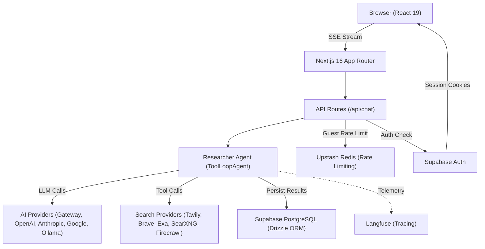

# Polymorph


Polymorph is an AI platform with a generative UI. It combines multi-step research, rich interactive components, and an expanding set of creative capabilities — including code generation, image creation, and multimodal interaction.

## Overview

- Next.js 16 + React 19 + TypeScript
- Vercel AI SDK-powered chat + tool workflows
- Search provider support (Tavily, Brave)
- 8 generative UI display tools for rich interactive responses
- PostgreSQL + Drizzle for persisted chat history (via Supabase)
- Supabase Auth, Supabase Storage, and Redis-backed limits

## Tech Stack

| Category  | Technology                                                                                           |
| --------- | ---------------------------------------------------------------------------------------------------- |
| Framework | Next.js 16 (App Router)                                                                              |
| Runtime   | Bun                                                                                                  |
| Language  | TypeScript (strict mode)                                                                             |
| Database  | PostgreSQL via Supabase + Drizzle ORM                                                                |
| Auth      | Supabase Auth                                                                                        |
| AI        | Vercel AI SDK + AI Gateway                                                                           |
| Search    | Tavily (primary), Brave (multimedia)                                                                 |
| Styling   | Tailwind CSS v4 + shadcn/ui                                                                          |
| Testing   | Vitest                                                                                               |
| Gen UI    | 8 display tools (tables, charts, timelines, citations, callouts, plans, link previews, option lists) |

## Architecture



See [Architecture Documentation](docs/architecture/OVERVIEW.md) for detailed diagrams.

## Quickstart

```bash
bun install
cp .env.local.example .env.local   # then set DATABASE_URL, AI_GATEWAY_API_KEY, TAVILY_API_KEY
bun run migrate
bun dev                             # http://localhost:43100
```

See the [full Quickstart Guide](docs/getting-started/QUICKSTART.md) for detailed setup including local Supabase, auth configuration, and a guided first search.

## Documentation

[Browse all documentation ->](docs/README.md)

### Getting Started

- [Quickstart Guide](docs/getting-started/QUICKSTART.md) -- End-to-end setup from clone to first search
- [Environment Reference](docs/getting-started/ENVIRONMENT.md) -- All environment variables explained
- [Configuration Guide](docs/getting-started/CONFIGURATION.md) -- Auth modes, search providers, AI providers

### Architecture

- [Architecture Overview](docs/architecture/OVERVIEW.md) -- System design, data flow, and component relationships
- [Research Agent](docs/architecture/RESEARCH-AGENT.md) -- ToolLoopAgent orchestration and tool pipeline
- [Generative UI](docs/architecture/GENERATIVE-UI.md) -- Display tools and rich interactive components
- [Streaming](docs/architecture/STREAMING.md) -- SSE response creation and message part streaming
- [Model Configuration](docs/architecture/MODEL-CONFIGURATION.md) -- Model selection logic and provider registry
- [Search Providers](docs/architecture/SEARCH-PROVIDERS.md) -- Tavily, Brave, Exa, SearXNG, and Firecrawl

### Reference

- [API Reference](docs/reference/API.md) -- Chat API endpoint, request/response schemas, error codes
- [File Index](docs/reference/FILE-INDEX.md) -- Every file in the repository with a one-line description

### Operations

- [Deployment Guide](docs/operations/DEPLOYMENT.md) -- Vercel deployment and production configuration
- [Docker Guide](docs/operations/DOCKER.md) -- Containerized setup with Docker Compose
- [Troubleshooting](docs/operations/TROUBLESHOOTING.md) -- Common issues, error messages, and fixes
- [Day-2 Operations](docs/operations/runbooks/day-2-operations.md) -- Monitoring, maintenance, and incident response

### Contributing

- [Contributing Guide](CONTRIBUTING.md)
- [Changelog](CHANGELOG.md)
- [Launch Decisions](docs/architecture/DECISIONS.md)
- [Security Policy](SECURITY.md)

## CI/CD Quality Gates

The repository includes GitHub Actions workflows for:

- Lint (`bun lint`)
- Typecheck (`bun typecheck`)
- Format check (`bun format:check`)
- Tests (`bun run test`)
- Build (`bun run build`)

## Attribution

Polymorph is derived from [miurla/morphic](https://github.com/miurla/morphic) under the Apache-2.0 license. See [LICENSE](LICENSE) for details.
