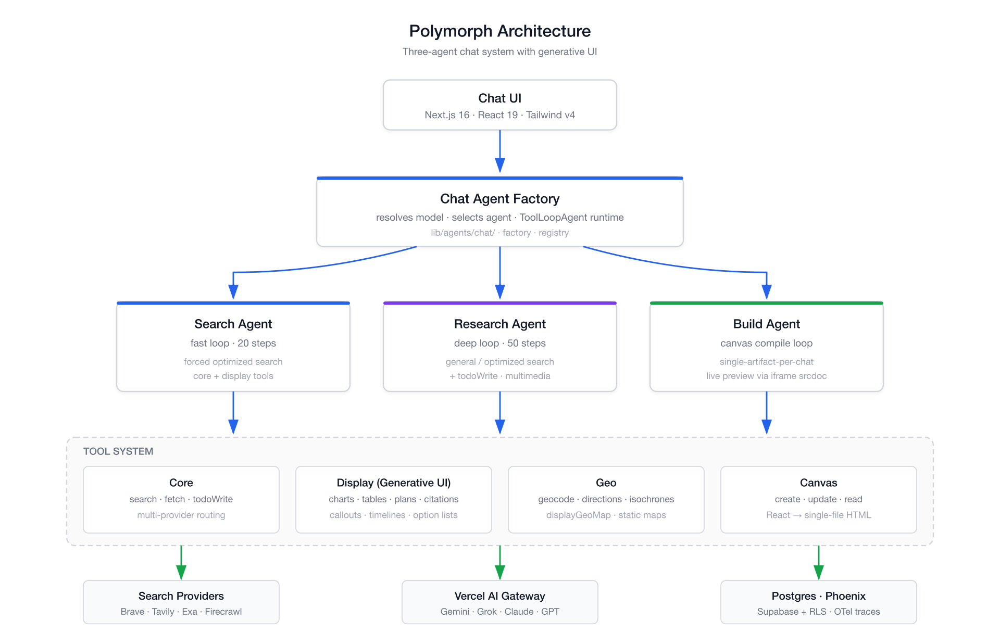

  <picture>
    <source media="(prefers-color-scheme: dark)" srcset="docs/assets/polymorph-wordmark-dark.png">
    <source media="(prefers-color-scheme: light)" srcset="docs/assets/polymorph-wordmark-light.png">
    
  </picture>

  
AI platform for research, creation, and exploration.

 

  A conversation-first interface that expands into a multi-step research agent,
  generative UI for inline data and maps, and a canvas workspace that compiles
  single-file React artifacts live.

 

Polymorph end to end — canvas artifacts, generative UI, conversational workflows, and the evals dashboard.

## Features

- **Canvas artifacts** — generates and previews single-file React apps with live editing
- **Multi-step research agent** — searches the web, reasons across sources, and synthesizes answers
- **Generative UI** — tables, charts, geo maps, timelines, citations, callouts, and link previews render inline
- **Three conversation modes** — Search, Research, and Build share one chat surface with intent-aware prompting
- **Geo intelligence** — interactive maps, real directions, reachability polygons, and static map images
- **Multi-provider AI** — Grok 4.1 Fast (speed and quality) via Vercel AI Gateway, with Gemini 2.5 Flash Image for inline generation, plus direct OpenAI, Anthropic, Google, OpenAI-compatible, and Ollama providers
- **Voice mode** — speech input and text-to-speech playback
- **Guest access** — instant search without sign-up, rate-limited per IP in cloud deployments

## Documentation

[Browse all documentation →](docs/README.md)

- [Quickstart Guide](docs/getting-started/QUICKSTART.md) — local setup, Supabase, auth, and a guided first search
- [Architecture Overview](docs/architecture/OVERVIEW.md) — system design, data flow, tech stack
- [Geo & Spatial Tools](docs/architecture/GEO-TOOLS.md) — geocoding, directions, isochrones, static maps, and `displayGeoMap`
- [Environment Reference](docs/getting-started/ENVIRONMENT.md) — all environment variables
- [Deployment Guide](docs/operations/DEPLOYMENT.md) — Vercel deployment and production config
- [Contributing Guide](CONTRIBUTING.md) — development workflow and quality gates
- [API Reference](docs/reference/API.md) — chat API endpoint and schemas

## Architecture

  <picture>
    <source media="(prefers-color-scheme: dark)" srcset="docs/assets/architecture-dark.png">
    <source media="(prefers-color-scheme: light)" srcset="docs/assets/architecture.png">
    
  </picture>

Three-agent chat system with generative UI · See <a href="docs/architecture/OVERVIEW.md">architecture overview</a> for the full breakdown.

## Attribution

Polymorph is derived from [miurla/morphic](https://github.com/miurla/morphic) under the Apache-2.0 license. See [LICENSE](LICENSE) for details.
