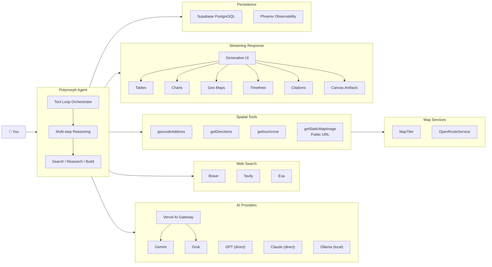

<div align="center">
  <picture>
    <source media="(prefers-color-scheme: dark)" srcset="docs/assets/polymorph-wordmark-dark.png">
    <source media="(prefers-color-scheme: light)" srcset="docs/assets/polymorph-wordmark-light.png">
    
  </picture>

  <p>AI platform for research, creation, and exploration.</p>


</div>

## Features

- **Three conversation modes** — Search, Research, and Build share one chat surface with intent-aware prompting
- **Multi-step research agent** — searches the web, reasons across sources, and synthesizes answers
- **Generative UI** — tables, charts, geo maps, timelines, citations, callouts, and link previews render inline
- **Geo intelligence** — interactive maps, real directions, reachability polygons, and static map images
- **Canvas artifacts** — generates and previews single-file React apps with live editing
- **Multi-provider AI** — Gemini and Grok via Vercel AI Gateway, plus GPT, Claude, and Ollama via direct provider keys
- **Voice mode** — speech input and text-to-speech playback
- **Guest access** — instant search without sign-up, rate-limited per IP

## Architecture


```mermaid
graph LR
    User["👤 You"]

    subgraph Agent["Polymorph Agent"]
        direction TB
        Orchestrator["Tool Loop Orchestrator"]
        Reasoning["Multi-step Reasoning"]
        Modes["Search / Research / Build"]
        Orchestrator --> Reasoning --> Modes
    end

    subgraph Providers["AI Providers"]
        direction TB
        Gateway["Vercel AI Gateway"]
        Gemini["Gemini"]
        Grok["Grok"]
        Gateway --> Gemini & Grok
        GPT["GPT (direct)"]
        Claude["Claude (direct)"]
        Ollama["Ollama (local)"]
    end

    subgraph Search["Web Search"]
        Brave["Brave"]
        Tavily["Tavily"]
        Exa["Exa"]
    end

    subgraph Geo["Spatial Tools"]
        Geocode["geocodeAddress"]
        Directions["getDirections"]
        Isochrone["getIsochrone"]
        StaticMap["getStaticMapImage<br/>Public URL"]
    end

    subgraph MapServices["Map Services"]
        MapTiler["MapTiler"]
        ORS["OpenRouteService"]
    end

    subgraph Response["Streaming Response"]
        direction TB
        GenUI["Generative UI"]
        Tables["Tables"]
        Charts["Charts"]
        GeoMaps["Geo Maps"]
        Timelines["Timelines"]
        Citations["Citations"]
        Canvas["Canvas Artifacts"]
        GenUI --> Tables & Charts & GeoMaps & Timelines & Citations & Canvas
    end

    subgraph Data["Persistence"]
        Supabase["Supabase PostgreSQL"]
        Phoenix["Phoenix Observability"]
    end

    User --> Agent
    Agent --> Providers
    Agent --> Search
    Agent --> Geo
    Geo --> MapServices
    Agent --> Response
    Agent --> Data
```

## Quickstart

```bash
bun install
cp .env.local.example .env.local   # then set DATABASE_URL, AI_GATEWAY_API_KEY, BRAVE_SEARCH_API_KEY
bun run migrate
bun dev                             # http://localhost:43100
```

Add `NEXT_PUBLIC_MAPTILER_API_KEY`, `MAPTILER_API_KEY`, and optionally `ORS_API_KEY` if you want the geo-map, directions, static-map, and isochrone features locally.

See the [full Quickstart Guide](docs/getting-started/QUICKSTART.md) for detailed setup including local Supabase, auth configuration, and a guided first search.

## Documentation

[Browse all documentation →](docs/README.md)

- [Architecture Overview](docs/architecture/OVERVIEW.md) — system design, data flow, tech stack
- [Geo & Spatial Tools](docs/architecture/GEO-TOOLS.md) — geocoding, directions, isochrones, static maps, and `displayGeoMap`
- [Environment Reference](docs/getting-started/ENVIRONMENT.md) — all environment variables
- [Deployment Guide](docs/operations/DEPLOYMENT.md) — Vercel deployment and production config
- [Contributing Guide](CONTRIBUTING.md) — development workflow and quality gates
- [API Reference](docs/reference/API.md) — chat API endpoint and schemas

## Attribution

Polymorph is derived from [miurla/morphic](https://github.com/miurla/morphic) under the Apache-2.0 license. See [LICENSE](LICENSE) for details.
