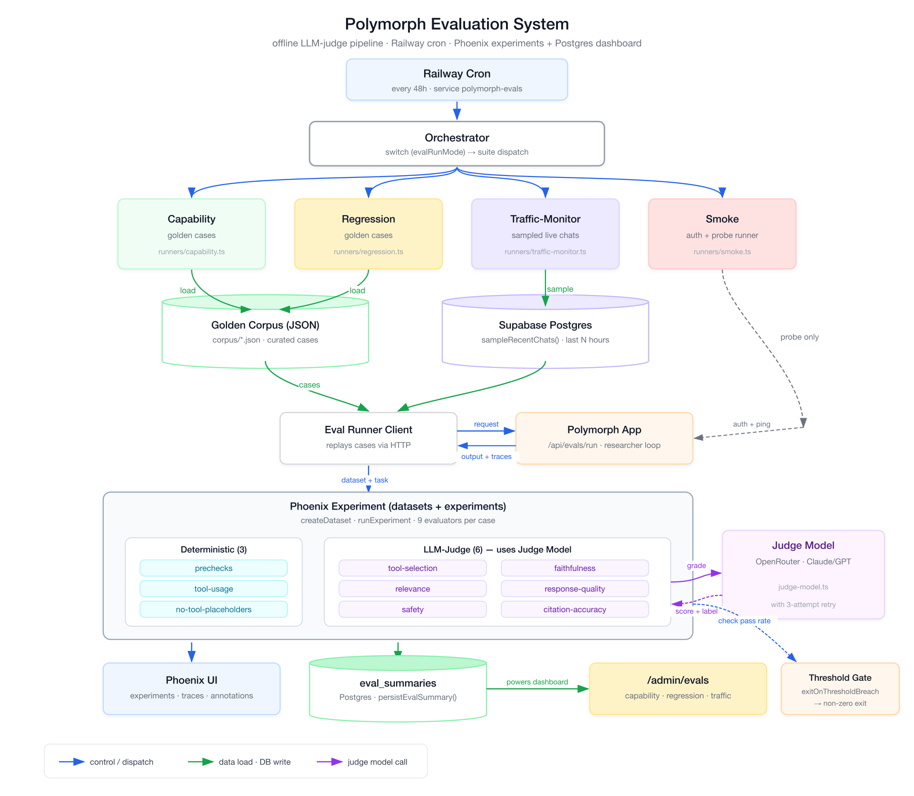

  <picture>
    <source media="(prefers-color-scheme: dark)" srcset="docs/assets/polymorph-wordmark-dark.png">
    <source media="(prefers-color-scheme: light)" srcset="docs/assets/polymorph-wordmark-light.png">
    
  </picture>

  
AI platform for research, creation, and exploration.

 

  A conversation-first interface that expands into a multi-step research agent,
  generative UI for inline data and maps, and a canvas workspace that compiles
  single-file React artifacts live.

 

Polymorph end to end — canvas artifacts, generative UI, conversational workflows, and the evals dashboard. <a href="https://github.com/NickB03/polymorph/blob/main/docs/assets/demos/polymorph-demo.mp4">View the high-resolution video on GitHub</a>.

## Features

- **Canvas artifacts** — generates and previews single-file React apps with live editing
- **Multi-step research agent** — searches the web, reasons across sources, and synthesizes answers
- **Generative UI** — tables, charts, geo maps, timelines, citations, callouts, and link previews render inline
- **Three conversation modes** — Search, Research, and Build share one chat surface with intent-aware prompting
- **Geo intelligence** — interactive maps, real directions, reachability polygons, and static map images
- **Multi-provider AI** — GLM-5.3 Flash/GLM-5.3 via OpenRouter for text, Meta Muse Image via Vercel AI Gateway for inline generation, plus direct OpenAI, Anthropic, Google, OpenAI-compatible, and Ollama providers
- **Voice mode** — speech input and text-to-speech playback
- **Configurable guest access** — optional instant search without sign-up, rate-limited per IP in cloud deployments

## Technical highlights

- **RLS-keyed multi-tenant Postgres** — every user-scoped table is protected by Row-Level Security policies keyed on a per-request session GUC, set through `withRLS`/`withOptionalRLS` (`lib/db/with-rls.ts`)
- **Generative UI as typed message parts** — ~15 display, canvas, and image tools stream structured output that renders as tables, charts, maps, timelines, and interactive widgets (`lib/tools/*`, `components/tool-ui/*`)
- **Single-artifact canvas** — one React app compiled server-side to a persisted, versioned single-file HTML document and served client-side via `iframe.srcdoc`, with HMAC-SHA256-signed guest edit tokens that rotate on every write (`lib/canvas/*`)
- **9-evaluator LLM-judge pipeline** — 3 deterministic + 6 LLM-judge evaluators run against Phoenix experiments, including a weekly regression canary on Railway cron (`services/evals`)
- **End-to-end OpenTelemetry tracing** — every LLM call and tool invocation is traced into Arize Phoenix, with production span-content masking (`instrumentation.ts`, `lib/utils/telemetry.ts`)

## Documentation

[Browse all documentation →](docs/README.md)

- [Quickstart Guide](docs/getting-started/QUICKSTART.md) — local setup, Supabase, auth, and a guided first search
- [Architecture Overview](docs/architecture/OVERVIEW.md) — system design, data flow, tech stack
- [Geo & Spatial Tools](docs/architecture/GEO-TOOLS.md) — geocoding, directions, isochrones, static maps, and `displayGeoMap`
- [Environment Reference](docs/getting-started/ENVIRONMENT.md) — all environment variables
- [Deployment Guide](docs/operations/DEPLOYMENT.md) — Vercel deployment and production config
- [Contributing Guide](CONTRIBUTING.md) — development workflow and quality gates
- [API Reference](docs/reference/API.md) — chat API endpoint and schemas

## Architecture

  <a href="docs/assets/architecture.png">
    <picture>
      <source media="(prefers-color-scheme: dark)" srcset="docs/assets/architecture-dark.png">
      <source media="(prefers-color-scheme: light)" srcset="docs/assets/architecture.png">
      
    </picture>
  </a>

Three-agent chat system with generative UI · See <a href="docs/architecture/OVERVIEW.md">architecture overview</a> for the full breakdown.

## Evaluation

  <a href="docs/assets/eval-system.png">
    <picture>
      <source media="(prefers-color-scheme: dark)" srcset="docs/assets/eval-system-dark.png">
      <source media="(prefers-color-scheme: light)" srcset="docs/assets/eval-system.png">
      
    </picture>
  </a>

Offline LLM-judge pipeline · Railway cron → Phoenix experiments → Postgres dashboard.

## Status & roadmap

- **Canvas is one artifact per chat** — `createCanvasArtifact`/`updateCanvasArtifact`/`readCanvasArtifact` are only registered when a chat has an active canvas context; there's no multi-artifact workspace yet
- **OpenRouter/Z.ai is the default text provider** — GLM-5.3 Flash/GLM-5.3 via OpenRouter, with direct OpenAI, Anthropic, Google, OpenAI-compatible, and Ollama providers supported for self-hosted or BYO-key setups
- **Deferred dependency upgrades** — Vitest 5, `@vitejs/plugin-react` 6, and ESLint 10 were attempted and rolled back (ESLint 10 is blocked on `eslint-plugin-react` compatibility); TypeScript 7 and the Drizzle ORM v1 beta are also not yet adopted
- **Evals cron runs a low-cost weekly canary by default** — the scheduled Railway cron replays a single synthetic regression case; full capability/traffic-monitor suites are triggered on demand from the Railway dashboard

## Attribution

Polymorph is derived from [miurla/morphic](https://github.com/miurla/morphic) under the Apache-2.0 license. See [LICENSE](LICENSE) for details.
