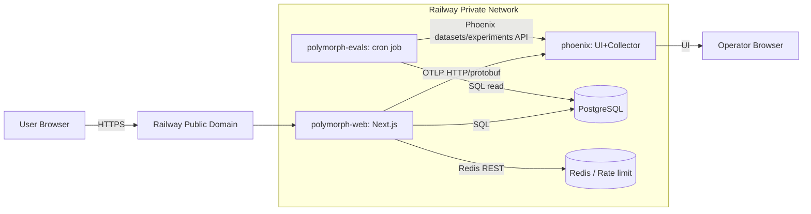
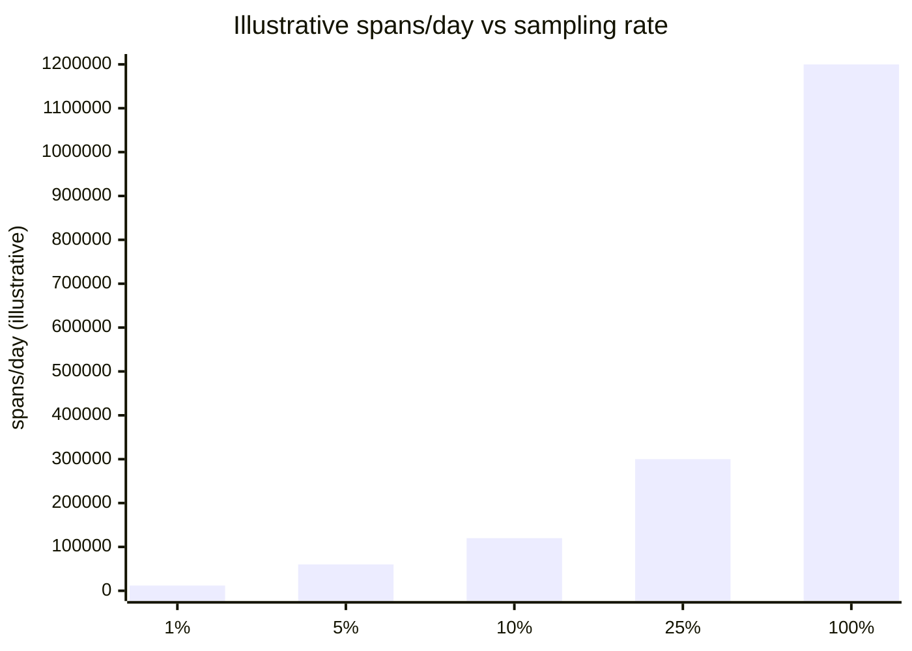
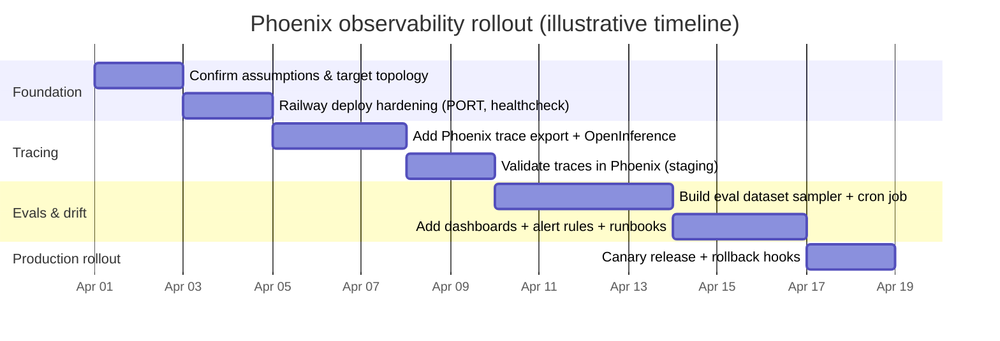

# Comprehensive Observability Plan for NickB03/polymorph with Arize Phoenix on Railway

## Executive summary

NickB03/polymorph (“Polymorph”) is a full‑stack, streaming, tool-using AI application built with Next.js (App Router), React, and strict TypeScript, using the Vercel AI SDK agent framework (ToolLoopAgent) to orchestrate multi-step research with tools like search and fetch, and persisting chat + tool artifacts in PostgreSQL via Drizzle (commonly backed by Supabase). fileciteturn38file0L1-L51 fileciteturn35file0L16-L67

The repo already contains multiple “observability-adjacent” foundations—an explicit health endpoint, request correlation IDs, optional performance logging, and a Langfuse tracing integration—but it is oriented toward Vercel deployments and Langfuse telemetry, and it does not yet provide a Phoenix-first, Railway-native observability posture (portable tracing export, consistent structured logging with trace correlation, platform-specific port/healthcheck correctness, and continuous quality/drift monitoring). fileciteturn26file0L1-L43 fileciteturn33file0L1-L35 fileciteturn38file0L45-L48 fileciteturn18file0L96-L108

The most direct, low-risk path to add Arize Phoenix observability is to:

- Export **OpenTelemetry traces** from the app to Phoenix using **OpenInference translation for Vercel AI SDK spans**, so Phoenix can render LLM/tool traces with first-class semantics. citeturn8view0 citeturn0search4
- Deploy **Phoenix as a separate Railway service** using the official Phoenix container images, with persistence via a Railway Volume (SQLite) or PostgreSQL (recommended for production). citeturn5search0turn5search2turn0search0
- Make Railway deployments robust by aligning the Polymorph service with Railway’s `PORT`/healthcheck requirements, using pre-deploy migrations, and leveraging private networking for internal Phoenix collector traffic. citeturn3search1turn3search0turn6search2turn3search3
- Add **continuous evaluation and drift monitoring** via scheduled Railway Cron services that sample conversations/tool outputs from the existing DB schema and run Phoenix experiments/evaluators (TypeScript SDK options exist). fileciteturn34file0L1-L171 citeturn3search2turn9search0turn9search1

## Assumptions and confirmations needed

### Assumptions to validate (explicitly unknown until you confirm)

Polymorph contains multiple viable deployment patterns (Vercel, Docker), and Railway supports several (GitHub deploy, Dockerfile, images). Confirming the following will prevent “false precision” in the plan: fileciteturn14file0L1-L33 fileciteturn23file0L1-L41 citeturn1view0

- Whether Phoenix will be **self-hosted on Railway** (recommended for “keep data in infra”) or whether you intend to use Phoenix Cloud; auth, endpoints, and secret handling differ. citeturn5search1turn4search1turn4search0

  > **CONFIRMED: Self-hosted on Railway.** The project already publishes multi-arch Docker images to GHCR and has a Docker-based deployment pipeline. Keeping Phoenix in the same Railway environment enables private networking (`phoenix.railway.internal:6006`) so traces never leave internal infrastructure. No external vendor dependency for trace storage.

- Expected traffic and trace volume (requests/day, average tool steps per request, concurrency). This drives sampling, retention, and Phoenix storage sizing.

  > **CONFIRMED: Low volume, no sampling needed initially.** This is an early-stage personal/small-team project. Realistic near-term estimate: ~100-500 chat requests/day, potentially growing to 1,000-2,000/day. Each chat triggers the researcher agent with 5-20 tool steps plus model calls (~30-80 spans per request). At 500 req/day x 50 spans = ~25,000 spans/day at 100% sampling — well within Phoenix capacity on SQLite. Revisit sampling only if traffic exceeds ~5,000 req/day.

- Whether you want to **keep Langfuse** as a secondary system (parallel telemetry) or migrate fully to Phoenix (simpler, less duplication). Polymorph currently uses Langfuse both via an OTel exporter and direct SDK calls. fileciteturn10file0L1-L22 fileciteturn19file0L1-L70

  > **CONFIRMED: Migrate fully to Phoenix. Remove Langfuse.** The Langfuse integration is relatively contained: `LangfuseExporter` in `instrumentation.ts`, direct SDK trace/feedback calls in `create-chat-stream-response.ts` / `create-ephemeral-chat-stream-response.ts` / `feedback.ts`, and `langfuseTraceId` metadata in `experimental_telemetry` across 3 agents. Running two tracing backends adds complexity with no benefit at this scale. Phoenix provides equivalent trace visualization, evaluation, and dataset capabilities. Migration scope: remove `langfuse` and `langfuse-vercel` packages, remove all Langfuse SDK calls, replace with Phoenix/OTel equivalents.

- Whether you will use Supabase Postgres in production or Railway Postgres; both work, but network/access assumptions change. Polymorph expects `DATABASE_URL` and supports SSL behavior flags. fileciteturn17file0L1-L33 fileciteturn31file0L17-L62

  > **CONFIRMED: Keep Supabase Postgres for the application.** Local dev uses Supabase CLI (port 44322), cloud/production uses managed Supabase via `DATABASE_URL`. Supabase is deeply integrated — auth, RLS policies, middleware session management, restricted user support via `DATABASE_RESTRICTED_URL` in `lib/db/index.ts`. No plans to switch to Railway Postgres for the app. **Implication for Phoenix:** Phoenix should use its own storage (SQLite + Volume or a separate Railway Postgres instance). Do not share the Supabase database with Phoenix.

- Data retention and compliance expectations: whether prompts/responses are allowed to be stored in traces, and what redaction is required.

  > **CONFIRMED: No formal compliance requirements.** This is a personal project, not subject to SOC2/HIPAA/GDPR. Prompts, responses, and tool inputs/outputs can all be stored in traces without redaction. No PII concerns beyond what users voluntarily type. Retention target: 30-90 days initially, adjust based on storage costs. Redaction helpers are not needed now but are good forward-looking architecture if the product ever serves external users.

### Repo files / info you should confirm (high leverage)

These are the minimum “decision points” where small configuration differences change the implementation details:

- **Runtime and start command** on Railway: the repo uses Bun and Next, and the production `start` script is currently hard-coded to `-p 43100` (this conflicts with Railway’s injected `PORT` unless you override). fileciteturn12file0L25-L61 citeturn3search1turn3search3

  > **CONFIRMED: Update the start script.** Current `package.json` has `"start": "next start -p 43100"` (hardcoded). Update to `"start": "next start --hostname 0.0.0.0 --port ${PORT:-43100}"` — defaulting to 43100 (current convention) rather than 3000 for local dev consistency. The Dockerfile already binds to `0.0.0.0` via `CMD ["bun", "start", "-H", "0.0.0.0"]`. Railway will inject `PORT` and this change makes the app respect it.

- Whether you will deploy via:
  - the repo’s **Dockerfile**, which runs `bun run migrate` at container start and then starts Next, fileciteturn13file0L1-L41
  - or Railway’s build system (“Railpack/Nixpacks”) which typically expects `output: "standalone"` and a compatible start script. citeturn1view0L370-L420

  > **CONFIRMED: Use the existing Dockerfile.** The project has a working multi-stage Dockerfile (Node 22 builder, Bun 1.2.12 runtime) published as multi-arch images to `ghcr.io` via GitHub Actions. `next.config.mjs` does **not** set `output: "standalone"` — adding it would change the build output structure and require testing across all deployment targets (Vercel, Docker, Railway). Using the pre-built GHCR image is the cleanest path. Migrations should move to a Railway Pre-Deploy Command (`bun run migrate`) instead of running at container startup via `docker-entrypoint.sh` — better for replica scaling.

- The desired Phoenix persistence mode (SQLite+Volume vs Postgres) and whether you will enable Phoenix authentication (affects ingestion auth headers). citeturn5search2turn5search0turn5search3turn4search4

  > **CONFIRMED: SQLite + Railway Volume initially.** At ~25,000 spans/day, SQLite is more than adequate. Simplest setup: mount a Railway Volume, set `PHOENIX_WORKING_DIR`. No additional database service to manage. Upgrade to Postgres when/if: multi-user access to Phoenix UI is needed, trace volume exceeds SQLite comfort zone, or backup/restore requirements emerge. Phoenix authentication is not needed initially given low user count — enable it later when exposing Phoenix UI to additional team members.

- How you want to gate tracing: today, the Vercel AI SDK’s `experimental_telemetry.isEnabled` is wired to `ENABLE_LANGFUSE_TRACING` via `isTracingEnabled()`, which may be semantically wrong once Phoenix is introduced. fileciteturn21file0L170-L193 fileciteturn11file0L1-L9

  > **CONFIRMED: Decouple and simplify.** Since we're removing Langfuse entirely (see Q3 above), the fix is straightforward: rename `ENABLE_LANGFUSE_TRACING` to `ENABLE_TRACING` in `lib/utils/telemetry.ts`, update `isTracingEnabled()` to check the new env var, and rewrite `instrumentation.ts` to use `OpenInferenceBatchSpanProcessor` + `OTLPTraceExporter` targeting Phoenix. Remove all Langfuse-specific SDK calls and `langfuseTraceId`/`langfuseUpdateParent` metadata from `experimental_telemetry` in `researcher.ts`, `title-generator.ts`, and `generate-related-questions.ts`. Files to update: `lib/utils/telemetry.ts`, `instrumentation.ts`, `create-chat-stream-response.ts`, `create-ephemeral-chat-stream-response.ts`, `lib/actions/feedback.ts`, plus 3 agent files and env docs.

## Repository review and system architecture

### What the system is, in practical terms

Polymorph is a “chat + research agent + tools + streaming UI” system:

- The primary entrypoint is a Next.js API route (`POST /api/chat`) that validates request shape, determines guest vs authenticated mode, selects a model, enforces rate limits, and then delegates to a streaming response generator. fileciteturn18file0L1-L208
- The core agent is a Vercel AI SDK ToolLoopAgent (“researcher”), configured with two modes (chat vs research) and a tool suite (search/fetch/display tools, todo tools, and optional canvas tooling). fileciteturn21file0L1-L170 fileciteturn35file0L139-L245
- Search and fetch tools are implemented as async generators yielding intermediate states (`searching`/`fetching`) and then a `complete` result, which is important for both UI semantics and trace semantics (it naturally maps to spans/events). fileciteturn24file0L82-L289 fileciteturn25file0L180-L274
- Persistence is in PostgreSQL with Drizzle, using a structured schema where a chat contains messages and messages contain “parts,” including dedicated columns to store tool inputs/outputs (search/fetch/todo/dynamic) and provider metadata. This is valuable for Phoenix datasets/evals because you already have a canonical record of what happened. fileciteturn34file0L1-L171

### Languages, frameworks, and deployment artifacts

- Language/runtime: strict TypeScript with Bun as the runtime in development/production scripting; Next.js serves the app. fileciteturn38file0L14-L18 fileciteturn12file0L62-L77
- CI/CD: GitHub Actions runs lint/typecheck/format/tests/build gates; a separate workflow builds and publishes multi-arch Docker images to GHCR. fileciteturn22file0L1-L85 fileciteturn23file0L1-L41
- Docker: a multi-stage Dockerfile builds Next with Node (builder), then runs with Bun, executing Drizzle migrations at container start. fileciteturn13file0L1-L41
- Health checks: `/api/health` performs a simple DB check and returns 200 or 503, suitable for Railway deployment gating. fileciteturn26file0L1-L43

### Existing telemetry hooks in the repo

- A middleware/proxy adds an `x-request-id` correlation header for requests, which should be propagated into traces/logs. fileciteturn33file0L21-L31
- There is a Vercel OpenTelemetry hook file (`instrumentation.ts`) registering OTel with a Langfuse exporter; as written, it runs unconditionally and assumes Vercel’s OTel runtime package. fileciteturn10file0L1-L22
- Langfuse is integrated at the application level for “trace-per-chat” behavior and for feedback submission. fileciteturn19file0L52-L79 fileciteturn27file0L1-L61

image_group{"layout":"carousel","aspect_ratio":"16:9","query":["Arize Phoenix tracing UI screenshot","Railway deployment dashboard Next.js service screenshot","OpenTelemetry trace waterfall example"],"num_per_query":1}

## Observability readiness gap analysis

### Traces and model telemetry

Polymorph already emits rich “agent structure” via the Vercel AI SDK and uses `experimental_telemetry` in the agent configuration, which is exactly the right conceptual primitive to feed Phoenix—**but the export target is not Phoenix** and the semantic toggling is conflated with Langfuse enablement. fileciteturn21file0L170-L193 fileciteturn11file0L1-L9

Key gaps:

- Trace export is currently oriented to Langfuse (both via OTel exporter and SDK calls), not to Phoenix. fileciteturn10file0L1-L22 fileciteturn19file0L52-L79
- Phoenix expects OpenInference semantic conventions for best UX; raw spans can be accepted, but the best results come from translation/instrumentation. citeturn0search4turn0search12turn8view0
- The app has multiple “trace identifiers” in play (Langfuse trace IDs, request IDs, potentially OTel trace IDs). Without deliberate correlation strategy, troubleshooting becomes harder.

### Logs

The codebase primarily uses `console.log` / `console.error` throughout key paths (search/fetch providers, streaming), and there is an optional `ENABLE_PERF_LOGGING` toggle for performance logging. fileciteturn18file0L12-L21 fileciteturn24file0L138-L143

Key gaps:

- No consistent structured logging format (JSON fields like `request_id`, `trace_id`, `chat_id_hash`, etc.).
- No explicit log sanitization policy for prompts/responses/tool outputs.

### Metrics (service + ML quality)

Polymorph’s health route checks DB connectivity, but there is no application-level metric emission system (request rate, error rate, tail latency, tool/provider error rates) beyond ad-hoc logging. fileciteturn26file0L1-L43 fileciteturn36file0L33-L51

Phoenix is best at trace + evaluation workflows; it is not a replacement for classic infra metrics. Therefore a “comprehensive” posture typically combines:

- Phoenix for **LLM traces + evals**
- Platform/runtime metrics (Railway metrics + optional metrics stack) for **CPU/memory/availability/latency trends** citeturn3search14turn3search5

### Drift, dataset shift, and feature monitoring

For AI systems, drift is often a combination of:

- distribution shift in inputs (user query types, languages, lengths),
- shift in retrieval/search behavior (providers used, result counts, domain mix),
- shift in output quality (faithfulness/hallucinations, citation correctness).

This is closely related to dataset shift and concept drift concepts studied in ML monitoring literature. citeturn10search1turn10search3

Polymorph already stores tool inputs/outputs and provider metadata in the DB schema, which gives you the raw materials for drift monitoring, but there is no pipeline that aggregates, evaluates, and alerts on these shifts. fileciteturn34file0L83-L171

## Target observability architecture on Railway with Phoenix

### Recommended deployment topology

Deploy three Railway services in the same Railway environment (e.g., “production”), relying on Railway private networking so traces never traverse the public internet unless you choose to: citeturn6search2turn6search1

- **polymorph-web**: the Next.js/Bun application.
- **phoenix**: Phoenix server + collector.
- **polymorph-evals** (cron): a scheduled job that samples recent chats from Postgres, runs evaluators, and logs results back to Phoenix datasets/experiments.

Phoenix itself is containerized, exposes a UI at port 6006, and accepts OTLP traces over HTTP (`/v1/traces` on port 6006) and OTLP/gRPC on port 4317. citeturn5search2turn5search0

### Architecture diagram (runtime + telemetry)



### Railway-specific constraints that drive implementation

- Railway injects a `PORT` environment variable and expects your service to listen on it; healthchecks use that same port. citeturn3search1turn3search3
- Healthchecks gate deployments by repeatedly querying a configured path until a 200 is returned; Railway does not continuously probe after cutover. citeturn3search1
- Pre-deploy commands are a clean place for migrations; they have environment variables but run in a separate container, do not persist filesystem changes, and do not mount volumes. citeturn3search0
- Volumes mount only at runtime; use them for Phoenix SQLite persistence if you do not use Postgres. citeturn0search0turn5search0
- Private networking uses internal DNS `SERVICE_NAME.railway.internal`; Railway recommends binding to `::` to support IPv4+IPv6 in newer environments and IPv6-only legacy environments. citeturn6search2turn6search1

### Options tables for key decisions

**Phoenix storage backend (persistence + scale)** citeturn5search0turn5search2turn0search0

| Option                  | How                                                       | Pros                                                              | Cons                                                                                                                 | When to choose                                              |
| ----------------------- | --------------------------------------------------------- | ----------------------------------------------------------------- | -------------------------------------------------------------------------------------------------------------------- | ----------------------------------------------------------- |
| SQLite + Railway Volume | Mount a Volume; set `PHOENIX_WORKING_DIR`; default SQLite | Lowest operational overhead; fast to start                        | Single-node constraints; volume-backed deployments can have small downtime on redeploy; volume sizing limits by plan | Early stage, single Phoenix instance, moderate trace volume |
| PostgreSQL backend      | Set `PHOENIX_SQL_DATABASE_URL`                            | Better concurrency; standard DB backups; easier long-term scaling | Extra DB service + cost; migrations/connection management                                                            | Production, multi-user, higher trace volume                 |

**Telemetry transport from app to Phoenix collector** citeturn5search2turn4search1turn4search2

| Transport          | Endpoint                        | Pros                                               | Cons                                                              | Recommendation                             |
| ------------------ | ------------------------------- | -------------------------------------------------- | ----------------------------------------------------------------- | ------------------------------------------ |
| OTLP HTTP/protobuf | `http://phoenix:6006/v1/traces` | Usually simplest through proxies; easy header auth | Slightly more overhead than gRPC                                  | Best default on Railway                    |
| OTLP gRPC          | `http://phoenix:4317`           | Efficient and standard                             | gRPC can be trickier across some networks; ensure ports reachable | Use if you already run gRPC OTLP elsewhere |

**Sampling strategies (trace volume vs debuggability)** citeturn11search0turn11search3

| Strategy                  | What it means                           | Pros                          | Cons                      | Fit for Polymorph              |
| ------------------------- | --------------------------------------- | ----------------------------- | ------------------------- | ------------------------------ |
| Head-based fixed-rate     | Sample X% of traces at start            | Predictable volume            | Can miss rare failures    | Use only if volume is too high |
| Error-biased              | Always sample errors + small baseline   | Keeps failure visibility      | More complex              | Strong default as you scale    |
| Feature-flag “debug mode” | No sampling for selected users/requests | Great for incident deep dives | Requires routing controls | Add as an operator tool        |

### Illustrative trace volume chart (to size retention)

The following is intentionally **illustrative**—replace with real numbers once you confirm traffic.

Assume:

- 1 chat request triggers ~120 spans (agent, tool calls, provider calls, persistence).
- 10,000 chat requests/day.

Then spans/day ≈ 1.2M (100% sampling). At 10% sampling, ≈ 120k spans/day.



## Implementation plan

### Milestones and timeline

This assumes one engineer familiar with the repo and Railway; compress/expand based on team size.



### Step-by-step build plan with concrete file changes

#### Railway deployment correctness for polymorph-web

**Problem:** `package.json` defines `start` as `next start -p 43100`, which will not automatically bind to Railway’s injected `PORT` (and therefore can break healthchecks/public routing unless you manually set `PORT=43100`). fileciteturn12file0L25-L61 citeturn3search1turn3search3

**Required changes (recommended):**

1. Update `package.json` start command to use `PORT` and bind to an appropriate host.

Example Linux-compatible approach (good for Railway/Docker):

```json
{
  "scripts": {
    "start": "next start --hostname 0.0.0.0 --port ${PORT:-3000}"
  }
}
```

Railway notes that Next “needs an additional flag to listen on `PORT`,” and Railway healthchecks explicitly rely on `PORT`. citeturn3search13turn3search1

2. In Railway service settings:

- Set Healthcheck Path = `/api/health` (existing and DB-aware). fileciteturn26file0L1-L43
- Ensure pre-deploy migrations run (see below).

3. Prefer running migrations as a **Railway Pre-Deploy Command**, rather than at every container startup:

- Pre-deploy commands are designed for migrations and run between build and deploy. citeturn3search0
- This reduces race risk when scaling replicas.

Use:

- Pre-deploy command: `bun run migrate` (or `npm run migrate` depending on your build image path), matching the repo’s migration script usage. fileciteturn13file0L24-L33 fileciteturn17file0L1-L33

#### Deploy Phoenix as a Railway service

Use the Phoenix official Docker image (pin a version for production stability). citeturn5search0turn5search1turn5search8

**Service: phoenix**

- Source: Docker image `arizephoenix/phoenix:version-X.Y.Z` (pin for prod). citeturn5search1turn5search0
- Public domain: expose UI on port 6006.
- Private network: allow polymorph-web to reach collector endpoint internally.

**Persistence path (choose one):**

- SQLite + Volume: attach Railway Volume; set `PHOENIX_WORKING_DIR` to the mount path; volumes mount only at runtime. citeturn0search0turn5search0turn5search2
- Postgres: set `PHOENIX_SQL_DATABASE_URL`. citeturn5search2turn5search0

**Collector ports:**
Phoenix default ports include:

- 6006 for UI and OTLP HTTP/protobuf at `/v1/traces`
- 4317 for OTLP gRPC citeturn5search2turn4search8

#### Add Phoenix trace export from polymorph-web

##### Recommended approach for this repo: OpenInference Vercel span processor + OTLP exporter

Polymorph uses the Vercel AI SDK and already uses `@vercel/otel` registration in `instrumentation.ts`. fileciteturn10file0L1-L22
OpenInference provides a dedicated package to translate Vercel AI SDK spans into OpenInference semantics so Phoenix can display them correctly. citeturn8view0turn7search2

**Dependencies to add (Bun-compatible install):**

- `@arizeai/openinference-vercel`
- `@arizeai/openinference-semantic-conventions`
- `@opentelemetry/exporter-trace-otlp-proto` (HTTP/protobuf exporter)
  Keep versions compatible with your existing `@vercel/otel` dependencies. citeturn7search9turn8view0

**Core code change: `instrumentation.ts`**
Replace the Langfuse exporter registration with a Phoenix OTLP exporter wrapped by OpenInference span processing. (You can keep Langfuse separately via its SDK if desired, but avoid double-export initially.)

Example (conceptual):

```ts
import { registerOTel } from '@vercel/otel'
import { OpenInferenceBatchSpanProcessor } from '@arizeai/openinference-vercel'
import { OTLPTraceExporter } from '@opentelemetry/exporter-trace-otlp-proto'
import { SEMRESATTRS_PROJECT_NAME } from '@arizeai/openinference-semantic-conventions'

export function register() {
  const collectorBase =
    process.env.PHOENIX_COLLECTOR_ENDPOINT ?? 'http://localhost:6006'

  registerOTel({
    serviceName: 'polymorph-web',
    attributes: {
      [SEMRESATTRS_PROJECT_NAME]:
        process.env.PHOENIX_PROJECT_NAME ?? 'polymorph',
      deployment_environment: process.env.RAILWAY_ENVIRONMENT ?? 'unknown'
    },
    spanProcessors: [
      new OpenInferenceBatchSpanProcessor({
        exporter: new OTLPTraceExporter({
          url: `${collectorBase}/v1/traces`,
          headers: process.env.PHOENIX_API_KEY
            ? { Authorization: `Bearer ${process.env.PHOENIX_API_KEY}` }
            : {}
        })
        // If you want *all spans*, omit spanFilter.
        // Add a spanFilter only after confirming volume/cost constraints.
      })
    ]
  })
}
```

Why this works:

- Phoenix accepts OTLP HTTP/protobuf at `/v1/traces` on port 6006. citeturn5search2turn5search7
- OpenInference Vercel is explicitly designed to ingest Vercel AI SDK spans and export to Phoenix. citeturn8view0turn7search2

**Environment variables in Railway (polymorph-web service):**

- `PHOENIX_COLLECTOR_ENDPOINT=http://phoenix.railway.internal:6006` (private network)
- `PHOENIX_PROJECT_NAME=polymorph-prod`
- `PHOENIX_API_KEY=...` (only if Phoenix auth is enabled)
  Private networking DNS pattern is `SERVICE_NAME.railway.internal`. citeturn6search1turn6search2

If you enable Phoenix authentication, ingestion requires authorization headers / API keys. citeturn5search3turn4search4turn4search0

##### Alternative: Phoenix OTEL SDK for Node + manual instrumentations

Phoenix also provides a TypeScript OTEL wrapper (`@arizeai/phoenix-otel`) that can register tracing from Node apps, reading `PHOENIX_COLLECTOR_ENDPOINT` and `PHOENIX_API_KEY`. citeturn4search0turn4search1turn4search10  
This is attractive for generic Node apps, but for Polymorph specifically you still need Vercel AI span translation to reach full “LLM trace” fidelity in the Phoenix UI. citeturn0search12turn8view0

#### Decouple “telemetry enablement” from Langfuse

Right now, `experimental_telemetry.isEnabled` in the agent uses `isTracingEnabled()`, which is tied to `ENABLE_LANGFUSE_TRACING`. fileciteturn21file0L170-L193 fileciteturn20file0L1-L20

To avoid unintentionally disabling Phoenix traces when Langfuse is off:

- Keep `ENABLE_LANGFUSE_TRACING` for Langfuse only.
- Add `ENABLE_PHOENIX_TRACING` (or `ENABLE_OTEL_TRACING`) to gate OpenTelemetry export + Vercel AI SDK `experimental_telemetry`.

Minimal change pattern:

- `lib/utils/telemetry.ts`: add a second flag reader for Phoenix/OTel enablement.
- `lib/agents/researcher.ts`: use Phoenix/OTel enablement flag for `experimental_telemetry.isEnabled`.
- Keep Langfuse behavior in `create-chat-stream-response.ts` guarded by the Langfuse flag. fileciteturn19file0L52-L79

#### Add evaluation + drift monitoring with scheduled Railway Cron service

Railway Cron Jobs start a service on a schedule; the service should run a task and exit, and schedules use UTC. citeturn3search2

You already store the necessary structured data (tool inputs/outputs, provider metadata) in the `parts` table. fileciteturn34file0L83-L171  
Build a cron service that:

1. Pulls a stratified sample of chats/messages/parts from Postgres.
2. Converts to a dataset format (question, context/citations, answer, tool traces).
3. Runs evaluators (faithfulness, document relevance, tool selection correctness).
4. Pushes results to Phoenix experiments/datasets.

Phoenix provides TypeScript evaluators (`@arizeai/phoenix-evals`) and a TypeScript client (`@arizeai/phoenix-client`) for experimentation workflows. citeturn9search0turn9search1turn4search10

Example evaluator setup (TypeScript, conceptual):

```ts
import { createFaithfulnessEvaluator } from '@arizeai/phoenix-evals/llm'
import { openai } from '@ai-sdk/openai'

const faithfulness = createFaithfulnessEvaluator({
  model: openai('gpt-4o-mini')
})

const score = await faithfulness({
  input: 'User question ...',
  context: 'Concatenated retrieved snippets ...',
  output: 'Model answer ...'
})
```

citeturn9search0turn9search2

Quality/drift framing (how to interpret results):

- “Dataset shift” broadly describes when training/validation data differs from deployment data; in LLM apps, this is often user-query distribution and retrieved-context distribution shifting over time. citeturn10search1turn10search0
- “Concept drift” refers to changes over time in the relationship between inputs and target outputs; for evaluators, this manifests as your quality target changing or user intent patterns changing. citeturn10search3turn10search7

## Testing, dashboards, alerting, incident response, and rollout checklist

### Testing and validation plan

**Unit tests**

- Add tests for your new telemetry gating logic (Phoenix tracing on/off independent of Langfuse on/off).
- Add tests for “safe redaction” helpers (if you implement redaction of prompts/PII before export).

**Integration tests**

- A staged Railway environment where:
  - `polymorph-web` can connect to DB, and `/api/health` returns 200. fileciteturn26file0L1-L33
  - `polymorph-web` can reach `phoenix.railway.internal:6006` over private networking. citeturn6search2turn6search1
- Confirm that at least one end-to-end chat run produces:
  - an OTel trace in Phoenix with spans for model invocation and tool calls (OpenInference formatted). citeturn8view0turn5search2

**E2E tests**
Adopt a browser E2E harness (e.g., Playwright) to:

- create a chat, send a prompt, wait for streaming completion,
- assert that citations appear and the UI does not crash.

**Load tests**
Define a modest synthetic scenario (e.g., 20 concurrent chats) to:

- validate Phoenix collector throughput,
- observe p95 latency changes with tracing enabled/disabled,
- validate sampling configuration.

**Synthetic drift injection**
On a staging dataset:

- generate prompts with systematically different distributions (e.g., longer prompts, different language mix),
- verify your drift monitors detect changes (for example, embedding cluster shifts or evaluator score shifts).

### Monitoring views (dashboards) and alert rules

Phoenix is your primary “LLM observability surface.” Complement it with Railway metrics/logs for platform signals. citeturn3search14turn3search5

Recommended Phoenix dashboards:

- Trace overview by route: `/api/chat` latency distribution; tool step counts per request.
- Provider breakdown: error rates by model provider and search provider (Tavily vs others), since Polymorph has explicit fallback chains. fileciteturn24file0L51-L143
- Quality trend: evaluator scores over time (faithfulness, citation relevance, refusal correctness).

SLO suggestions (initial “starter SLOs”)
Use SLOs to define what reliability means and to drive alerting/incident response. Google’s SRE guidance emphasizes choosing SLIs that map to user-visible outcomes, and using error budgets to manage risk. citeturn11search0turn11search3

For Polymorph, reasonable early SLIs:

- Availability: `% of /api/chat requests returning success` (non-5xx) over 30d.
- Latency: p95 time to first token (TTFT) and p95 time to last token (TTLT) for `/api/chat`.
- Correctness proxy: % of responses passing a “citation present” and “document relevance” evaluator threshold in daily samples.

Alerting rules (operator-paging threshold examples)

- High-severity: `/api/chat` 5xx rate > 2% over 5 minutes.
- High-severity: DB healthcheck failing (healthcheck path not 200) during deploy—this should block deploy in Railway if configured. citeturn3search1turn26file0
- Medium: provider-specific error spikes (Tavily failures or model-provider failures).
- Quality regression: daily faithfulness score mean drops > X std dev (needs data-driven thresholds).

### Incident response playbook (Phoenix + Railway aligned)

Polymorph already includes a “day-2 operations” outline; extend it with Phoenix-specific procedures. fileciteturn36file0L1-L51

Playbook structure:

1. **Detect:** alert fired (latency, errors, quality).
2. **Triage:** isolate blast radius (guest vs auth, specific provider, specific region).
3. **Diagnose quickly with Phoenix traces:** find exemplar failing traces; inspect tool calls and provider errors.
4. **Mitigate:** switch providers (model/search), reduce concurrency, enable sampling, or rollback.
5. **Recover:** redeploy, verify, and write a postmortem.

### Security, privacy, and cost implications

- Railway variables are injected as environment variables into build/runtime and changing them requires a deploy review; treat them as the secret store for `PHOENIX_API_KEY`, DB URLs, and provider keys. citeturn0search15turn0search18
- Next.js bundles variables prefixed with `NEXT_PUBLIC_` into client code; never put Phoenix keys or collector endpoints intended for private networking into `NEXT_PUBLIC_*`. citeturn0search10
- If Phoenix auth is enabled, trace collection is blocked until API keys are created; plan a controlled switchover window. citeturn5search3turn4search4
- Data minimization: OpenInference/LLM traces can include prompts, tool inputs, and outputs. If your prompts can include secrets/PII, implement redaction before export and treat Phoenix storage as sensitive data at rest.

### Rollout and post-deploy verification checklist

**Pre-rollout**

- Confirm start command listens on Railway `PORT` and binds appropriately. citeturn3search3turn3search1
- Configure Railway healthcheck path to `/api/health`. citeturn3search1turn26file0
- Configure pre-deploy migration command. citeturn3search0turn17file0
- Deploy Phoenix with persistence (Volume or Postgres) and confirm UI loads. citeturn5search2turn5search0turn0search0

**Canary**

- Enable Phoenix tracing for a small subset (feature flag or temporary sampling).
- Verify: Phoenix receives traces; spans show LLM calls + tool calls. citeturn8view0turn5search2
- Verify: No significant latency regression at p95.

**Full rollout**

- Increase sampling toward desired steady-state.
- Turn on cron eval job at a conservative cadence (e.g., hourly or daily) and confirm it exits cleanly (Railway cron requirement). citeturn3search2

**Rollback plan**

- Maintain a “tracing-off” deploy configuration by toggling `ENABLE_PHOENIX_TRACING=false` (and/or sampling to 0%).
- If deploy causes failures, revert to prior image/build and rerun smoke test (homepage + one chat request). This aligns with the repo’s existing rollback posture. fileciteturn14file0L33-L46

## Production environment variables (Vercel)

The following environment variables must be set in the Vercel dashboard (**Settings → Environment Variables**, Production environment) for Phoenix tracing:

```env
ENABLE_TRACING=true
PHOENIX_COLLECTOR_ENDPOINT=<public Phoenix URL, e.g. https://phoenix-production-xxxx.up.railway.app>
PHOENIX_PROJECT_NAME=polymorph-prod
PHOENIX_API_KEY=<the API key created in Phoenix>
```

> **Note:** Since Vercel serverless functions run outside any private network, the Phoenix endpoint must be publicly reachable. Authentication via `PHOENIX_API_KEY` is required to secure the endpoint.

### How each variable is used

- **`ENABLE_TRACING`** — gates all OTel trace export in `instrumentation.ts`. When `false` or unset, no tracing code is loaded and no spans are exported.
- **`PHOENIX_COLLECTOR_ENDPOINT`** — base URL for the Phoenix OTLP HTTP collector. `instrumentation.ts` appends `/v1/traces` to this value. Must be a publicly reachable URL since Vercel functions can't use private networking.
- **`PHOENIX_PROJECT_NAME`** — sets the project name attribute on all exported spans via the `SEMRESATTRS_PROJECT_NAME` OpenInference semantic convention. Phoenix uses this to group traces in the UI.
- **`PHOENIX_API_KEY`** — `instrumentation.ts` (lines 29-31) reads this and explicitly sets `Authorization: Bearer <key>` on the `OTLPTraceExporter` headers. Required when Phoenix authentication is enabled.

### Note on PHOENIX_API_KEY vs OTEL_EXPORTER_OTLP_HEADERS redundancy

Both `PHOENIX_API_KEY` and `OTEL_EXPORTER_OTLP_HEADERS` accomplish the same thing: setting the `Authorization: Bearer` header on outbound OTLP requests to Phoenix.

- `PHOENIX_API_KEY` is read explicitly by `instrumentation.ts` and passed as a header to the `OTLPTraceExporter` constructor.
- `OTEL_EXPORTER_OTLP_HEADERS` is a standard OTel env var that the exporter SDK reads automatically at initialization.

**`PHOENIX_API_KEY` alone is sufficient.** The `OTEL_EXPORTER_OTLP_HEADERS` variable is redundant but harmless as a belt-and-suspenders approach. If both are set, the explicit header from `PHOENIX_API_KEY` takes precedence (constructor headers override env-var headers in the OTLP exporter SDK).

### Variable reference in other docs

See also: `docs/getting-started/ENVIRONMENT.md` for the full environment variable matrix including the tracing section.

## Source links

```text
Repo (primary):
- https://github.com/NickB03/polymorph

Arize Phoenix (primary):
- https://arize.com/docs/phoenix/self-hosting
- https://arize.com/docs/phoenix/self-hosting/configuration
- https://arize.com/docs/phoenix/tracing/how-to-tracing/setup-tracing/javascript
- https://arize-ai.github.io/openinference/js/packages/openinference-vercel/
- https://arize.com/docs/phoenix/sdk-api-reference/typescript/overview
- https://arize.com/docs/phoenix/sdk-api-reference/typescript/arizeai-phoenix-evals

Railway (primary):
- https://docs.railway.com/guides/nextjs
- https://docs.railway.com/deployments/healthchecks
- https://docs.railway.com/deployments/pre-deploy-command
- https://docs.railway.com/public-networking
- https://docs.railway.com/private-networking
- https://docs.railway.com/guides/volumes
- https://docs.railway.com/variables
- https://docs.railway.com/reference/cron-jobs

Background (academic / SRE):
- https://doi.org/10.1145/2523813 (Concept drift survey)
- https://sre.google/sre-book/service-level-objectives/
```
