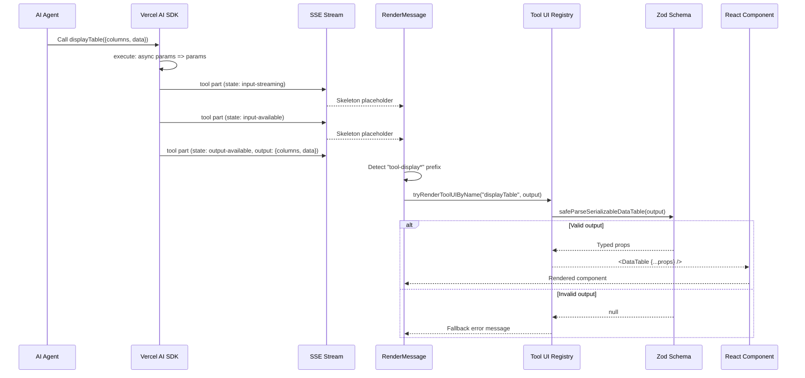
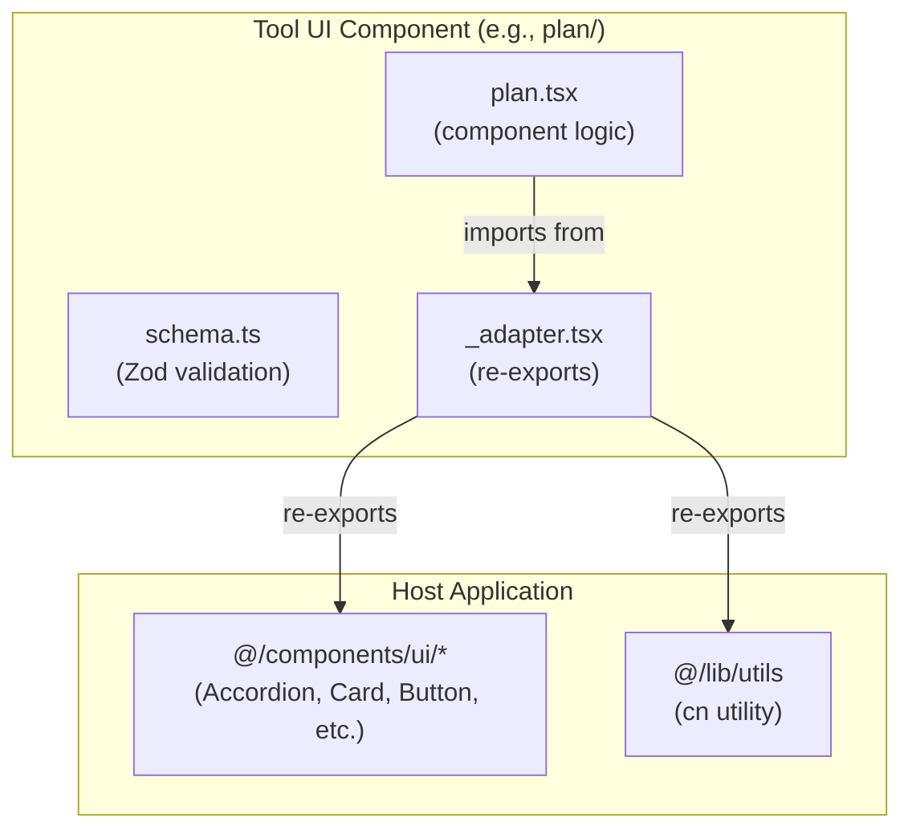
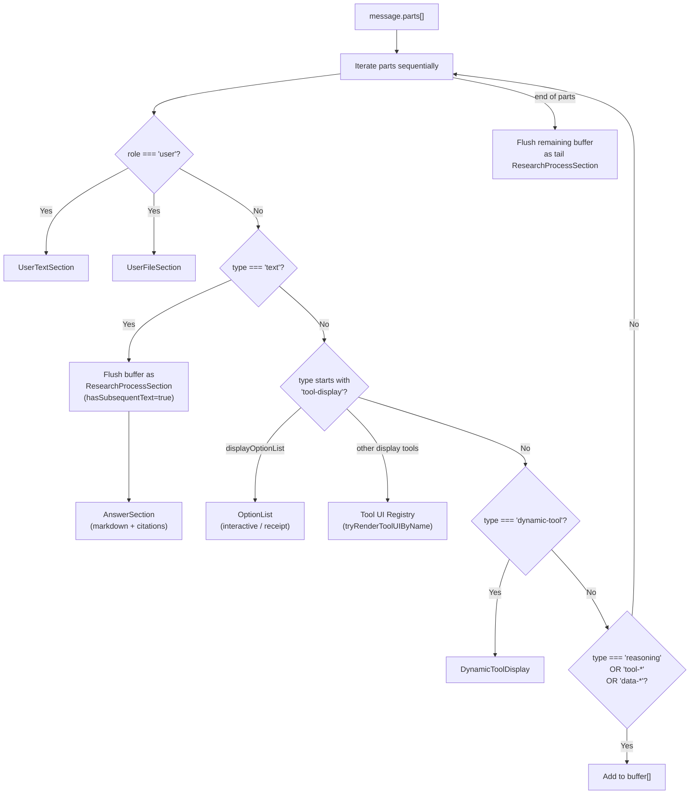
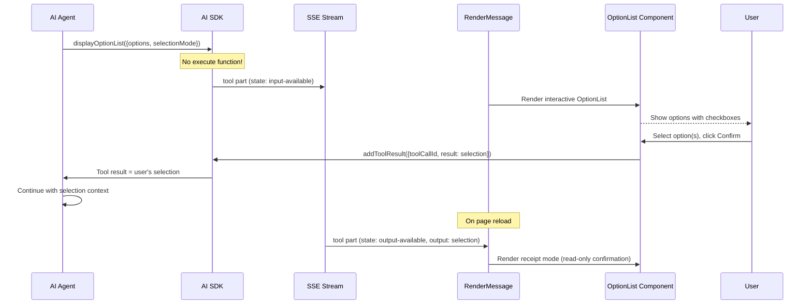
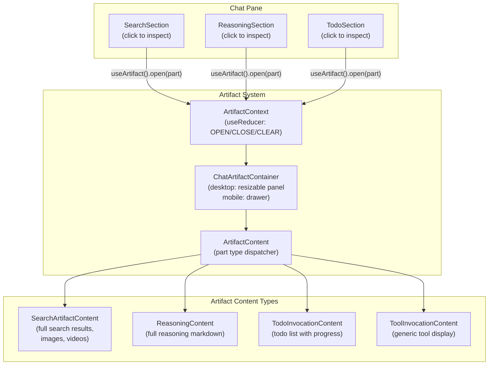

# Generative UI

This document describes the generative UI system in Polymorph — how AI tool invocations are transformed into rich, interactive React components rendered inline in the chat.

## Table of Contents

- [Overview](#overview)
- [End-to-End Rendering Pipeline](#end-to-end-rendering-pipeline)
- [Display Tools (Server)](#display-tools-server)
- [Tool UI Registry](#tool-ui-registry)
- [Adapter Pattern](#adapter-pattern)
- [Schema and Validation Layer](#schema-and-validation-layer)
- [Message Rendering Pipeline](#message-rendering-pipeline)
- [Display Tool Components](#display-tool-components)
- [Interactive Tool: OptionList](#interactive-tool-optionlist)
- [Dynamic Tool Display](#dynamic-tool-display)
- [Artifact / Inspector Panel](#artifact--inspector-panel)
- [Research Process Section](#research-process-section)
- [How to Add a New Generative UI Tool](#how-to-add-a-new-generative-ui-tool)
- [Key File Reference](#key-file-reference)
- [Future Capabilities](#future-capabilities)

---

## Overview

The generative UI system lets the AI agent produce structured data that renders as rich UI components (tables, charts, citations, plans, link previews, option lists, callouts, timelines) directly inside the chat conversation. The system is built around three core ideas:

1. **Display tools** — server-side AI tool definitions that accept structured input and pass it through as output (`execute: async params => params`). They exist purely to give the AI a schema to emit structured data.

2. **Tool UI registry** — a client-side component registry that maps tool names to React components, using Zod schemas to safely parse and validate tool output before rendering.

3. **Adapter pattern** — each tool UI component imports its host-specific dependencies (shadcn/ui components, utility functions) through a local `_adapter.tsx` file, keeping the component logic decoupled from the design system.

```mermaid
graph LR
    subgraph Server["Server (lib/tools/)"]
        Agent["AI Agent"]
        DisplayTool["Display Tool<br/>(displayTable, displayPlan, etc.)"]
    end

    subgraph Stream["SSE Stream"]
        ToolPart["tool-displayXxx part<br/>(input + output)"]
    end

    subgraph Client["Client (components/)"]
        RenderMsg["RenderMessage"]
        Registry["Tool UI Registry<br/>(tryRenderToolUIByName)"]
        Schema["Zod Schema<br/>(safeParseSerializableXxx)"]
        Component["React Component<br/>(DataTable, Plan, etc.)"]
    end

    Agent -->|"tool call"| DisplayTool
    DisplayTool -->|"params → params"| ToolPart
    ToolPart -->|"SSE"| RenderMsg
    RenderMsg -->|"tool-display* prefix"| Registry
    Registry -->|"validate"| Schema
    Schema -->|"typed props"| Component
```



---

## End-to-End Rendering Pipeline

This diagram shows the complete lifecycle of a generative UI element, from the AI agent invoking a display tool to the component appearing in the chat.



### State transitions during rendering

Each display tool part transitions through states as the AI SDK processes the tool call:

| State              | UI                                    | Duration  |
| ------------------ | ------------------------------------- | --------- |
| `input-streaming`  | Animated skeleton placeholder (pulse) | Brief     |
| `input-available`  | Animated skeleton placeholder (pulse) | Brief     |
| `output-available` | Full rendered component               | Permanent |
| `output-error`     | Error message (dashed border)         | Permanent |

Display tools transition quickly through these states since their `execute` function simply returns the input unchanged.

---

## Display Tools (Server)

Display tools are defined in `lib/tools/display-*.ts`. Each is a Vercel AI SDK `tool()` with a Zod input schema and a passthrough execute function.

### Design principle

Display tools do not perform any computation — they serve as a structured output channel for the AI agent. The agent fills in the schema, and the frontend renders it. This separation means the AI provides the data structure while the React components own all presentation logic.

### Tool definitions

| Tool                 | File                                | Description                          | Has `execute`? |
| -------------------- | ----------------------------------- | ------------------------------------ | :------------: |
| `displayPlan`        | `lib/tools/display-plan.ts`         | Step-by-step guides with status      |      Yes       |
| `displayTable`       | `lib/tools/display-table.ts`        | Sortable data tables with formatting |      Yes       |
| `displayChart`       | `lib/tools/display-chart.ts`        | Bar and line chart visualizations    |      Yes       |
| `displayCitations`   | `lib/tools/display-citations.ts`    | Rich source citation lists           |      Yes       |
| `displayLinkPreview` | `lib/tools/display-link-preview.ts` | Link preview cards                   |      Yes       |
| `displayOptionList`  | `lib/tools/display-option-list.ts`  | Interactive option lists             |       No       |
| `displayCallout`     | `lib/tools/display-callout.ts`      | Styled callout boxes                 |      Yes       |
| `displayTimeline`    | `lib/tools/display-timeline.ts`     | Chronological event timelines        |      Yes       |

All tools with `execute` use the same passthrough pattern:

```ts
execute: async params => params
```

**`displayOptionList`** is the exception — it has no `execute` function because it is a **frontend tool**. The AI sends the tool call input, the frontend renders an interactive option list, the user makes a selection, and `addToolResult` sends the selection back to the AI as the tool result.

### Schema example (displayTable)

The table tool defines a rich schema with column formatting options:

```ts
const FormatSchema = z.discriminatedUnion('kind', [
  z.object({ kind: z.literal('text') }),
  z.object({ kind: z.literal('number'), decimals: z.number().optional(), ... }),
  z.object({ kind: z.literal('currency'), currency: z.string(), ... }),
  z.object({ kind: z.literal('percent'), ... }),
  z.object({ kind: z.literal('date'), dateFormat: z.enum(['short', 'long', 'relative']).optional() }),
  z.object({ kind: z.literal('delta'), ... }),
  z.object({ kind: z.literal('boolean'), labels: ... }),
  z.object({ kind: z.literal('link'), hrefKey: ... }),
  z.object({ kind: z.literal('badge'), colorMap: ... }),
  z.object({ kind: z.literal('status'), statusMap: ... }),
  z.object({ kind: z.literal('array'), maxVisible: ... })
])
```

This allows the AI to specify exactly how each column should be formatted — currencies, percentages, status badges, links — and the DataTable component renders them accordingly.

**Source files:** [`lib/tools/display-plan.ts`](../lib/tools/display-plan.ts), [`lib/tools/display-table.ts`](../lib/tools/display-table.ts), [`lib/tools/display-chart.ts`](../lib/tools/display-chart.ts), [`lib/tools/display-citations.ts`](../lib/tools/display-citations.ts), [`lib/tools/display-link-preview.ts`](../lib/tools/display-link-preview.ts), [`lib/tools/display-option-list.ts`](../lib/tools/display-option-list.ts), [`lib/tools/display-callout.ts`](../lib/tools/display-callout.ts), [`lib/tools/display-timeline.ts`](../lib/tools/display-timeline.ts)

### Mode-specific tool availability

The researcher agent (`lib/agents/researcher.ts`) exposes different tools depending on the search mode:

| Tool                 | Chat Mode |        Research Mode        |
| -------------------- | :-------: | :-------------------------: |
| `search`             |    Yes    |             Yes             |
| `fetch`              |    Yes    |             Yes             |
| `displayPlan`        |    Yes    |             No              |
| `displayTable`       |    Yes    |             Yes             |
| `displayChart`       |    Yes    |             Yes             |
| `displayCitations`   |    Yes    |             Yes             |
| `displayLinkPreview` |    Yes    |             Yes             |
| `displayOptionList`  |    Yes    |             Yes             |
| `displayCallout`     |    Yes    |             Yes             |
| `displayTimeline`    |    Yes    |             Yes             |
| `todoWrite`          |    No     | Yes (when writer available) |

**Chat mode** (max 20 steps) uses forced optimized search and includes `displayPlan` for step-by-step guides. **Research mode** (max 50 steps) uses full search and enables `todoWrite` for task management when a writer is available.

### Shared base fields

All display tool schemas support optional base fields defined in `components/tool-ui/shared/schema.ts`:

| Field     | Type     | Description                                                                                                                         |
| --------- | -------- | ----------------------------------------------------------------------------------------------------------------------------------- |
| `id`      | `string` | Unique identifier for the component instance (`ToolUIIdSchema`)                                                                     |
| `role`    | `enum`   | Semantic role: `information`, `decision`, `control`, `state`, `composite` (`ToolUIRoleSchema`)                                      |
| `receipt` | `object` | Outcome tracking with `outcome` (success/partial/failed/cancelled), `summary`, `identifiers[]`, `timestamp` (`ToolUIReceiptSchema`) |

These base fields enable consistent identification, semantic classification, and outcome tracking across all generative UI components.

### Action system

Some display tools support an optional `actions[]` field for interactive buttons:

| Property       | Type      | Description                                                       |
| -------------- | --------- | ----------------------------------------------------------------- |
| `id`           | `string`  | Unique action identifier                                          |
| `label`        | `string`  | Button display text                                               |
| `variant`      | `enum`    | `default`, `destructive`, `outline`, `secondary`, `ghost`, `link` |
| `icon`         | `string`  | Optional Lucide icon name                                         |
| `disabled`     | `boolean` | Whether the action is disabled                                    |
| `shortcut`     | `string`  | Keyboard shortcut hint                                            |
| `confirmLabel` | `string`  | Confirmation text before executing                                |
| `sentence`     | `string`  | Natural language description sent back to the AI                  |

Currently supported on `OptionList` and extensible to other components via the shared `ActionSchema`.

---

## Tool UI Registry

The registry (`components/tool-ui/registry.tsx`) is the central mapping between tool names and their React component renderers. It exports three functions:

### `tryRenderToolUIByName(toolName, output)`

Primary lookup. First tries a direct name match, then falls back to schema probing.

```text
1. Find entry where entry.name === toolName
2. If found, call entry.tryRender(output)
3. If that returns a component, return it
4. Otherwise, fall back to tryRenderToolUI(output)
```

### `tryRenderToolUI(output)`

Iterates over all registered entries and returns the first successful schema match. This enables rendering even when the tool name is unknown (e.g., during database rehydration where only the output is available).

### `isRegisteredToolUI(toolName)`

Returns `true` if the tool name has a registered entry. Used by `DynamicToolDisplay` to decide whether to show the rich component or the generic tool debug view.

### Registry entries

Each entry has a `name` and a `tryRender` function that validates and renders:

```ts
const entries: ToolUIEntry[] = [
  {
    name: 'displayPlan',
    tryRender: output => {
      const parsed = safeParseSerializablePlan(output)
      if (!parsed) return null
      return <Plan {...parsed} />
    }
  },
  // ... displayTable, displayChart, displayCitations, displayLinkPreview, displayOptionList, displayCallout, displayTimeline
]
```

The `tryRender` pattern ensures that invalid or corrupted tool output gracefully returns `null` instead of crashing the UI.

**Source file:** [`components/tool-ui/registry.tsx`](../components/tool-ui/registry.tsx)

---

## Adapter Pattern

Each tool UI component directory contains an `_adapter.tsx` file that re-exports host-specific dependencies. This pattern decouples the tool UI components from the application's design system.



### Adapter contents by component

| Component       | Adapter re-exports                                                                       |
| --------------- | ---------------------------------------------------------------------------------------- |
| `plan/`         | Accordion, Card (Header/Content/Title/Description), Collapsible, `cn`                    |
| `data-table/`   | Accordion, Badge, Button, Table (all parts), Tooltip (all parts), `cn`                   |
| `chart/`        | Card (Header/Content/Title/Description), ChartContainer, ChartTooltip, ChartLegend, `cn` |
| `citation/`     | Popover (all parts), `cn`                                                                |
| `link-preview/` | `cn`                                                                                     |
| `option-list/`  | Button, Separator, `cn`                                                                  |
| `callout/`      | `cn`                                                                                     |
| `timeline/`     | `cn`                                                                                     |
| `shared/`       | Button, `cn`                                                                             |

### Why adapters?

The adapter pattern provides two benefits:

1. **Portability** — Tool UI components can be extracted into a shared package without carrying application-specific imports. A different host application would provide its own adapters.

2. **Single point of change** — If the host switches from shadcn/ui to a different component library, only the adapter files need to be updated.

**Source files:** `components/tool-ui/*/\_adapter.tsx`

---

## Schema and Validation Layer

Every tool UI component has a corresponding `schema.ts` that defines the Zod schema for its serializable props. The schema layer provides three things:

### 1. Contract definition

Each schema uses `defineToolUiContract` from `components/tool-ui/shared/contract.ts`:

```ts
const contract = defineToolUiContract('Plan', SerializablePlanSchema)
```

This creates a contract object with:

- `schema` — the Zod schema itself
- `parse(input)` — strict parse that throws on invalid input
- `safeParse(input)` — returns `null` on invalid input (used in the registry)

### 2. Serializable vs. runtime types

Each component distinguishes between serializable props (what comes from the AI) and runtime props (what the React component accepts):

- **Serializable** — JSON-safe, no callbacks, no `className`, no `ReactNode`. This is what the AI tool schema defines.
- **Runtime** — Adds `onChange`, `onAction`, `className`, and other interactive props.

For example, `OptionListProps` extends the serializable schema with `onChange`, `onAction`, and `className`.

### 3. Shared base schemas

All tool UI schemas share common base fields from `components/tool-ui/shared/schema.ts`:

| Schema                | Purpose                                             |
| --------------------- | --------------------------------------------------- |
| `ToolUIIdSchema`      | Unique identifier (`z.string().min(1)`)             |
| `ToolUIRoleSchema`    | Surface role (information, decision, control, etc.) |
| `ToolUIReceiptSchema` | Outcome metadata (success/partial/failed/cancelled) |
| `ActionSchema`        | Button action definition with variant and shortcut  |

**Source files:** [`components/tool-ui/shared/schema.ts`](../components/tool-ui/shared/schema.ts), [`components/tool-ui/shared/contract.ts`](../components/tool-ui/shared/contract.ts), `components/tool-ui/*/schema.ts`

---

## Message Rendering Pipeline

The `RenderMessage` component (`components/render-message.tsx`) is the central dispatcher that routes each message part to the appropriate UI component. It uses a **buffer-and-flush strategy** for assistant messages.



### Buffer-and-flush explained

The dispatcher maintains a buffer of non-text parts (reasoning, tool results, data parts). When a text part arrives:

1. The buffer is flushed as a `ResearchProcessSection` with `hasSubsequentText=true` (so it auto-collapses)
2. The text part renders as an `AnswerSection`

This produces an interleaved layout:

```text
[Research Process: search → fetch → reasoning]  ← collapsed
[Answer text with markdown and citations]
[Research Process: more searches]                ← collapsed
[More answer text]
[DisplayTable component]                         ← inline
[Final answer text]
```

### Display tool rendering

When the dispatcher encounters a part with a `tool-display*` type prefix:

1. It flushes any buffered parts first
2. For `displayOptionList`: renders the interactive `OptionList` component with `addToolResult` callback
3. For all other display tools: calls `tryRenderToolUIByName(toolName, output)` from the registry
4. During `input-streaming` and `input-available` states: shows an animated skeleton placeholder

### Display tool text suppression

When a display tool renders rich UI (table, timeline, callout, etc.), the agent is instructed to not duplicate its content in surrounding text. Two layers enforce this:

1. **Prompt instructions** — The system prompts tell the agent that the display tool IS the answer for the content it covers. Text after a display tool should only contain additional analysis, caveats, or a synthesizing conclusion — never a restatement of the tool's data.

2. **Frontend guard** — `RenderMessage` suppresses near-empty text parts adjacent to display tools. A text part is "near-empty" if it contains only whitespace or a bare markdown heading (e.g., `## React vs Vue`). If the previous or next part is a `tool-display*` part, the near-empty text part is skipped.

This guard is intentionally conservative: text parts with substantive content (full sentences, analysis, citations) always render regardless of adjacency to display tools. Old persisted messages are unaffected.

### AnswerSection

`AnswerSection` wraps `MarkdownMessage` which uses the `Streamdown` library for streaming-aware markdown rendering. It supports:

- GitHub-flavored markdown (tables, strikethrough)
- LaTeX math (KaTeX)
- Inline citations via custom `<Citing>` link component
- Citation maps that resolve `[n](#toolCallId)` references to actual URLs

**Source files:** [`components/render-message.tsx`](../components/render-message.tsx), [`components/answer-section.tsx`](../components/answer-section.tsx), [`components/message.tsx`](../components/message.tsx)

---

## Display Tool Components

### Plan (`components/tool-ui/plan/`)

A visual step-by-step guide with status indicators and progress tracking.

**Props:** `id`, `title`, `description`, `todos[]` (each with `id`, `label`, `status`, optional `description`), `maxVisibleTodos`

**Status types:** `pending` | `in_progress` | `completed` | `cancelled`

**Features:**

- Progress bar with percentage calculation
- Celebration animation when progress crosses thresholds
- Staggered entrance animations for new items
- Collapsible step descriptions
- Accordion for overflow items (shows first 4, collapses rest)
- `Plan.Compact` variant without header/progress bar

### DataTable (`components/tool-ui/data-table/`)

A sortable data table with rich column formatting and responsive layout.

**Props:** `id`, `columns[]` (key, label, format, sortable, align, `abbr`, `width`, `truncate`, `hideOnMobile`, `priority`), `data[]`, `rowIdKey`, `defaultSort`

**Format kinds:** `text`, `number`, `currency`, `percent`, `date`, `delta`, `boolean`, `link`, `badge`, `status`, `array`

**Features:**

- Three-state sort cycling (ascending -> descending -> unsorted)
- Container query responsive layout (`auto` switches between table and cards at `@md`)
- Mobile card view with accordion expand for secondary columns
- Column priority system (`primary`, `secondary`, `tertiary`) for mobile
- Accessibility: sort announcements, ARIA roles, keyboard navigation

**Compound components:** `DataTable`, `DataTable.Table` (forced table), `DataTable.Cards` (forced cards), `DataTable.Provider` (headless)

### Chart (`components/tool-ui/chart/`)

A data visualization component supporting bar and line charts via Recharts.

**Props:** `id`, `type` (bar/line), `title`, `description`, `data[]`, `xKey`, `series[]` (key, label, color), `colors[]`, `showLegend`, `showGrid`

**Features:**

- Bar and line chart types with automatic axis configuration
- Multiple data series with configurable color palette
- Individual series color overrides via `series[].color`
- Grid lines and legend support (configurable via `showGrid`, `showLegend`)
- Interactive tooltips via `ChartTooltip`
- Clickable data points with `onDataPointClick` callback (client-only prop)
- Card wrapper with optional title and description
- Schema validation with `superRefine` (rejects duplicate series keys, validates `xKey` and series keys exist in every data row, ensures Y-values are finite numbers or null)

### CitationList (`components/tool-ui/citation/`)

A list of source citations with metadata and navigation.

**Props:** `id`, `citations[]` (each with `id`, `href`, `title`, `snippet`, `domain`, `favicon`, `type`, `author`, `publishedAt`, `locale`)

**Citation types:** `webpage`, `document`, `article`, `api`, `code`, `other`

**Variants:**

- `default` — full cards with metadata, best for 3-6 sources where each needs visibility
- `inline` — compact badges that wrap in text flow, best for many inline references
- `stacked` — overlapping favicon circles with popover, best for compact source attribution

**Features:**

- Overflow indicator with popover for truncated lists
- Hover popover with delay for browsing
- Type-specific icons (Globe, FileText, Newspaper, etc.)
- Safe navigation href sanitization

### LinkPreview (`components/tool-ui/link-preview/`)

A rich link preview card with image, title, and description.

**Props:** `id`, `href`, `title`, `description`, `image`, `domain`, `favicon`, `createdAt`, `locale`, `ratio`, `fit`

**Features:**

- Aspect ratio options (16:9, 4:3, 1:1, auto)
- Image fit modes (cover, contain, fill)
- Hover scale animation on image
- Keyboard accessible (Enter/Space to navigate)
- Href sanitization for security

### Callout (`components/tool-ui/callout/`)

A styled callout box for highlighting critical information with variant-specific iconography and color.

**Props:** `id`, `variant`, `title` (optional), `content`

**Variants:** `info` | `warning` | `tip` | `success` | `error` | `definition`

**Features:**

- Variant-specific Lucide icons (Info, AlertTriangle, Lightbulb, CheckCircle2, XCircle, BookOpen)
- Color theming per variant with dark mode support
- Accessible `<aside role="note">` semantic HTML
- Concise — encourages 1-3 sentence content

### Timeline (`components/tool-ui/timeline/`)

A vertical chronological timeline of events with category-specific styling.

**Props:** `id`, `title`, `description` (optional), `events[]` (each with `id`, `date`, `title`, optional `description`, optional `category`)

**Event categories:** `milestone` | `event` | `release` | `announcement` | `default`

**Features:**

- Category-specific Lucide icons (Star, Calendar, Package, Megaphone, Flag)
- Color theming per category with dark mode support
- Connecting lines between events
- Date badges with category-colored backgrounds
- Accessible `<section>` + `<ol>` semantic HTML
- Schema validation with `superRefine` (rejects duplicate event IDs)

### OptionList (`components/tool-ui/option-list/`)

An interactive option list that pauses the AI conversation for user input.

**Props:** `id`, `options[]`, `selectionMode` (single/multi), `minSelections`, `maxSelections`, `actions[]`

**Features:**

- Single and multi-select modes with radio/checkbox indicators
- Full keyboard navigation (Arrow keys, Home/End, Enter/Space, Escape)
- ARIA listbox semantics
- Configurable action buttons (default: Clear + Confirm)
- **Receipt mode** — after selection, renders as a read-only confirmation card
- Max selection enforcement (locks unselected options when limit reached)

**Interactive flow:**

1. AI calls `displayOptionList` (no `execute` function)
2. Frontend renders interactive OptionList with `addToolResult` callback
3. User selects option(s) and clicks Confirm
4. `addToolResult({ toolCallId, result: selection })` sends result back to AI
5. AI continues with the user's selection
6. On reload, the component renders in receipt mode showing the confirmed selection

---

## Interactive Tool: OptionList

The `displayOptionList` tool is unique because it is a **client-resolved tool** — the AI sends the tool call but the frontend resolves it via user interaction.



**Source files:** [`lib/tools/display-option-list.ts`](../lib/tools/display-option-list.ts), [`components/tool-ui/option-list/option-list.tsx`](../components/tool-ui/option-list/option-list.tsx)

---

## Dynamic Tool Display

The `DynamicToolDisplay` component (`components/dynamic-tool-display.tsx`) handles MCP tools and runtime-defined tools that are not part of the built-in tool UI registry.

### Behavior

1. If the tool name is registered in the Tool UI registry (`isRegisteredToolUI`): renders the rich component for `output-available`, skeleton for streaming states
2. If the tool name is NOT registered: renders a generic debug view showing tool type, display name, input/output JSON, and status indicator

### Tool name conventions

| Prefix      | Type         | Display name transformation          |
| ----------- | ------------ | ------------------------------------ |
| `mcp__`     | MCP Tool     | Remove prefix, replace `__` with `.` |
| `dynamic__` | Dynamic Tool | Remove prefix                        |
| (other)     | Custom Tool  | Use as-is                            |

### State indicators

- `input-streaming` — blue pulsing dot, "Streaming..."
- `input-available` — blue dot, "Processing..."
- `output-available` — green dot, "Complete"
- `output-error` — red dot, "Failed" with error text

**Source file:** [`components/dynamic-tool-display.tsx`](../components/dynamic-tool-display.tsx)

---

## Artifact / Inspector Panel

The artifact system provides a detail panel that opens when users click on research process items (search results, reasoning, todo lists). It is separate from the display tool system — it shows expanded views of core tool results rather than generative UI components.



### Architecture

- **`ArtifactRoot`** wraps the chat in `ArtifactProvider` + `ChatArtifactContainer`
- **`ArtifactContext`** uses `useReducer` with three actions: `OPEN` (set part + show), `CLOSE` (hide), `CLEAR_CONTENT` (delayed cleanup after animation)
- **`ChatArtifactContainer`** renders differently per viewport:
  - **Desktop:** side-by-side panels with a draggable resize handle (320px min, 800px max, 500px default). Width persists to localStorage.
  - **Mobile:** full-width drawer overlay via `InspectorDrawer`
- **Mutual exclusion** with sidebar: opening the artifact closes the sidebar and vice versa

### Content dispatch

`ArtifactContent` dispatches based on `part.type`:

| Part type          | Component                                         | Content shown                                 |
| ------------------ | ------------------------------------------------- | --------------------------------------------- |
| `tool-search`      | `ToolInvocationContent` → `SearchArtifactContent` | Search results with source links and snippets |
| `tool-fetch`       | `ToolInvocationContent`                           | Generic tool display                          |
| `tool-askQuestion` | `ToolInvocationContent`                           | Generic tool display                          |
| `tool-todoWrite`   | `TodoInvocationContent`                           | Todo list with progress                       |
| `reasoning`        | `ReasoningContent`                                | Full reasoning text as markdown               |

**Source files:** [`components/artifact/artifact-root.tsx`](../components/artifact/artifact-root.tsx), [`components/artifact/artifact-context.tsx`](../components/artifact/artifact-context.tsx), [`components/artifact/artifact-content.tsx`](../components/artifact/artifact-content.tsx), [`components/artifact/chat-artifact-container.tsx`](../components/artifact/chat-artifact-container.tsx)

---

## Research Process Section

The `ResearchProcessSection` component (`components/research-process-section.tsx`) renders the collapsible research steps (reasoning, search results, fetch results, todo updates, data parts) that appear between answer sections.

### Grouping logic

1. **`splitByText`** — splits parts into segments at text boundaries
2. **`groupConsecutiveParts`** — groups consecutive tool parts of the same type together
3. Single-item groups get standalone collapsible styling; multi-item groups get grouped accordion styling

### Auto-collapse behavior

- Segments with 5+ parts get a parent collapsible ("Research Process (N steps)")
- When text generation starts (`hasSubsequentText=true`), the parent auto-collapses
- Users can override by clicking

### Part rendering

Each part is dispatched via `RenderPart`:

| Part type   | Component          | Behavior                                    |
| ----------- | ------------------ | ------------------------------------------- |
| `reasoning` | `ReasoningSection` | Collapsible with preview text, inspect link |
| `tool-*`    | `ToolSection`      | Collapsible tool result                     |
| `data-*`    | `DataSection`      | Data display (related questions, etc.)      |

**Source file:** [`components/research-process-section.tsx`](../components/research-process-section.tsx)

---

## How to Add a New Generative UI Tool

Follow these steps to add a new display tool (e.g., `displayTimeline`):

### Step 1: Define the server-side tool

Create `lib/tools/display-timeline.ts`:

```ts
import { tool } from 'ai'
import { z } from 'zod'

const DisplayTimelineSchema = z.object({
  id: z.string().min(1).describe('Unique identifier for this timeline'),
  title: z.string().describe('Timeline title'),
  events: z
    .array(
      z.object({
        date: z.string().describe('Date or time label'),
        title: z.string().describe('Event title'),
        description: z.string().optional().describe('Event details')
      })
    )
    .min(1)
    .describe('Timeline events in chronological order')
})

export const displayTimelineTool = tool({
  description:
    'Display a timeline of events. Use when presenting chronological sequences, project milestones, or historical events.',
  inputSchema: DisplayTimelineSchema,
  execute: async params => params
})
```

### Step 2: Create the component directory

Create the following files under `components/tool-ui/timeline/`:

**`_adapter.tsx`** — re-export host dependencies:

```tsx
export { Card, CardContent, CardHeader, CardTitle } from '@/components/ui/card'
export { cn } from '@/lib/utils'
```

**`schema.ts`** — define the serializable schema and contract:

```ts
import { z } from 'zod'
import { defineToolUiContract } from '../shared/contract'
import { ToolUIIdSchema } from '../shared/schema'

export const SerializableTimelineSchema = z.object({
  id: ToolUIIdSchema,
  title: z.string().min(1),
  events: z
    .array(
      z.object({
        date: z.string(),
        title: z.string(),
        description: z.string().optional()
      })
    )
    .min(1)
})

export type SerializableTimeline = z.infer<typeof SerializableTimelineSchema>

const contract = defineToolUiContract('Timeline', SerializableTimelineSchema)
export const parseSerializableTimeline = contract.parse
export const safeParseSerializableTimeline = contract.safeParse
```

**`timeline.tsx`** — the React component:

```tsx
'use client'
import { Card, CardContent, CardHeader, CardTitle, cn } from './_adapter'
import type { SerializableTimeline } from './schema'

export function Timeline({
  id,
  title,
  events,
  className
}: SerializableTimeline & { className?: string }) {
  return (
    <Card
      className={cn('w-full max-w-xl', className)}
      data-tool-ui-id={id}
      data-slot="timeline"
    >
      <CardHeader>
        <CardTitle>{title}</CardTitle>
      </CardHeader>
      <CardContent>{/* Your timeline rendering logic */}</CardContent>
    </Card>
  )
}
```

### Step 3: Register in the Tool UI registry

Add the entry to `components/tool-ui/registry.tsx`:

```tsx
import { Timeline } from './timeline/timeline'
import { safeParseSerializableTimeline } from './timeline/schema'

// Add to the entries array:
{
  name: 'displayTimeline',
  tryRender: output => {
    const parsed = safeParseSerializableTimeline(output)
    if (!parsed) return null
    return <Timeline {...parsed} />
  }
}
```

### Step 4: Add the tool to the agent

In `lib/agents/researcher.ts`, add the tool to the active tools for the desired mode(s):

```ts
import { displayTimelineTool } from '@/lib/tools/display-timeline'

// In the tools object:
displayTimeline: displayTimelineTool

// In the activeTools array for chat/research mode:
activeTools: [...existingTools, 'displayTimeline']
```

### Step 5: Verify

1. Run `bun typecheck` to ensure type safety
2. Run `bun dev` and test by prompting the AI to create a timeline
3. Verify the component renders during streaming (skeleton) and after completion (full component)
4. Verify the component handles invalid output gracefully (returns null, shows fallback)

---

## Key File Reference

### Display tools (server)

| File                                | Purpose                                 |
| ----------------------------------- | --------------------------------------- |
| `lib/tools/display-plan.ts`         | Plan tool definition + schema           |
| `lib/tools/display-table.ts`        | DataTable tool definition + schema      |
| `lib/tools/display-chart.ts`        | Chart tool definition + schema          |
| `lib/tools/display-citations.ts`    | Citations tool definition + schema      |
| `lib/tools/display-link-preview.ts` | LinkPreview tool definition + schema    |
| `lib/tools/display-option-list.ts`  | OptionList tool definition (no execute) |
| `lib/tools/display-callout.ts`      | Callout tool definition + schema        |
| `lib/tools/display-timeline.ts`     | Timeline tool definition + schema       |

### Tool UI components (client)

| File                                               | Purpose                              |
| -------------------------------------------------- | ------------------------------------ |
| `components/tool-ui/registry.tsx`                  | Central tool name -> component map   |
| `components/tool-ui/plan/plan.tsx`                 | Plan component with progress         |
| `components/tool-ui/plan/schema.ts`                | Plan Zod schema + contract           |
| `components/tool-ui/data-table/data-table.tsx`     | DataTable with sort + responsive     |
| `components/tool-ui/data-table/schema.ts`          | DataTable Zod schema + contract      |
| `components/tool-ui/data-table/formatters.tsx`     | Column value formatting              |
| `components/tool-ui/chart/chart.tsx`               | Chart component (bar/line)           |
| `components/tool-ui/chart/schema.ts`               | Chart Zod schema + contract          |
| `components/tool-ui/citation/citation-list.tsx`    | CitationList with variants           |
| `components/tool-ui/citation/schema.ts`            | Citation Zod schema + contract       |
| `components/tool-ui/link-preview/link-preview.tsx` | LinkPreview card                     |
| `components/tool-ui/link-preview/schema.ts`        | LinkPreview Zod schema + contract    |
| `components/tool-ui/option-list/option-list.tsx`   | Interactive OptionList               |
| `components/tool-ui/option-list/schema.ts`         | OptionList Zod schema + contract     |
| `components/tool-ui/callout/callout.tsx`           | Callout component with variants      |
| `components/tool-ui/callout/schema.ts`             | Callout Zod schema + contract        |
| `components/tool-ui/timeline/timeline.tsx`         | Timeline component with events       |
| `components/tool-ui/timeline/schema.ts`            | Timeline Zod schema + contract       |
| `components/tool-ui/shared/schema.ts`              | Shared base schemas (id, role, etc.) |
| `components/tool-ui/shared/contract.ts`            | `defineToolUiContract` helper        |
| `components/tool-ui/*/_adapter.tsx`                | Host dependency adapters             |

### Rendering pipeline

| File                                      | Purpose                             |
| ----------------------------------------- | ----------------------------------- |
| `components/render-message.tsx`           | Part-type dispatcher (buffer/flush) |
| `components/dynamic-tool-display.tsx`     | MCP/dynamic tool renderer           |
| `components/answer-section.tsx`           | Answer text with markdown + actions |
| `components/message.tsx`                  | Streaming markdown via Streamdown   |
| `components/research-process-section.tsx` | Collapsible research steps          |
| `components/reasoning-section.tsx`        | Reasoning display with preview      |

### Artifact / Inspector

| File                                              | Purpose                                        |
| ------------------------------------------------- | ---------------------------------------------- |
| `components/artifact/artifact-root.tsx`           | Provider + container wrapper                   |
| `components/artifact/artifact-context.tsx`        | React context with open/close state            |
| `components/artifact/artifact-content.tsx`        | Part type -> content dispatcher                |
| `components/artifact/chat-artifact-container.tsx` | Resizable desktop + mobile drawer              |
| `components/artifact/tool-invocation-content.tsx` | Tool part dispatcher (search, fetch, question) |
| `components/artifact/search-artifact-content.tsx` | Full search results view                       |
| `components/artifact/reasoning-content.tsx`       | Full reasoning markdown view                   |
| `components/artifact/todo-invocation-content.tsx` | Todo list detail view                          |
| `components/inspector/inspector-panel.tsx`        | Panel chrome with icon + close                 |

### Types

| File                         | Purpose                          |
| ---------------------------- | -------------------------------- |
| `lib/types/dynamic-tools.ts` | DynamicToolPart type definitions |

---

## Future Capabilities

Polymorph's generative UI system is designed to expand beyond research. Planned display components include:

- **Code Artifacts** — Live code rendering with syntax highlighting and execution previews
- **Image Generation** — Display components for AI-generated images with variant selection
- **Multimodal Input/Output** — Components for handling mixed media (text, images, audio, video)
- **Website Previews** — Interactive iframe-based previews for generated web content
