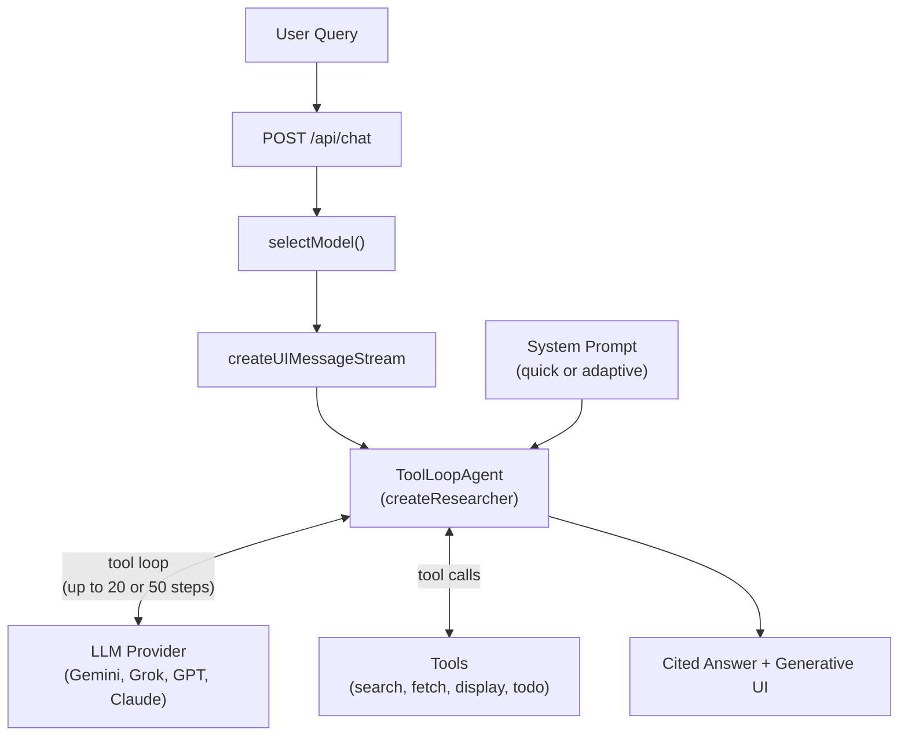
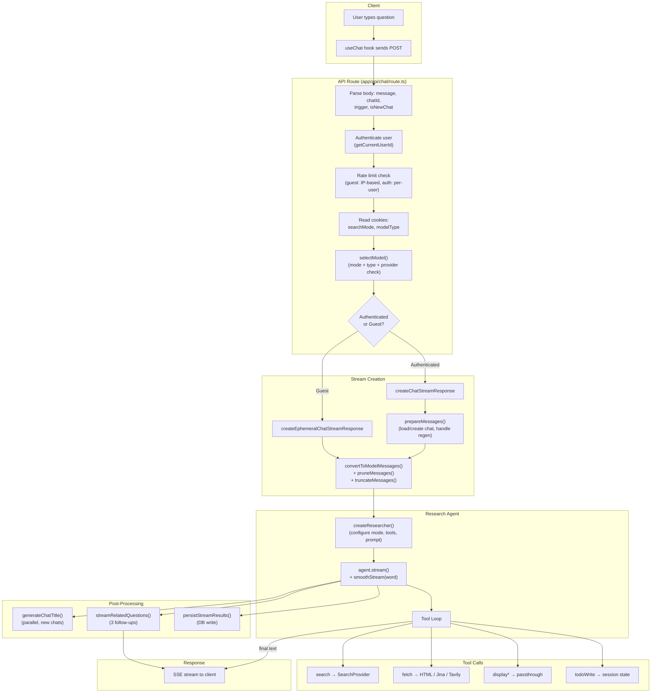
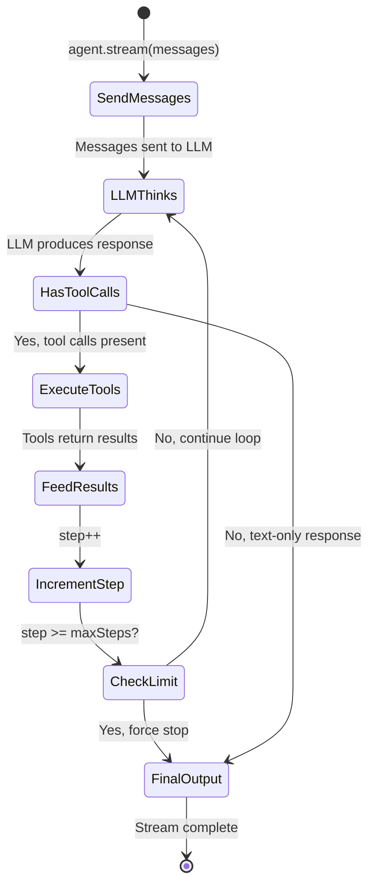
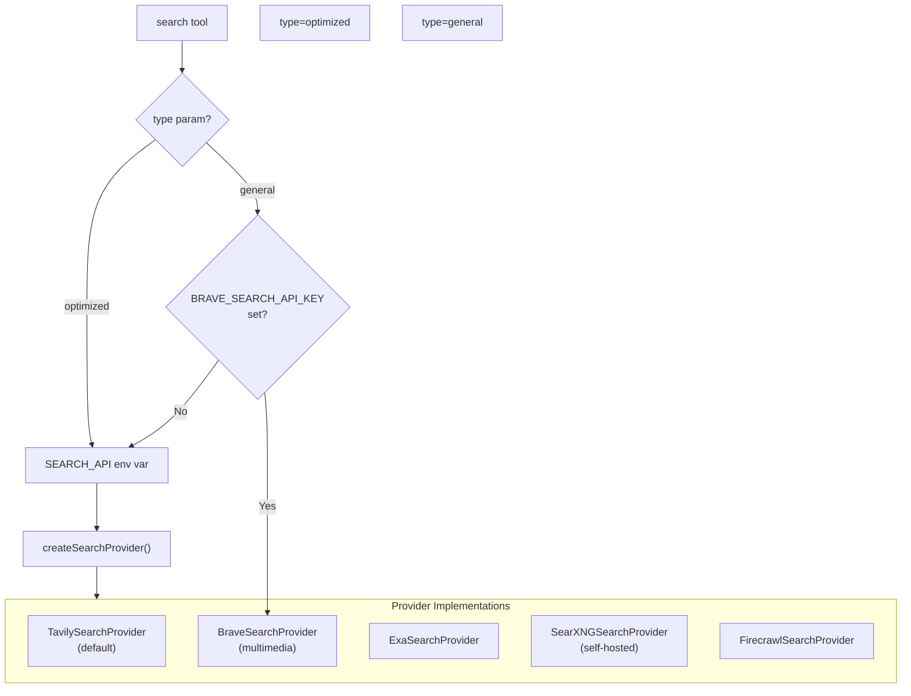
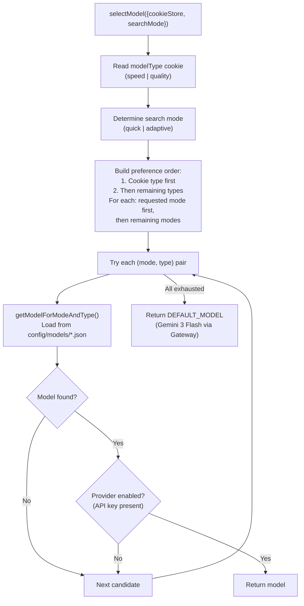

# Research Agent

This document provides a deep technical reference for the research agent system in Vana v2 — the agentic pipeline that transforms a user's question into a multi-source, cited answer with rich generative UI. It covers the ToolLoopAgent pattern, search modes, the tool system, search providers, model selection, context window management, streaming integration, and how to extend the agent.

## Table of Contents

- [Overview](#overview)
- [End-to-End Pipeline](#end-to-end-pipeline)
- [The ToolLoopAgent Pattern](#the-toolloopagent-pattern)
- [Search Modes](#search-modes)
- [Tool System](#tool-system)
- [Search Providers](#search-providers)
- [Model Selection](#model-selection)
- [Context Window Management](#context-window-management)
- [Streaming Integration](#streaming-integration)
- [Auxiliary Agents](#auxiliary-agents)
- [Extending the Agent](#extending-the-agent)
- [Key Files](#key-files)

---

## Overview

The research agent is the core intelligence of Vana v2. When a user submits a question, the agent autonomously plans a research strategy, executes web searches, fetches page content, tracks progress through tasks, and synthesizes findings into a cited answer with inline generative UI components (tables, citations, plans, link previews, option lists).

The agent is built on the Vercel AI SDK's `ToolLoopAgent` — a construct that runs an LLM in a loop, allowing it to call tools repeatedly until it decides to produce a final answer or hits a step limit. Two operating modes (quick and adaptive) control the agent's behavior, tool availability, and depth of research.



**Source file:** [`lib/agents/researcher.ts`](../lib/agents/researcher.ts)

---

## End-to-End Pipeline

This section traces a single user query from HTTP request to streamed response, showing every system it passes through.



### Pipeline Steps

1. **HTTP Request**: The client sends `POST /api/chat` with the user's message, chat ID, trigger type, and search mode/model type from cookies.

2. **Authentication & Rate Limiting**: The API route authenticates the user via Supabase. Guest users are rate-limited by IP (Upstash Redis); authenticated users by overall chat limits. Guest users and cloud deployments are forced to `modelType=speed`.

3. **Model Selection**: `selectModel()` reads cookie preferences for model type (`speed` or `quality`) and search mode (`quick` or `adaptive`), looks up the model in `config/models/*.json`, and verifies the provider is enabled (API key present). Falls back to Gemini 3 Flash via Gateway.

4. **Stream Dispatch**: Authenticated users go through `createChatStreamResponse` (with DB persistence and title generation); guests go through `createEphemeralChatStreamResponse` (stateless).

5. **Message Preparation**: Conversation history is loaded, converted to model messages, pruned (old reasoning/tool calls removed), and truncated to fit the model's context window.

6. **Agent Creation**: `createResearcher()` instantiates a `ToolLoopAgent` with the appropriate system prompt, tool set, and step limit based on search mode.

7. **Tool Loop Execution**: The LLM reasons about the query and calls tools (search, fetch, display, todo). Each tool call and result is streamed to the client in real time. The loop continues until the agent produces a final text answer or hits the step limit.

8. **Post-Processing**: Title generation (new chats, parallel), related questions (streamed after the main answer), and database persistence (in `onFinish` callback) run concurrently or after the main stream.

---

## The ToolLoopAgent Pattern

The `ToolLoopAgent` from the Vercel AI SDK (`ai` package) is the central abstraction. It wraps a language model with a set of tools and runs in a loop: the LLM produces output, and if that output includes tool calls, the tools are executed and their results fed back into the LLM for the next iteration.

### How It Works



### Configuration

The `createResearcher` function in [`lib/agents/researcher.ts`](../lib/agents/researcher.ts) configures the agent with:

```typescript
const agent = new ToolLoopAgent({
  model: getModel(model), // Resolved LLM from provider registry
  instructions: systemPrompt, // Mode-specific prompt + current date
  tools, // All available tools
  activeTools: activeToolsList, // Subset enabled for this mode
  stopWhen: stepCountIs(maxSteps), // 20 (quick) or 50 (adaptive)
  providerOptions, // Model-specific options (if any)
  experimental_telemetry // Langfuse tracing config
})
```

Key concepts:

- **`tools`**: The full set of tools the agent knows about. All tools are always defined in the tools object regardless of mode.
- **`activeTools`**: A subset of tool names that the agent can actually invoke. This is what differs between modes.
- **`stopWhen`**: A predicate that terminates the loop. `stepCountIs(N)` stops after N tool-call rounds.
- **`instructions`**: The system prompt that shapes the agent's behavior, injected with the current date/time.

### Invocation

The agent is invoked via `stream()`, which returns a streamable result:

```typescript
const result = await researchAgent.stream({
  messages: modelMessages,
  abortSignal,
  experimental_transform: smoothStream({ chunking: 'word' })
})
result.consumeStream()
writer.merge(result.toUIMessageStream({ messageMetadata }))
```

- `smoothStream({ chunking: 'word' })` buffers LLM output and re-emits at word boundaries for a natural typing effect.
- `consumeStream()` starts consuming the stream (required for side effects).
- `toUIMessageStream()` converts the agent's output into UI message stream events.
- `writer.merge()` pipes these events into the SSE response.

---

## Search Modes

The agent operates in one of two modes, selected by the user via a cookie preference. Each mode has a distinct system prompt, tool set, step limit, and behavioral philosophy.

### Quick Mode

**Purpose:** Fast, focused answers. Optimized for simple questions that need 1-3 searches.

| Property          | Value                                                 |
| ----------------- | ----------------------------------------------------- |
| Max steps         | 20                                                    |
| Search type       | Forced `optimized` (via `wrapSearchToolForQuickMode`) |
| Target tool calls | ~5                                                    |
| `todoWrite`       | Not available                                         |
| `displayPlan`     | Available                                             |

**How search wrapping works:** In quick mode, the search tool is wrapped by `wrapSearchToolForQuickMode()`, which intercepts every call and forces `type: 'optimized'` regardless of what the LLM requests. This ensures the agent always gets content snippets directly from the search provider (Tavily/Exa) rather than needing to fetch pages separately.

**System prompt behavior:**

- Instructs the agent to complete research within ~5 tool calls
- Defines early stop criteria (sufficient info, converging results, diminishing returns)
- Directs the agent to start with search immediately (no text preamble)
- Prohibits use of fetch on search results (only on user-provided URLs)
- Requires all responses to use inline citations `[number](#toolCallId)`

**Active tools:** `search`, `fetch`, `displayPlan`, `displayTable`, `displayCitations`, `displayLinkPreview`, `displayOptionList`

### Adaptive Mode

**Purpose:** Thorough, multi-step research. For complex queries that need systematic investigation.

| Property          | Value                           |
| ----------------- | ------------------------------- |
| Max steps         | 50                              |
| Search type       | Full (general + optimized)      |
| Target tool calls | ~20                             |
| `todoWrite`       | Available (when writer present) |
| `displayPlan`     | Not in `activeTools`            |

**System prompt behavior:**

- Assesses query complexity first (simple, medium, complex)
- For 5+ aspects, strongly recommends `todoWrite` for structured planning
- Supports both `type: 'optimized'` (content snippets) and `type: 'general'` (for news, videos, images via Brave)
- Encourages multiple searches from different angles
- Allows fetching top 2-3 sources for deeper content analysis

**Active tools:** `search`, `fetch`, `displayTable`, `displayCitations`, `displayLinkPreview`, `displayOptionList`, `todoWrite` (conditional)

### Mode Comparison

| Aspect                       | Quick                        | Adaptive                              |
| ---------------------------- | ---------------------------- | ------------------------------------- |
| Step limit                   | 20                           | 50                                    |
| Search types                 | `optimized` only (forced)    | `optimized` + `general`               |
| Task planning                | No (`todoWrite` unavailable) | Yes (`todoWrite` available)           |
| `displayPlan`                | Available                    | Not in active tools                   |
| Fetch from search results    | Discouraged by prompt        | Encouraged for top sources            |
| Target efficiency            | ~5 tool calls                | ~20 tool calls                        |
| Prompt complexity assessment | No                           | Yes (simple/medium/complex)           |
| Early stop criteria          | 4 criteria                   | 5 criteria (includes todo completion) |

### `askQuestion` Tool

The `askQuestion` tool is defined in the tools object but is **not** in either mode's `activeTools` list. It exists as a clarifying question mechanism with frontend confirmation (no server-side `execute` function). It is registered but not actively enabled for either mode.

---

## Tool System

The agent's tools fall into two categories: **core tools** that perform actual operations and **display tools** that render rich UI components.

### Core Tools

#### `search` — Multi-provider web search

**Source:** [`lib/tools/search.ts`](../lib/tools/search.ts)

Uses the `async *execute` generator pattern to stream intermediate states to the client:

1. Yields `{ state: 'searching', query }` immediately (shows loading spinner)
2. Selects search provider based on `SEARCH_API` env var and `type` parameter
3. Executes search with configured provider
4. Builds citation mapping (`citationMap`) and attaches `toolCallId` from context
5. Yields `{ state: 'complete', ...searchResults }` with results, images, and citation map

**Parameters:**

- `query` (required): Search query string
- `type` (`'optimized'` | `'general'`): Provider routing (default: `'optimized'`)
- `content_types` (`['web', 'video', 'image', 'news']`): Content filtering (Brave only)
- `max_results` (default: 20, minimum enforced: 10)
- `search_depth` (`'basic'` | `'advanced'`): Search depth
- `include_domains` / `exclude_domains`: Domain filtering

#### `fetch` — Web content extraction

**Source:** [`lib/tools/fetch.ts`](../lib/tools/fetch.ts)

Also uses the streaming generator pattern. Has two fetch strategies:

| Strategy  | Type param            | Use case                | Details                                                            |
| --------- | --------------------- | ----------------------- | ------------------------------------------------------------------ |
| Regular   | `'regular'` (default) | Standard web pages      | Direct HTTP fetch, HTML tag stripping, 50k char limit, 10s timeout |
| API-based | `'api'`               | PDFs, JS-rendered pages | Jina Reader (if `JINA_API_KEY`) or Tavily Extract (fallback)       |

**Regular fetch processing:**

1. Fetches URL with 10-second timeout
2. Validates content type (text/html or text/plain)
3. Strips `<script>` and `<style>` tags
4. Replaces `` tags with `[IMAGE: alt]` markers
5. Removes all remaining HTML tags
6. Truncates to 50,000 characters

#### `askQuestion` — Clarifying questions

**Source:** [`lib/tools/question.ts`](../lib/tools/question.ts)

Has **no server-side execute function**. When the agent calls this tool, the tool call is streamed to the client, and the frontend renders an interactive question UI. The user's response is sent back via `addToolResult` (Vercel AI SDK's frontend tool confirmation pattern).

#### `todoWrite` — Research task tracking

**Source:** [`lib/tools/todo.ts`](../lib/tools/todo.ts)

Session-scoped task management. Each `createTodoTools()` call creates an isolated closure with its own todo state.

**Key behaviors:**

- First call initializes the task list
- Subsequent calls merge by **content matching** (case-insensitive): sending a todo with the same content as an existing one updates its status rather than creating a duplicate
- Returns `{ completedCount, totalCount, todos }` for progress tracking
- New todos without explicit status default to `'pending'`

**Workflow pattern in the agent:**

1. CREATE: Call with all tasks as first action
2. UPDATE: Send only changed tasks (unchanged ones are preserved)
3. FINALIZE: Mark all tasks completed before writing final answer

### Display Tools

All display tools share a common pattern: they accept structured input, validate it with Zod schemas, and return the input as output (`execute: async params => params`). The actual rendering happens in the frontend via `components/tool-ui/registry.tsx`.

| Tool                 | Purpose                                     | Key input fields                                      | Trigger examples                                |
| -------------------- | ------------------------------------------- | ----------------------------------------------------- | ----------------------------------------------- |
| `displayPlan`        | Step-by-step guides and how-to checklists   | `id`, `title`, `todos[]` with `id`, `label`, `status` | "how to deploy to AWS", "steps to learn Python" |
| `displayTable`       | Sortable data tables with formatted columns | `columns[]` with `key`, `label`, `format`, `data[]`   | "compare React vs Vue", "GPU benchmarks"        |
| `displayCitations`   | Rich source citation cards                  | `citations[]` with `id`, `href`, `title`, `snippet`   | "best resources for learning Rust"              |
| `displayLinkPreview` | Single featured link card                   | `id`, `href`, `title`, `description`, `image`         | "where are the React docs"                      |
| `displayOptionList`  | Interactive option selector                 | `id`, `options[]` with `id`, `label`, `description`   | "which database should I use"                   |

**`displayOptionList`** is unique: it has no `execute` function (like `askQuestion`), so the frontend resolves it via `addToolResult` when the user makes a selection.

**`displayTable` format types:** `text`, `number`, `currency`, `percent`, `date`, `delta`, `boolean`, `link`, `badge`, `status`, `array` — each with type-specific options (e.g., currency code, decimal places, color maps).

### Dynamic Tools

**Source:** [`lib/tools/dynamic.ts`](../lib/tools/dynamic.ts)

A factory for creating runtime-defined tools, primarily for MCP (Model Context Protocol) integration:

- `createDynamicTool(name, description, execute)` — creates a tool with a flexible passthrough schema
- `createMCPTool(toolName, description, mcpClient)` — wraps an MCP tool call
- `createCustomTool(name, description, handler)` — wraps a custom handler

Dynamic tools use `z.object({}).passthrough()` as their input schema, accepting any object shape.

---

## Search Providers

The search tool delegates to one of five search providers, selected by the `SEARCH_API` environment variable. A factory pattern (`createSearchProvider`) instantiates the appropriate provider.



### Provider Details

All providers implement the `SearchProvider` interface from [`lib/tools/search/providers/base.ts`](../lib/tools/search/providers/base.ts):

```typescript
interface SearchProvider {
  search(
    query: string,
    maxResults: number,
    searchDepth: 'basic' | 'advanced',
    includeDomains: string[],
    excludeDomains: string[],
    options?: {
      type?: 'general' | 'optimized'
      content_types?: Array<'web' | 'video' | 'image' | 'news'>
    }
  ): Promise<SearchResults>
}
```

#### Tavily (Default)

**Source:** [`lib/tools/search/providers/tavily.ts`](../lib/tools/search/providers/tavily.ts)

- **API:** `https://api.tavily.com/search`
- **Env var:** `TAVILY_API_KEY`
- **Features:** Content snippets, image descriptions, answers, domain filtering
- **Minimum query length:** 5 characters (padded with spaces if shorter)
- **Minimum results:** 5 (enforced by Tavily API)
- Returns results with `title`, `content`, `url` plus processed images with descriptions

#### Brave

**Source:** [`lib/tools/search/providers/brave.ts`](../lib/tools/search/providers/brave.ts)

- **API:** `https://api.search.brave.com/res/v1/`
- **Env var:** `BRAVE_SEARCH_API_KEY`
- **Unique capability:** Multimedia content types — web, video, image searches in parallel
- **Used for:** `type='general'` when Brave is configured (the dedicated general search provider)
- Executes parallel API calls for each requested content type (`searchWeb`, `searchVideos`, `searchImages`)
- Video results are mapped to `SerperSearchResultItem` format for compatibility

#### Exa

**Source:** [`lib/tools/search/providers/exa.ts`](../lib/tools/search/providers/exa.ts)

- **SDK:** `exa-js` client library
- **Env var:** `EXA_API_KEY`
- **Features:** Semantic search with `searchAndContents`, highlights extraction
- Returns content as joined highlights

#### SearXNG

**Source:** [`lib/tools/search/providers/searxng.ts`](../lib/tools/search/providers/searxng.ts)

- **API:** Self-hosted instance at `SEARXNG_API_URL`
- **Features:** Multi-engine meta-search (Google, Bing, DuckDuckGo, Wikipedia)
- **Search depth affects behavior:**
  - `basic`: Google + Bing, 1-year time range, safesearch on
  - `advanced`: Google + Bing + DuckDuckGo + Wikipedia, no time range, safesearch off
- Supports an advanced search mode via a separate `/api/advanced-search` endpoint
- Separates general results from image results based on `img_src` presence

#### Firecrawl

**Source:** [`lib/tools/search/providers/firecrawl.ts`](../lib/tools/search/providers/firecrawl.ts)

- **SDK:** Custom `FirecrawlClient`
- **Env var:** `FIRECRAWL_API_KEY`
- **Features:** Web + news + image sources, markdown content extraction
- For advanced depth, includes news sources alongside web
- Extracts markdown content (truncated to 1000 chars) from web results

### Provider Selection Logic

1. For `type='optimized'`: Use the provider from `SEARCH_API` env var (default: `tavily`)
2. For `type='general'`: Check if `BRAVE_SEARCH_API_KEY` is set
   - If yes: use Brave (multimedia support)
   - If no: fall back to the `SEARCH_API` provider (same as optimized)

The search config utility ([`lib/utils/search-config.ts`](../lib/utils/search-config.ts)) dynamically adjusts the agent's system prompt based on which providers are available, including guidance about content types and multimedia support.

---

## Model Selection

The model selection system resolves which LLM to use for each request based on three factors: search mode, model type preference, and provider availability.



### Default Model Assignments

From `config/models/default.json`:

| Mode     | Type    | Model                         | Provider |
| -------- | ------- | ----------------------------- | -------- |
| Quick    | Speed   | `google/gemini-3-flash`       | Gateway  |
| Quick    | Quality | `xai/grok-4.1-fast-reasoning` | Gateway  |
| Adaptive | Speed   | `google/gemini-3-flash`       | Gateway  |
| Adaptive | Quality | `xai/grok-4.1-fast-reasoning` | Gateway  |

### Provider Registry

The provider registry ([`lib/utils/registry.ts`](../lib/utils/registry.ts)) wraps six AI providers via `createProviderRegistry`:

| Provider ID         | SDK                                | Env var required                                               |
| ------------------- | ---------------------------------- | -------------------------------------------------------------- |
| `gateway`           | `@ai-sdk/gateway`                  | `AI_GATEWAY_API_KEY`                                           |
| `openai`            | `@ai-sdk/openai`                   | `OPENAI_API_KEY`                                               |
| `anthropic`         | `@ai-sdk/anthropic`                | `ANTHROPIC_API_KEY`                                            |
| `google`            | `@ai-sdk/google`                   | `GOOGLE_GENERATIVE_AI_API_KEY`                                 |
| `openai-compatible` | `@ai-sdk/openai` (custom base URL) | `OPENAI_COMPATIBLE_API_KEY` + `OPENAI_COMPATIBLE_API_BASE_URL` |
| `ollama`            | `ollama-ai-provider-v2`            | `OLLAMA_BASE_URL`                                              |

The `getModel(modelString)` function takes a `providerId:modelId` string (e.g., `gateway:google/gemini-3-flash`) and returns a `LanguageModel` instance from the registry.

### Force-Speed Behavior

Guest users and cloud deployments (`VANA_CLOUD_DEPLOYMENT=true`) are forced to `modelType=speed` regardless of cookie preference. This is implemented by replacing the cookie store with a mock that always returns `{ value: 'speed' }` for the `modelType` cookie.

---

## Context Window Management

Before messages are sent to the LLM, they pass through a multi-stage processing pipeline to fit within the model's context window.

**Source:** [`lib/utils/context-window.ts`](../lib/utils/context-window.ts)

### Processing Stages

1. **Reasoning part stripping** (OpenAI only): Removes `reasoning` parts from assistant messages to avoid OpenAI Responses API compatibility issues.

2. **Model message conversion**: Transforms `UIMessage[]` (SDK UI format with `parts`) into `ModelMessage[]` (LLM-facing format with `content`).

3. **Message pruning** (`pruneMessages`):
   - Reasoning: removed from all messages except the last
   - Tool calls: removed from all messages except the last 2
   - Empty messages: removed entirely

4. **Token-based truncation** (`truncateMessages`): If total tokens exceed the model's limit, older messages are dropped while preserving the first user message (up to 30% of budget) and as many recent messages as possible.

### Token Counting

Token estimation uses `js-tiktoken` with the `cl100k_base` encoding (GPT-4 tokenizer) as an approximation for all model families. A fallback of ~4 characters per token is used if tiktoken fails.

### Model Context Windows

| Model Family                         | Context Window    | Output Tokens |
| ------------------------------------ | ----------------- | ------------- |
| GPT-4.1 / GPT-4o-mini                | 128,000           | 16,384        |
| Claude Opus 4 / Sonnet 4             | 680,000           | 8,192         |
| Claude 3.7 Sonnet / 3.5 Haiku        | 200,000           | 8,192         |
| Gemini 3 Flash / 2.5 Flash / 2.5 Pro | 1,048,576         | 65,536        |
| Grok 4.1 Fast Reasoning              | 1,048,576         | 65,536        |
| Grok 4 / Grok 3 / Grok 3 Mini        | 131,072 - 256,000 | 8,192         |

A 10% safety buffer is reserved for system prompts and formatting overhead. The formula is:

```
maxInputTokens = contextWindow - outputTokens - (contextWindow * 0.1)
```

### Truncation Strategy

When messages exceed the limit:

1. Reserve space for the first user message (if it does not exceed 30% of budget)
2. Add messages from the end (most recent first)
3. If a user message cannot fit, try evicting older assistant messages to make room
4. Ensure the final message list starts with a `user` role message

---

## Streaming Integration

The agent's output is delivered to the client as Server-Sent Events (SSE). The streaming integration connects the `ToolLoopAgent` to the SSE response.

### Stream Creation

Both authenticated and ephemeral paths follow the same pattern:

```typescript
const stream = createUIMessageStream({
  execute: async ({ writer }) => {
    // 1. Prepare messages
    // 2. Create agent
    const result = await researchAgent.stream({
      messages, abortSignal,
      experimental_transform: smoothStream({ chunking: 'word' })
    })
    result.consumeStream()
    // 3. Merge agent output into SSE stream
    writer.merge(result.toUIMessageStream({ messageMetadata }))
    // 4. Stream related questions
    await streamRelatedQuestions(writer, responseMessages, abortSignal)
  },
  onFinish: async ({ responseMessage }) => {
    // 5. Persist to database (authenticated only)
    await persistStreamResults(responseMessage, ...)
  }
})
return createUIMessageStreamResponse({ stream })
```

### What Gets Streamed

During the tool loop, every tool call and result is streamed in real time:

| Event                | When                         | Client rendering                   |
| -------------------- | ---------------------------- | ---------------------------------- |
| Tool call start      | Agent decides to call a tool | Loading skeleton appears           |
| Tool input streaming | Input parameters arrive      | Parameters shown (if applicable)   |
| Tool result          | Tool execution completes     | SearchSection, FetchSection, etc.  |
| Text delta           | Agent writes answer text     | Markdown text appears word-by-word |
| Data part            | Related questions arrive     | Follow-up question chips appear    |

### Message Metadata

The stream's `start` event includes metadata used by the client for UI and debugging:

```typescript
messageMetadata: ({ part }) => {
  if (part.type === 'start') {
    return { traceId: parentTraceId, searchMode, modelId }
  }
}
```

### Abort Handling

The `AbortSignal` from the HTTP request propagates through the entire pipeline. When the client disconnects or the 300-second timeout fires, all in-flight operations are canceled: LLM calls, tool executions, title generation, and related questions.

For more details, see [`docs/STREAMING.md`](STREAMING.md).

---

## Auxiliary Agents

Beyond the main research agent, two auxiliary LLM calls run as part of the pipeline.

### Title Generator

**Source:** [`lib/agents/title-generator.ts`](../lib/agents/title-generator.ts)

Generates a 3-5 word chat title from the user's first message. Runs in parallel with the main agent stream for new chats only.

- Uses `generateText` (non-streaming) with the same model as the research agent
- System prompt: requests 3-5 word titles with no prefixes or quotes
- Fallback chain: empty result -> first 75 chars of user message -> `'New Chat'`
- Abort-safe: catches `AbortError` and `ResponseAborted` gracefully

### Related Questions Generator

**Source:** [`lib/agents/generate-related-questions.ts`](../lib/agents/generate-related-questions.ts)

Generates 3 concise follow-up questions after the main agent completes. Streams results incrementally.

- Uses `streamText` with `Output.array` for structured output
- Model: configured via `getRelatedQuestionsModel()` (default: Gemini 3 Flash)
- Receives the last user message + all response messages as context
- Validated against `relatedQuestionSchema` (Zod)
- Questions must be 10-12 words max, unique angles, in the user's language

---

## Extending the Agent

### Adding a New Core Tool

1. Create a new file in `lib/tools/` (e.g., `lib/tools/my-tool.ts`):

```typescript
import { tool } from 'ai'
import { z } from 'zod'

export const myTool = tool({
  description: 'Description for the LLM',
  inputSchema: z.object({
    param: z.string().describe('What this param does')
  }),
  execute: async ({ param }) => {
    // Implementation
    return { result: 'data' }
  }
})
```

2. Add the tool to `ResearcherTools` in [`lib/types/agent.ts`](../lib/types/agent.ts):

```typescript
export type ResearcherTools = {
  // ... existing tools
  myTool: typeof myTool
}
```

3. Register the tool in `createResearcher` ([`lib/agents/researcher.ts`](../lib/agents/researcher.ts)):

```typescript
import { myTool } from '../tools/my-tool'

// In the tools object:
const tools: ResearcherTools = {
  // ... existing tools
  myTool
}

// Add to activeToolsList for desired modes:
case 'adaptive':
  activeToolsList = [/* ..., */ 'myTool']
```

4. For streaming tools, use the `async *execute` generator pattern:

```typescript
async *execute({ param }) {
  yield { state: 'loading' as const }
  const result = await doWork(param)
  yield { state: 'complete' as const, ...result }
}
```

### Adding a New Display Tool

1. Create the tool in `lib/tools/display-my-component.ts` with a Zod schema and passthrough execute:

```typescript
export const displayMyComponentTool = tool({
  description: 'When to use this display tool',
  inputSchema: MyComponentSchema,
  execute: async params => params
})
```

2. Register it in the agent (same steps as core tools above)

3. Create a React component in `components/tool-ui/` and register it in the tool UI registry

### Modifying System Prompts

Edit [`lib/agents/prompts/search-mode-prompts.ts`](../lib/agents/prompts/search-mode-prompts.ts). The prompts are generated by functions (`getQuickModePrompt()` and `getAdaptiveModePrompt()`) that use environment-aware helpers to adjust guidance based on available providers.

Key sections in each prompt:

- **Efficiency guidelines**: Target tool call counts and early stop criteria
- **Search requirement**: Mandatory search before answering informational questions
- **Citation format**: `[number](#toolCallId)` inline citation rules
- **Display tool triggers**: When to use each display tool
- **Output format**: Markdown structure, heading requirements, emoji guidance

### Adding a New Search Provider

1. Implement the `SearchProvider` interface in `lib/tools/search/providers/my-provider.ts`:

```typescript
import { BaseSearchProvider } from './base'

export class MySearchProvider extends BaseSearchProvider {
  async search(query, maxResults, searchDepth, includeDomains, excludeDomains) {
    // Implementation returning SearchResults
  }
}
```

2. Add to the factory in [`lib/tools/search/providers/index.ts`](../lib/tools/search/providers/index.ts):

```typescript
export type SearchProviderType = /* ... */ | 'my-provider'

// In createSearchProvider switch:
case 'my-provider':
  return new MySearchProvider()
```

3. Set `SEARCH_API=my-provider` in environment variables

### Adding a New AI Provider

1. Install the provider SDK
2. Add the provider to the registry in [`lib/utils/registry.ts`](../lib/utils/registry.ts)
3. Add an `isProviderEnabled` check for the required env var
4. Add model entries to `config/models/default.json`
5. Add context window info to [`lib/utils/context-window.ts`](../lib/utils/context-window.ts)

---

## Key Files

| File                                                     | Purpose                                                                     |
| -------------------------------------------------------- | --------------------------------------------------------------------------- |
| `lib/agents/researcher.ts`                               | `ToolLoopAgent` factory — configures tools, prompt, and step limit per mode |
| `lib/agents/prompts/search-mode-prompts.ts`              | System prompts for quick and adaptive modes (environment-aware)             |
| `lib/agents/generate-related-questions.ts`               | Follow-up question generation with structured output                        |
| `lib/agents/title-generator.ts`                          | Parallel chat title generation                                              |
| `lib/tools/search.ts`                                    | Multi-provider search tool with streaming and citation mapping              |
| `lib/tools/fetch.ts`                                     | Web content extraction (regular HTML + API-based for PDFs)                  |
| `lib/tools/question.ts`                                  | Clarifying question tool (frontend confirmation, no server execute)         |
| `lib/tools/todo.ts`                                      | Session-scoped task tracking with content-based merge                       |
| `lib/tools/dynamic.ts`                                   | Dynamic/MCP tool factory                                                    |
| `lib/tools/display-plan.ts`                              | Step-by-step guide display tool                                             |
| `lib/tools/display-table.ts`                             | Sortable data table display tool                                            |
| `lib/tools/display-citations.ts`                         | Rich citation card display tool                                             |
| `lib/tools/display-link-preview.ts`                      | Featured link preview display tool                                          |
| `lib/tools/display-option-list.ts`                       | Interactive option list display tool                                        |
| `lib/tools/search/providers/index.ts`                    | Search provider factory and type exports                                    |
| `lib/tools/search/providers/base.ts`                     | `SearchProvider` interface and `BaseSearchProvider` abstract class          |
| `lib/tools/search/providers/tavily.ts`                   | Tavily search provider (default)                                            |
| `lib/tools/search/providers/brave.ts`                    | Brave search provider (multimedia support)                                  |
| `lib/tools/search/providers/exa.ts`                      | Exa semantic search provider                                                |
| `lib/tools/search/providers/searxng.ts`                  | SearXNG meta-search provider (self-hosted)                                  |
| `lib/tools/search/providers/firecrawl.ts`                | Firecrawl search provider                                                   |
| `lib/streaming/create-chat-stream-response.ts`           | Authenticated stream with persistence and title generation                  |
| `lib/streaming/create-ephemeral-chat-stream-response.ts` | Guest/ephemeral stream (stateless)                                          |
| `lib/utils/model-selection.ts`                           | Model resolution with fallback chain                                        |
| `lib/utils/registry.ts`                                  | AI provider registry (6 providers)                                          |
| `lib/utils/context-window.ts`                            | Token counting and context window truncation                                |
| `lib/utils/search-config.ts`                             | Environment-aware search provider configuration                             |
| `lib/types/agent.ts`                                     | `ResearcherTools` type, `ResearcherAgent` type, tool invocation types       |
| `lib/types/ai.ts`                                        | UI message types, tool part types, data part types                          |
| `app/api/chat/route.ts`                                  | API endpoint — auth, model selection, stream dispatch                       |
| `config/models/default.json`                             | Default model assignments per mode and type                                 |
