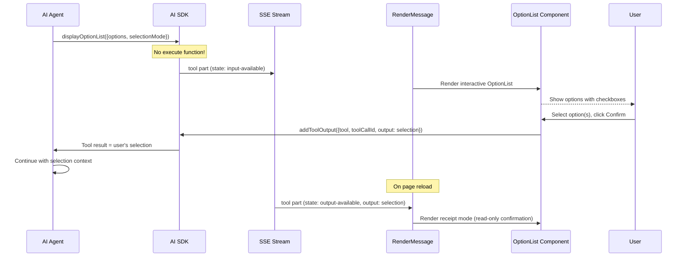

# Generative UI Interactive and Dynamic Tools

> **Audience:** Architect | Contributor
> **Prerequisites:** [Generative UI](GENERATIVE-UI.md)

This leaf covers OptionList interactions, dynamic tool display, inspector panel behavior, and research process grouping.

## Interactive Tool: OptionList

The `displayOptionList` tool is unique because it is a **client-resolved tool** — the AI sends the tool call but the frontend resolves it via user interaction.

**Source files:** [`lib/tools/display-option-list/`](../../lib/tools/display-option-list), [`components/tool-ui/option-list/option-list.tsx`](../../components/tool-ui/option-list/option-list.tsx)

---

## Dynamic Tool Display

The `DynamicToolDisplay` component (`components/dynamic-tool-display.tsx`) handles MCP tools and runtime-defined tools that are not part of the built-in tool UI registry.

### Behavior

1. If the tool name is registered in the Tool UI registry (`isRegisteredToolUI`): renders the rich component for `output-available`, skeleton for streaming states
2. If the tool name is NOT registered: renders a generic debug view showing tool type, display name, input/output JSON, and status indicator

### Tool name conventions

| Prefix      | Type         | Display name transformation          |
| ----------- | ------------ | ------------------------------------ |
| `mcp__`     | MCP Tool     | Remove prefix, replace `__` with `.` |
| `dynamic__` | Dynamic Tool | Remove prefix                        |
| (other)     | Custom Tool  | Use as-is                            |

### State indicators

- `input-streaming` — blue pulsing dot, "Streaming..."
- `input-available` — blue dot, "Processing..."
- `output-available` — green dot, "Complete"
- `output-error` — red dot, "Failed" with error text

**Source file:** [`components/dynamic-tool-display.tsx`](../../components/dynamic-tool-display.tsx)

---

## Inspector Panel

The inspector system provides a detail panel that opens when users click on research process items (search results, reasoning, todo lists). It is separate from the display tool system — it shows expanded views of core tool results rather than generative UI components.

The inspector uses a resizable split-pane layout provided by `ChatCanvasShell`:

- **Desktop:** side-by-side panels with a draggable resize handle (320px min, 800px max, 500px default). Width persists to localStorage.
- **Mobile:** full-width drawer overlay via `InspectorDrawer`
- **Mutual exclusion** with sidebar: opening the inspector closes the sidebar and vice versa

**Source files:** [`components/canvas/chat-canvas-shell.tsx`](../../components/canvas/chat-canvas-shell.tsx), [`components/canvas/canvas-context.tsx`](../../components/canvas/canvas-context.tsx)

---

## Research Process Section

The `ResearchProcessSection` component (`components/research-process-section.tsx`) renders the collapsible research steps (reasoning, search results, fetch results, todo updates, data parts) that appear between answer sections.

### Grouping logic

1. **`splitByText`** — splits parts into segments at text boundaries
2. **`groupConsecutiveParts`** — groups consecutive tool parts of the same type together
3. Single-item groups get standalone collapsible styling; multi-item groups get grouped accordion styling

### Auto-collapse behavior

- Segments with 5+ parts get a parent collapsible ("Research Process (N steps)")
- When text generation starts (`hasSubsequentText=true`), the parent auto-collapses
- Users can override by clicking

### Part rendering

Each part is dispatched via `RenderPart`:

| Part type   | Component          | Behavior                                    |
| ----------- | ------------------ | ------------------------------------------- |
| `reasoning` | `ReasoningSection` | Collapsible with preview text, inspect link |
| `tool-*`    | `ToolSection`      | Collapsible tool result                     |
| `data-*`    | `DataSection`      | Data display (related questions, etc.)      |

**Source file:** [`components/research-process-section.tsx`](../../components/research-process-section.tsx)

---
