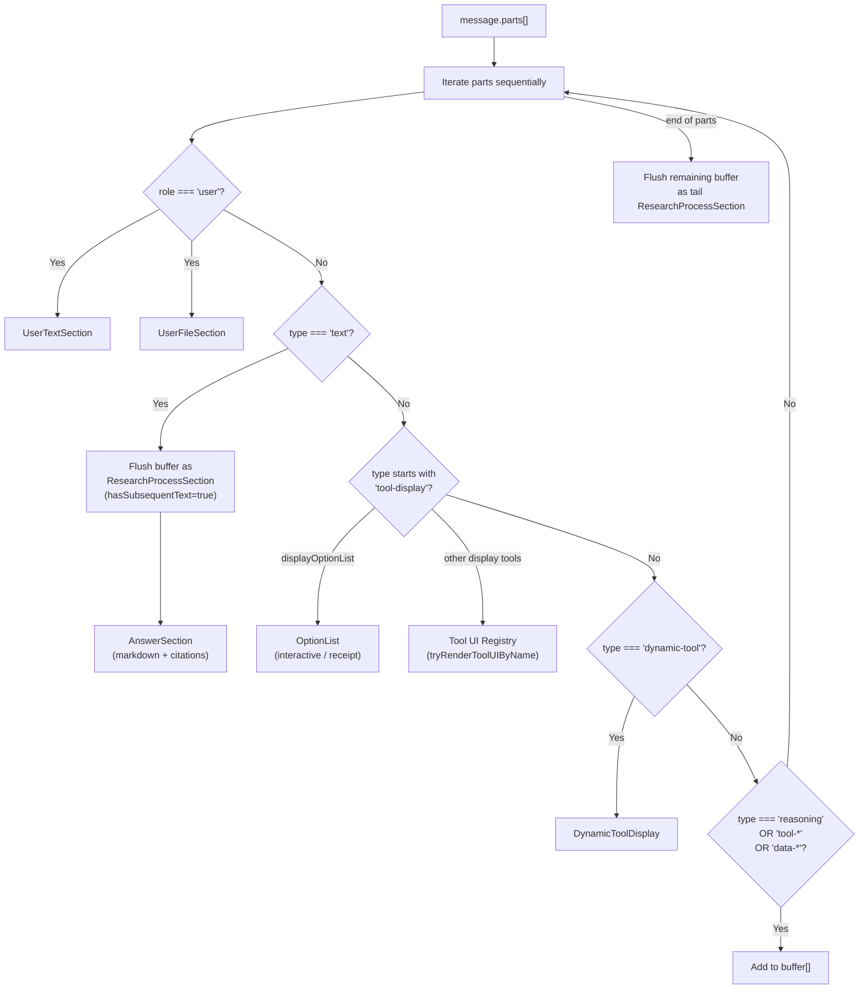

# Generative UI Message Rendering

> **Audience:** Architect | Contributor
> **Prerequisites:** [Generative UI](GENERATIVE-UI.md)

This leaf documents the RenderMessage buffer-and-flush strategy and display tool rendering path.

## Message Rendering Pipeline

The `RenderMessage` component (`components/render-message.tsx`) is the central dispatcher that routes each message part to the appropriate UI component. It uses a **buffer-and-flush strategy** for assistant messages.



### Buffer-and-flush explained

The dispatcher maintains a buffer of non-text parts (reasoning, tool results, data parts). When a text part arrives:

1. The buffer is flushed as a `ResearchProcessSection` with `hasSubsequentText=true` (so it auto-collapses)
2. The text part renders as an `AnswerSection`

This produces an interleaved layout:

```text
[Research Process: search → fetch → reasoning]  ← collapsed
[Answer text with markdown and citations]
[Research Process: more searches]                ← collapsed
[More answer text]
[DisplayTable component]                         ← inline
[Final answer text]
```

### Display tool rendering

When the dispatcher encounters a part with a `tool-display*` type prefix:

1. It flushes any buffered parts first
2. For `displayOptionList` and `displayQuestionWizard`: delegates to the tool module's `renderToolPart()` client adapter, which owns parsing, local component state, and app-local interactive output submission
3. For all other display tools and dedicated result tools: calls `tryRenderToolUIByName(toolName, output)` from the registry, which delegates migrated result tools to their module-local `tryRenderResult()` adapters
4. During `input-streaming` and `input-available` states: shows an animated skeleton placeholder

### Display tool text suppression

When a display tool renders rich UI (table, timeline, callout, etc.), the agent is instructed to not duplicate its content in surrounding text. Two layers enforce this:

1. **Prompt instructions** — The system prompts tell the agent that the display tool IS the answer for the content it covers. Text after a display tool should only contain additional analysis, caveats, or a synthesizing conclusion — never a restatement of the tool's data.

2. **Frontend guard** — `RenderMessage` suppresses near-empty text parts adjacent to display tools. A text part is "near-empty" if it contains only whitespace or a bare markdown heading (e.g., `## React vs Vue`). If the previous or next part is a `tool-display*` part, the near-empty text part is skipped.

This guard is intentionally conservative: text parts with substantive content (full sentences, analysis, citations) always render regardless of adjacency to display tools. Old persisted messages are unaffected.

### AnswerSection

`AnswerSection` wraps `MarkdownMessage` which uses the `Streamdown` library for streaming-aware markdown rendering. It supports:

- GitHub-flavored markdown (tables, strikethrough)
- LaTeX math (KaTeX)
- Inline citations via custom `<Citing>` link component
- Citation maps that resolve `[n](#toolCallId)` references to actual URLs

**Source files:** [`components/render-message.tsx`](../../components/render-message.tsx), [`components/answer-section.tsx`](../../components/answer-section.tsx), [`components/message.tsx`](../../components/message.tsx)

---
