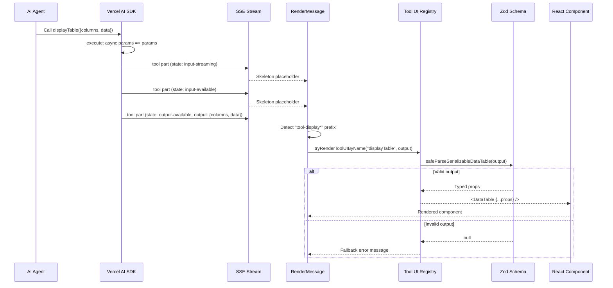

# Generative UI Overview

> **Audience:** Architect | Contributor
> **Prerequisites:** [Generative UI](GENERATIVE-UI.md)

This leaf explains the core generative UI concepts and end-to-end rendering lifecycle.

## Overview

The generative UI system lets the AI agent produce structured data that renders as rich UI components (tables, charts, geo maps, citations, plans, link previews, option lists, question wizards, callouts, timelines) directly inside the chat conversation. The system is built around three core ideas:

1. **Display tools** — server-side AI tool definitions that accept structured input and pass it through as output (`execute: async params => params`). They exist purely to give the AI a schema to emit structured data.

2. **Tool UI registry** — a client-side component registry that maps tool names to React components, using Zod schemas to safely parse and validate tool output before rendering.

3. **Adapter pattern** — each tool UI component imports its host-specific dependencies (shadcn/ui components, utility functions) through a local `_adapter.tsx` file, keeping the component logic decoupled from the design system.

```mermaid
graph LR
    subgraph Server["Server (lib/tools/)"]
        Agent["AI Agent"]
        DisplayTool["Display Tool<br/>(displayTable, displayPlan, etc.)"]
    end

    subgraph Stream["SSE Stream"]
        ToolPart["tool-displayXxx part<br/>(input + output)"]
    end

    subgraph Client["Client (components/)"]
        RenderMsg["RenderMessage"]
        Registry["Tool UI Registry<br/>(tryRenderToolUIByName)"]
        Schema["Zod Schema<br/>(safeParseSerializableXxx)"]
        Component["React Component<br/>(DataTable, Plan, etc.)"]
    end

    Agent -->|"tool call"| DisplayTool
    DisplayTool -->|"params → params"| ToolPart
    ToolPart -->|"SSE"| RenderMsg
    RenderMsg -->|"tool-display* prefix"| Registry
    Registry -->|"validate"| Schema
    Schema -->|"typed props"| Component
```

---

## End-to-End Rendering Pipeline

This diagram shows the complete lifecycle of a generative UI element, from the AI agent invoking a display tool to the component appearing in the chat.

### State transitions during rendering

Each display tool part transitions through states as the AI SDK processes the tool call:

| State              | UI                                    | Duration  |
| ------------------ | ------------------------------------- | --------- |
| `input-streaming`  | Animated skeleton placeholder (pulse) | Brief     |
| `input-available`  | Animated skeleton placeholder (pulse) | Brief     |
| `output-available` | Full rendered component               | Permanent |
| `output-error`     | Error message (dashed border)         | Permanent |

Display tools transition quickly through these states since their `execute` function simply returns the input unchanged.

---
