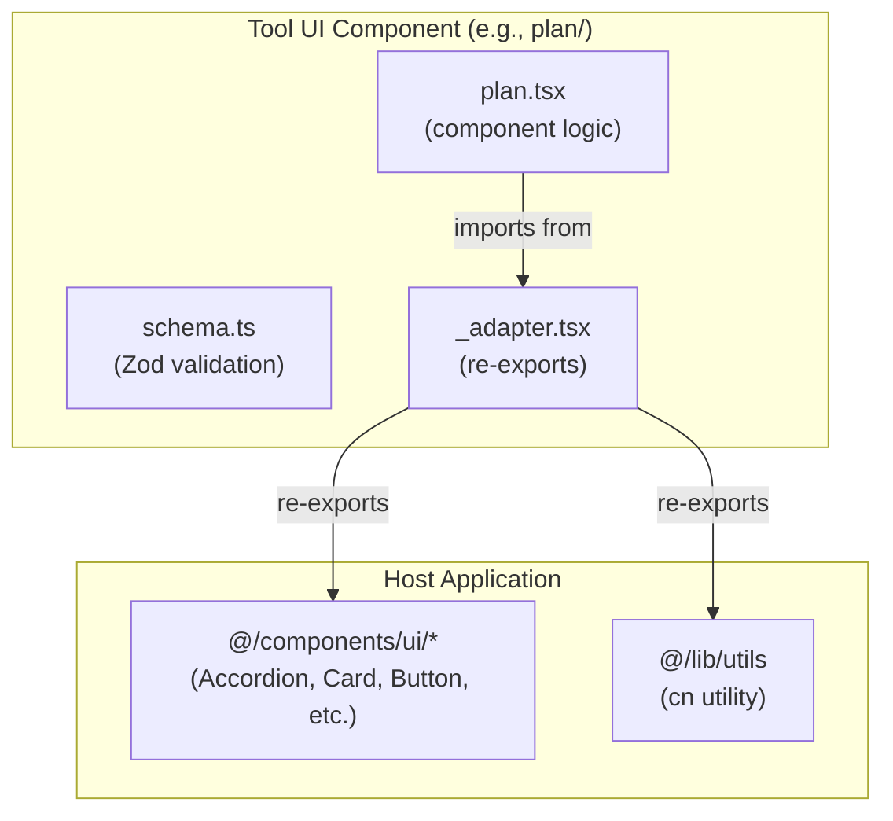

# Generative UI Registry and Adapters

> **Audience:** Architect | Contributor
> **Prerequisites:** [Generative UI](GENERATIVE-UI.md)

This leaf covers the Tool UI registry, local adapter pattern, and schema validation layer.

## Tool UI Registry

The registry (`components/tool-ui/registry.tsx`) is a compatibility facade over the manifest renderer catalogs. Passive display outputs are registered in `components/tool-ui/renderer-catalog.tsx`; interactive tool parts are registered in `components/tool-ui/interactive-renderer-catalog.tsx`; additional result tools can still be surfaced through the facade without moving browser-only code into the server runtime. The facade exports three functions:

All rendered tool cards now pass through a small motion shell:

- `ToolCardMount` wraps registered tool cards and only animates genuinely new parts.
- `HydrationAnimationProvider` in `components/chat.tsx` snapshots the initial tool-part IDs so SSR history paints immediately without replaying entrance motion.
- `StaggerList` is used by `displayTimeline` to stagger long event lists with a capped delay.

The mode pill animation lives next to the chat surface in `components/mode-selector.tsx` via `PillPresence`, but it uses the same `lib/motion/*` token and variant layer.

### `tryRenderToolUIByName(toolName, output)`

Primary lookup. First tries a direct name match, then falls back to schema probing.

```text
1. Find entry where entry.name === toolName
2. If found, call entry.tryRender(output)
3. If that returns a component, return it
4. Otherwise, fall back to tryRenderToolUI(output)
```

### `tryRenderToolUI(output)`

Iterates over all registered entries and returns the first successful schema match. This enables rendering even when the tool name is unknown (e.g., during database rehydration where only the output is available).

### `isRegisteredToolUI(toolName)`

Returns `true` if the tool name has a registered entry. Used by `DynamicToolDisplay` to decide whether to show the rich component or the generic tool debug view.

### Renderer catalog entries

Each manifest display entry has a `name` and a `tryRender` function that validates and renders:

```ts
const toolUiRendererEntries: ToolUiRendererEntry[] = [
  {
    name: 'displayPlan',
    tryRender: tryRenderDisplayPlanResult
  }
  // ... displayTable, displayChart, displayGeoMap, displayCitations, displayLinkPreview, displayAgentArtifact, displayOptionList, displayQuestionWizard, displayCallout, displayTimeline
]
```

The `tryRender` pattern ensures that invalid or corrupted tool output gracefully returns `null` instead of crashing the UI.

**Source files:** [`components/tool-ui/registry.tsx`](../../components/tool-ui/registry.tsx), [`components/tool-ui/renderer-catalog.tsx`](../../components/tool-ui/renderer-catalog.tsx), [`components/tool-ui/interactive-renderer-catalog.tsx`](../../components/tool-ui/interactive-renderer-catalog.tsx)

---

## Adapter Pattern

Each tool UI component directory contains an `_adapter.tsx` file that re-exports host-specific dependencies. This pattern decouples the tool UI components from the application's design system.



### Adapter contents by component

| Component       | Adapter re-exports                                                                       |
| --------------- | ---------------------------------------------------------------------------------------- |
| `plan/`         | Accordion, Card (Header/Content/Title/Description), Collapsible, `cn`                    |
| `data-table/`   | Accordion, Badge, Button, Table (all parts), Tooltip (all parts), `cn`                   |
| `chart/`        | Card (Header/Content/Title/Description), ChartContainer, ChartTooltip, ChartLegend, `cn` |
| `citation/`     | Popover (all parts), `cn`                                                                |
| `link-preview/` | `cn`                                                                                     |
| `option-list/`  | Button, Separator, `cn`                                                                  |
| `callout/`      | `cn`                                                                                     |
| `timeline/`     | `cn`                                                                                     |
| `shared/`       | Button, `cn`                                                                             |

### Adapter behavior

The adapter pattern decouples tool UI components from the host application's design system. Tool UI components import only from their local `_adapter.tsx`, which re-exports host dependencies. A different host application can provide its own adapters without modifying component logic.

**Source files:** `components/tool-ui/*/\_adapter.tsx`

---

## Schema and Validation Layer

Every tool UI component has a corresponding `schema.ts` that defines the Zod schema for its serializable props. The schema layer provides three things:

### 1. Contract definition

Each schema uses `defineToolUiContract` from `components/tool-ui/shared/contract.ts`:

```ts
const contract = defineToolUiContract('Plan', SerializablePlanSchema)
```

This creates a contract object with:

- `schema` — the Zod schema itself
- `parse(input)` — strict parse that throws on invalid input
- `safeParse(input)` — returns `null` on invalid input (used in the registry)

### 2. Serializable vs. runtime types

Each component distinguishes between serializable props (what comes from the AI) and runtime props (what the React component accepts):

- **Serializable** — JSON-safe, no callbacks, no `className`, no `ReactNode`. This is what the AI tool schema defines.
- **Runtime** — Adds `onChange`, `onAction`, `className`, and other interactive props.

For example, `OptionListProps` extends the serializable schema with `onChange`, `onAction`, and `className`.

### 3. Shared base schemas

All tool UI schemas share common base fields from `components/tool-ui/shared/schema.ts`:

| Schema                | Purpose                                             |
| --------------------- | --------------------------------------------------- |
| `ToolUIIdSchema`      | Unique identifier (`z.string().min(1)`)             |
| `ToolUIRoleSchema`    | Surface role (information, decision, control, etc.) |
| `ToolUIReceiptSchema` | Outcome metadata (success/partial/failed/cancelled) |
| `ActionSchema`        | Button action definition with variant and shortcut  |

**Source files:** [`components/tool-ui/shared/schema.ts`](../../components/tool-ui/shared/schema.ts), [`components/tool-ui/shared/contract.ts`](../../components/tool-ui/shared/contract.ts), `components/tool-ui/*/schema.ts`

---
