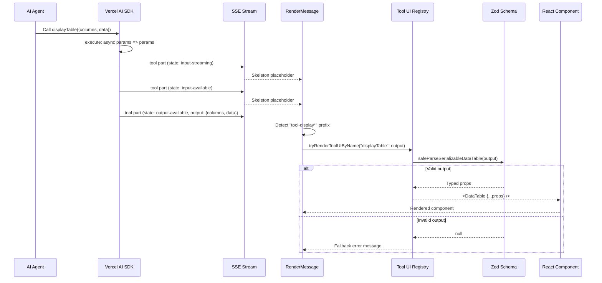
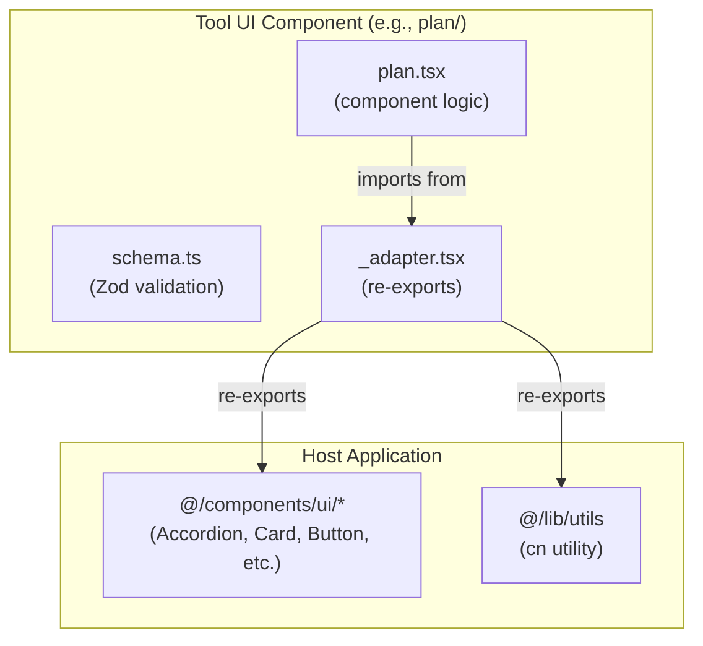
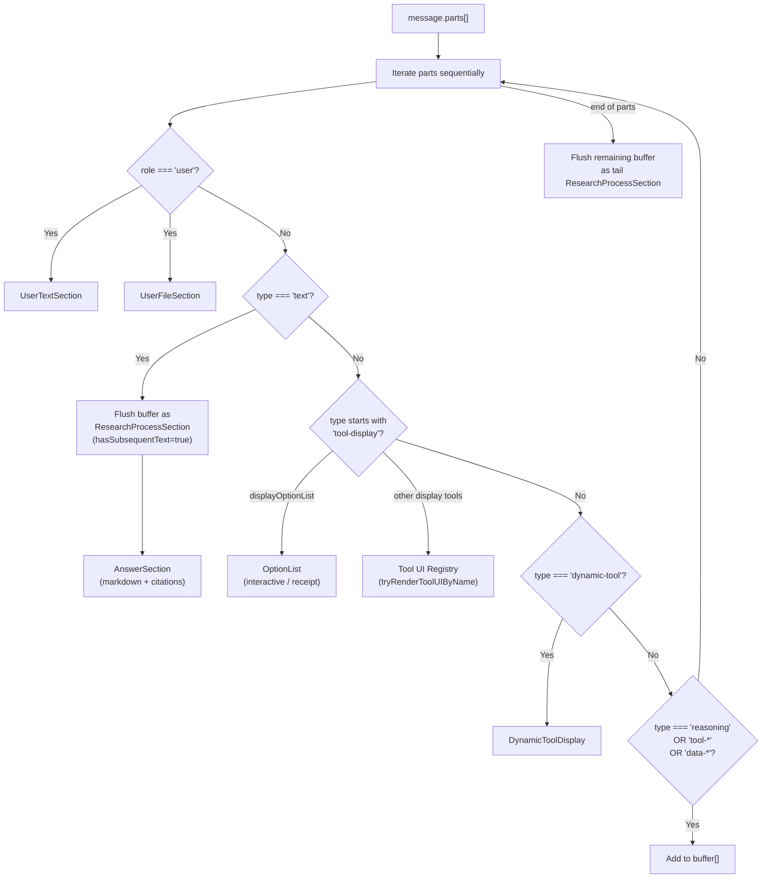
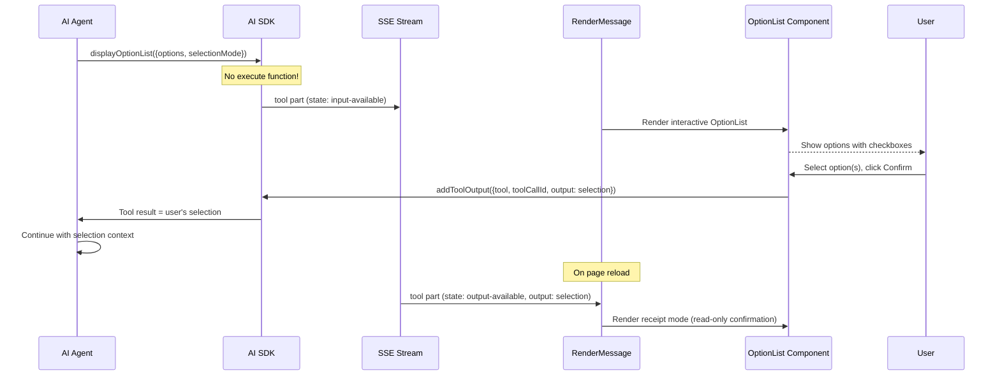

# Generative UI

> **Audience:** Architect | Contributor
> **Prerequisites:** [Architecture Overview](OVERVIEW.md)

This document describes the generative UI system in Polymorph — how AI tool invocations are transformed into rich, interactive React components rendered inline in the chat.

## Table of Contents

- [Overview](#overview)
- [End-to-End Rendering Pipeline](#end-to-end-rendering-pipeline)
- [Display Tools (Server)](#display-tools-server)
- [Tool UI Registry](#tool-ui-registry)
- [Adapter Pattern](#adapter-pattern)
- [Schema and Validation Layer](#schema-and-validation-layer)
- [Message Rendering Pipeline](#message-rendering-pipeline)
- [Display Tool Components](#display-tool-components)
- [Interactive Tool: OptionList](#interactive-tool-optionlist)
- [Dynamic Tool Display](#dynamic-tool-display)
- [Inspector Panel](#inspector-panel)
- [Research Process Section](#research-process-section)
- [How to Add a New Generative UI Tool](#how-to-add-a-new-generative-ui-tool)
- [Key File Reference](#key-file-reference)

---

## Overview

The generative UI system lets the AI agent produce structured data that renders as rich UI components (tables, charts, geo maps, citations, plans, link previews, option lists, question wizards, callouts, timelines) directly inside the chat conversation. The system is built around three core ideas:

1. **Display tools** — server-side AI tool definitions that accept structured input and pass it through as output (`execute: async params => params`). They exist purely to give the AI a schema to emit structured data.

2. **Tool UI registry** — a client-side component registry that maps tool names to React components, using Zod schemas to safely parse and validate tool output before rendering.

3. **Adapter pattern** — each tool UI component imports its host-specific dependencies (shadcn/ui components, utility functions) through a local `_adapter.tsx` file, keeping the component logic decoupled from the design system.

```mermaid
graph LR
    subgraph Server["Server (lib/tools/)"]
        Agent["AI Agent"]
        DisplayTool["Display Tool<br/>(displayTable, displayPlan, etc.)"]
    end

    subgraph Stream["SSE Stream"]
        ToolPart["tool-displayXxx part<br/>(input + output)"]
    end

    subgraph Client["Client (components/)"]
        RenderMsg["RenderMessage"]
        Registry["Tool UI Registry<br/>(tryRenderToolUIByName)"]
        Schema["Zod Schema<br/>(safeParseSerializableXxx)"]
        Component["React Component<br/>(DataTable, Plan, etc.)"]
    end

    Agent -->|"tool call"| DisplayTool
    DisplayTool -->|"params → params"| ToolPart
    ToolPart -->|"SSE"| RenderMsg
    RenderMsg -->|"tool-display* prefix"| Registry
    Registry -->|"validate"| Schema
    Schema -->|"typed props"| Component
```



---

## End-to-End Rendering Pipeline

This diagram shows the complete lifecycle of a generative UI element, from the AI agent invoking a display tool to the component appearing in the chat.



### State transitions during rendering

Each display tool part transitions through states as the AI SDK processes the tool call:

| State              | UI                                    | Duration  |
| ------------------ | ------------------------------------- | --------- |
| `input-streaming`  | Animated skeleton placeholder (pulse) | Brief     |
| `input-available`  | Animated skeleton placeholder (pulse) | Brief     |
| `output-available` | Full rendered component               | Permanent |
| `output-error`     | Error message (dashed border)         | Permanent |

Display tools transition quickly through these states since their `execute` function simply returns the input unchanged.

---

## Display Tools (Server)

Display tools are defined either as legacy flat shims (`lib/tools/display-*.ts`) or as per-tool modules under `lib/tools/<tool-name>/`. New and migrated high-friction tools use the module shape and are exposed through the manifest catalog in `lib/tools/tool-ui/*`:

```text
lib/tools/<tool-name>/
  schema.ts    Zod input/output contracts and toolName
  server.ts    AI SDK tool() or dynamicTool() export
  client.tsx   optional browser-side resolver for interactive tools
  result.tsx   optional dedicated result renderer
  index.ts     public module contract
```

Server-side agent code imports `serverTool` from `server.ts` so it does not pull client renderers into the agent runtime. `lib/tools/tool-ui/server-catalog.ts` collects those server tools for the chat toolset, while `components/tool-ui/renderer-catalog.tsx` and `components/tool-ui/interactive-renderer-catalog.tsx` own client rendering. The flat files remain compatibility re-exports for older imports.

Display tools do not perform any computation. They serve as a structured output channel for the AI agent. The agent fills in the schema, and the frontend renders it.

### Tool definitions

| Tool                    | File                                 | Description                                                           | Has `execute`? |
| ----------------------- | ------------------------------------ | --------------------------------------------------------------------- | :------------: |
| `displayPlan`           | `lib/tools/display-plan.ts`          | Step-by-step guides with status                                       |      Yes       |
| `displayTable`          | `lib/tools/display-table.ts`         | Sortable data tables with formatting                                  |      Yes       |
| `displayChart`          | `lib/tools/display-chart.ts`         | Bar and line chart visualizations                                     |      Yes       |
| `displayGeoMap`         | `lib/tools/display-geo-map.ts`       | Leaflet-based geo maps with markers, routes, polygons, and clustering |      Yes       |
| `displayCitations`      | `lib/tools/display-citations/`       | Rich source citation lists                                            |      Yes       |
| `displayLinkPreview`    | `lib/tools/display-link-preview/`    | Link preview cards                                                    |      Yes       |
| `displayAgentArtifact`  | `lib/tools/display-agent-artifact/`  | Inline agent artifacts with preview/code/raw tabs                     |      Yes       |
| `displayOptionList`     | `lib/tools/display-option-list/`     | Interactive option lists                                              |       No       |
| `displayQuestionWizard` | `lib/tools/display-question-wizard/` | Multi-step guided question flows                                      |       No       |
| `displayCallout`        | `lib/tools/display-callout.ts`       | Styled callout boxes                                                  |      Yes       |
| `displayTimeline`       | `lib/tools/display-timeline.ts`      | Chronological event timelines                                         |      Yes       |

All tools with `execute` use the same passthrough pattern:

```ts
execute: async params => params
```

**`displayOptionList`** and **`displayQuestionWizard`** are client-resolved tools. They have no `execute` function because the AI sends the tool call input, the module-local `client.tsx` renders the interactive surface, the user responds through the local `submitInteractiveToolOutput` callback, and `components/chat.tsx` bridges that callback to AI SDK `addToolOutput({ tool, toolCallId, output })`.

### Schema example (displayTable)

The table tool defines a rich schema with column formatting options:

```ts
const FormatSchema = z.discriminatedUnion('kind', [
  z.object({ kind: z.literal('text') }),
  z.object({ kind: z.literal('number'), decimals: z.number().optional(), ... }),
  z.object({ kind: z.literal('currency'), currency: z.string(), ... }),
  z.object({ kind: z.literal('percent'), ... }),
  z.object({ kind: z.literal('date'), dateFormat: z.enum(['short', 'long', 'relative']).optional() }),
  z.object({ kind: z.literal('delta'), ... }),
  z.object({ kind: z.literal('boolean'), labels: ... }),
  z.object({ kind: z.literal('link'), hrefKey: ... }),
  z.object({ kind: z.literal('badge'), colorMap: ... }),
  z.object({ kind: z.literal('status'), statusMap: ... }),
  z.object({ kind: z.literal('array'), maxVisible: ... })
])
```

This allows the AI to specify exactly how each column should be formatted — currencies, percentages, status badges, links — and the DataTable component renders them accordingly.

**Source files:** [`lib/tools/display-plan.ts`](../../lib/tools/display-plan.ts), [`lib/tools/display-table.ts`](../../lib/tools/display-table.ts), [`lib/tools/display-chart.ts`](../../lib/tools/display-chart.ts), [`lib/tools/display-geo-map.ts`](../../lib/tools/display-geo-map.ts), [`lib/tools/display-citations/`](../../lib/tools/display-citations), [`lib/tools/display-link-preview/`](../../lib/tools/display-link-preview), [`lib/tools/display-agent-artifact/`](../../lib/tools/display-agent-artifact), [`lib/tools/display-option-list/`](../../lib/tools/display-option-list), [`lib/tools/display-question-wizard/`](../../lib/tools/display-question-wizard), [`lib/tools/display-callout.ts`](../../lib/tools/display-callout.ts), [`lib/tools/display-timeline.ts`](../../lib/tools/display-timeline.ts)

### Mode-specific tool availability

The chat agent registry exposes different tools depending on the resolved agent mode:

| Tool                    | Chat Mode |        Research Mode        |
| ----------------------- | :-------: | :-------------------------: |
| `search`                |    Yes    |             Yes             |
| `fetch`                 |    Yes    |             Yes             |
| `displayPlan`           |    Yes    |             No              |
| `displayTable`          |    Yes    |             Yes             |
| `displayChart`          |    Yes    |             Yes             |
| `displayGeoMap`         |    Yes    |             Yes             |
| `displayCitations`      |    Yes    |             Yes             |
| `displayLinkPreview`    |    Yes    |             Yes             |
| `displayAgentArtifact`  |    Yes    |             Yes             |
| `displayOptionList`     |    Yes    |             Yes             |
| `displayQuestionWizard` |    Yes    |             Yes             |
| `displayCallout`        |    Yes    |             Yes             |
| `displayTimeline`       |    Yes    |             Yes             |
| `todoWrite`             |    No     | Yes (when writer available) |

**Chat mode** (max 20 steps) uses forced optimized search and includes `displayPlan` for step-by-step guides. **Research mode** (max 50 steps) uses full search and enables `todoWrite` for task management when a writer is available.

### Geo-map rendering contract

`displayGeoMap` is the renderer-facing half of the spatial toolchain: it receives a structured payload (`markers[]`, `routes[]`, `polygons[]`, etc.) and renders an interactive map. The helper tools `geocodeAddress`, `getDirections`, and `getIsochrone` prepare data that composes into that payload. `getStaticMapImage` is a parallel output mode — it returns a static PNG URL rather than a `displayGeoMap` payload, so use it when the answer should be a shareable image instead of an interactive card.

- `markers[]` supports default dots, emoji markers, and image-backed icons.
- `routes[]` supports labels, descriptions, hover/always tooltips, stroke colors, dash patterns, opacity, and weight.
- `polygons[]` supports filled regions such as isochrones and boundary overlays.
- `clustering` lets dense point sets collapse into cluster markers.
- `viewport` supports both fit-based framing and explicit center/zoom control.

See [Geo & Spatial Tools](GEO-TOOLS.md) for the full compose-first flow.

### Related: side-effect tools

Display tools are passthrough schemas rendered inline. A separate category of conditionally registered tools (`generateImage`, canvas artifact tools) performs work outside the chat and renders through module-local result adapters that are surfaced by the Tool UI registry. The live `competitorResearch` specialist follows the same dedicated-result pattern. See [Research Agent → Conditional Tools](RESEARCH-AGENT.md#conditional-tools).

### Community-portability evidence

Workstream 5 uses `competitorResearch` as the representative external/community-inspired AI SDK pattern: a structured Vercel AI SDK `tool({ inputSchema, execute })` definition ported through local adapters. The proof lives in [`lib/agents/chat/__tests__/community-portability.test.ts`](../../lib/agents/chat/__tests__/community-portability.test.ts) and exercises the local path rather than only checking registration:

- Research agent resolution and `activeTools` activation include `competitorResearch`, while search/chat and build definitions do not.
- `createChatAgentTools()` creates the specialist through the local toolset and executes it with mocked search/fetch tools shaped like real tool outputs.
- `components/tool-ui/registry.tsx` renders the structured result through the dedicated `CompetitorResearchResult` adapter.
- `lib/utils/message-mapping.ts` persists and restores the rich `tool-competitorResearch` part through dynamic tool columns.

This is an adapter-chain proof, not isolated git-history proof. It shows the current architecture can carry one structured AI SDK tool pattern through agent, toolset, rendering, and mapping seams without adding route/streaming/persistence-specific code for that tool. Verifying that a future change avoided route, streaming, or persistence edits still requires checking that change's diff.

### Shared base fields

All display tool schemas support optional base fields defined in `components/tool-ui/shared/schema.ts`:

| Field     | Type     | Description                                                                                                                         |
| --------- | -------- | ----------------------------------------------------------------------------------------------------------------------------------- |
| `id`      | `string` | Unique identifier for the component instance (`ToolUIIdSchema`)                                                                     |
| `role`    | `enum`   | Semantic role: `information`, `decision`, `control`, `state`, `composite` (`ToolUIRoleSchema`)                                      |
| `receipt` | `object` | Outcome tracking with `outcome` (success/partial/failed/cancelled), `summary`, `identifiers[]`, `timestamp` (`ToolUIReceiptSchema`) |

These base fields enable consistent identification, semantic classification, and outcome tracking across all generative UI components.

### Action system

Some display tools support an optional `actions[]` field for interactive buttons:

| Property       | Type      | Description                                                       |
| -------------- | --------- | ----------------------------------------------------------------- |
| `id`           | `string`  | Unique action identifier                                          |
| `label`        | `string`  | Button display text                                               |
| `variant`      | `enum`    | `default`, `destructive`, `outline`, `secondary`, `ghost`, `link` |
| `icon`         | `string`  | Optional Lucide icon name                                         |
| `disabled`     | `boolean` | Whether the action is disabled                                    |
| `shortcut`     | `string`  | Keyboard shortcut hint                                            |
| `confirmLabel` | `string`  | Confirmation text before executing                                |
| `sentence`     | `string`  | Natural language description sent back to the AI                  |

Currently supported on `OptionList` and extensible to other components via the shared `ActionSchema`.

---

## Tool UI Registry

The registry (`components/tool-ui/registry.tsx`) is a compatibility facade over the manifest renderer catalogs. Passive display outputs are registered in `components/tool-ui/renderer-catalog.tsx`; interactive tool parts are registered in `components/tool-ui/interactive-renderer-catalog.tsx`; additional result tools can still be surfaced through the facade without moving browser-only code into the server runtime. The facade exports three functions:

All rendered tool cards now pass through a small motion shell:

- `ToolCardMount` wraps registered tool cards and only animates genuinely new parts.
- `HydrationAnimationProvider` in `components/chat.tsx` snapshots the initial tool-part IDs so SSR history paints immediately without replaying entrance motion.
- `StaggerList` is used by `displayTimeline` to stagger long event lists with a capped delay.

The mode pill animation lives next to the chat surface in `components/mode-selector.tsx` via `PillPresence`, but it uses the same `lib/motion/*` token and variant layer.

### `tryRenderToolUIByName(toolName, output)`

Primary lookup. First tries a direct name match, then falls back to schema probing.

```text
1. Find entry where entry.name === toolName
2. If found, call entry.tryRender(output)
3. If that returns a component, return it
4. Otherwise, fall back to tryRenderToolUI(output)
```

### `tryRenderToolUI(output)`

Iterates over all registered entries and returns the first successful schema match. This enables rendering even when the tool name is unknown (e.g., during database rehydration where only the output is available).

### `isRegisteredToolUI(toolName)`

Returns `true` if the tool name has a registered entry. Used by `DynamicToolDisplay` to decide whether to show the rich component or the generic tool debug view.

### Renderer catalog entries

Each manifest display entry has a `name` and a `tryRender` function that validates and renders:

```ts
const toolUiRendererEntries: ToolUiRendererEntry[] = [
  {
    name: 'displayPlan',
    tryRender: tryRenderDisplayPlanResult
  }
  // ... displayTable, displayChart, displayGeoMap, displayCitations, displayLinkPreview, displayAgentArtifact, displayOptionList, displayQuestionWizard, displayCallout, displayTimeline
]
```

The `tryRender` pattern ensures that invalid or corrupted tool output gracefully returns `null` instead of crashing the UI.

**Source files:** [`components/tool-ui/registry.tsx`](../../components/tool-ui/registry.tsx), [`components/tool-ui/renderer-catalog.tsx`](../../components/tool-ui/renderer-catalog.tsx), [`components/tool-ui/interactive-renderer-catalog.tsx`](../../components/tool-ui/interactive-renderer-catalog.tsx)

---

## Adapter Pattern

Each tool UI component directory contains an `_adapter.tsx` file that re-exports host-specific dependencies. This pattern decouples the tool UI components from the application's design system.



### Adapter contents by component

| Component       | Adapter re-exports                                                                       |
| --------------- | ---------------------------------------------------------------------------------------- |
| `plan/`         | Accordion, Card (Header/Content/Title/Description), Collapsible, `cn`                    |
| `data-table/`   | Accordion, Badge, Button, Table (all parts), Tooltip (all parts), `cn`                   |
| `chart/`        | Card (Header/Content/Title/Description), ChartContainer, ChartTooltip, ChartLegend, `cn` |
| `citation/`     | Popover (all parts), `cn`                                                                |
| `link-preview/` | `cn`                                                                                     |
| `option-list/`  | Button, Separator, `cn`                                                                  |
| `callout/`      | `cn`                                                                                     |
| `timeline/`     | `cn`                                                                                     |
| `shared/`       | Button, `cn`                                                                             |

### Adapter behavior

The adapter pattern decouples tool UI components from the host application's design system. Tool UI components import only from their local `_adapter.tsx`, which re-exports host dependencies. A different host application can provide its own adapters without modifying component logic.

**Source files:** `components/tool-ui/*/\_adapter.tsx`

---

## Schema and Validation Layer

Every tool UI component has a corresponding `schema.ts` that defines the Zod schema for its serializable props. The schema layer provides three things:

### 1. Contract definition

Each schema uses `defineToolUiContract` from `components/tool-ui/shared/contract.ts`:

```ts
const contract = defineToolUiContract('Plan', SerializablePlanSchema)
```

This creates a contract object with:

- `schema` — the Zod schema itself
- `parse(input)` — strict parse that throws on invalid input
- `safeParse(input)` — returns `null` on invalid input (used in the registry)

### 2. Serializable vs. runtime types

Each component distinguishes between serializable props (what comes from the AI) and runtime props (what the React component accepts):

- **Serializable** — JSON-safe, no callbacks, no `className`, no `ReactNode`. This is what the AI tool schema defines.
- **Runtime** — Adds `onChange`, `onAction`, `className`, and other interactive props.

For example, `OptionListProps` extends the serializable schema with `onChange`, `onAction`, and `className`.

### 3. Shared base schemas

All tool UI schemas share common base fields from `components/tool-ui/shared/schema.ts`:

| Schema                | Purpose                                             |
| --------------------- | --------------------------------------------------- |
| `ToolUIIdSchema`      | Unique identifier (`z.string().min(1)`)             |
| `ToolUIRoleSchema`    | Surface role (information, decision, control, etc.) |
| `ToolUIReceiptSchema` | Outcome metadata (success/partial/failed/cancelled) |
| `ActionSchema`        | Button action definition with variant and shortcut  |

**Source files:** [`components/tool-ui/shared/schema.ts`](../../components/tool-ui/shared/schema.ts), [`components/tool-ui/shared/contract.ts`](../../components/tool-ui/shared/contract.ts), `components/tool-ui/*/schema.ts`

---

## Message Rendering Pipeline

The `RenderMessage` component (`components/render-message.tsx`) is the central dispatcher that routes each message part to the appropriate UI component. It uses a **buffer-and-flush strategy** for assistant messages.



### Buffer-and-flush explained

The dispatcher maintains a buffer of non-text parts (reasoning, tool results, data parts). When a text part arrives:

1. The buffer is flushed as a `ResearchProcessSection` with `hasSubsequentText=true` (so it auto-collapses)
2. The text part renders as an `AnswerSection`

This produces an interleaved layout:

```text
[Research Process: search → fetch → reasoning]  ← collapsed
[Answer text with markdown and citations]
[Research Process: more searches]                ← collapsed
[More answer text]
[DisplayTable component]                         ← inline
[Final answer text]
```

### Display tool rendering

When the dispatcher encounters a part with a `tool-display*` type prefix:

1. It flushes any buffered parts first
2. For `displayOptionList` and `displayQuestionWizard`: delegates to the tool module's `renderToolPart()` client adapter, which owns parsing, local component state, and app-local interactive output submission
3. For all other display tools and dedicated result tools: calls `tryRenderToolUIByName(toolName, output)` from the registry, which delegates migrated result tools to their module-local `tryRenderResult()` adapters
4. During `input-streaming` and `input-available` states: shows an animated skeleton placeholder

### Display tool text suppression

When a display tool renders rich UI (table, timeline, callout, etc.), the agent is instructed to not duplicate its content in surrounding text. Two layers enforce this:

1. **Prompt instructions** — The system prompts tell the agent that the display tool IS the answer for the content it covers. Text after a display tool should only contain additional analysis, caveats, or a synthesizing conclusion — never a restatement of the tool's data.

2. **Frontend guard** — `RenderMessage` suppresses near-empty text parts adjacent to display tools. A text part is "near-empty" if it contains only whitespace or a bare markdown heading (e.g., `## React vs Vue`). If the previous or next part is a `tool-display*` part, the near-empty text part is skipped.

This guard is intentionally conservative: text parts with substantive content (full sentences, analysis, citations) always render regardless of adjacency to display tools. Old persisted messages are unaffected.

### AnswerSection

`AnswerSection` wraps `MarkdownMessage` which uses the `Streamdown` library for streaming-aware markdown rendering. It supports:

- GitHub-flavored markdown (tables, strikethrough)
- LaTeX math (KaTeX)
- Inline citations via custom `<Citing>` link component
- Citation maps that resolve `[n](#toolCallId)` references to actual URLs

**Source files:** [`components/render-message.tsx`](../../components/render-message.tsx), [`components/answer-section.tsx`](../../components/answer-section.tsx), [`components/message.tsx`](../../components/message.tsx)

---

## Display Tool Components

### Plan (`components/tool-ui/plan/`)

A visual step-by-step guide with status indicators and progress tracking.

**Props:** `id`, `title`, `description`, `todos[]` (each with `id`, `label`, `status`, optional `description`)

**Status types:** `pending` | `in_progress` | `completed` | `cancelled`

**Features:**

- Progress bar with percentage calculation
- Celebration animation when progress crosses thresholds
- Staggered entrance animations for new items
- Collapsible step descriptions
- Accordion for overflow items (shows first 4, collapses rest)
- `Plan.Compact` variant without header/progress bar

### DataTable (`components/tool-ui/data-table/`)

A sortable data table with rich column formatting and responsive layout.

**Props:** `id`, `columns[]` (key, label, format, sortable, align, `abbr`, `width`, `truncate`, `hideOnMobile`, `priority`), `data[]`, `rowIdKey`, `defaultSort`

**Format kinds:** `text`, `number`, `currency`, `percent`, `date`, `delta`, `boolean`, `link`, `badge`, `status`, `array`

**Features:**

- Three-state sort cycling (ascending -> descending -> unsorted)
- Container query responsive layout (`auto` switches between table and cards at `@md`)
- Mobile card view with accordion expand for secondary columns
- Column priority system (`primary`, `secondary`, `tertiary`) for mobile
- Accessibility: sort announcements, ARIA roles, keyboard navigation

**Compound components:** `DataTable`, `DataTable.Table` (forced table), `DataTable.Cards` (forced cards), `DataTable.Provider` (headless)

### Chart (`components/tool-ui/chart/`)

A data visualization component supporting bar and line charts via Recharts.

**Props:** `id`, `type` (bar/line), `title`, `description`, `data[]`, `xKey`, `series[]` (key, label, color), `colors[]`, `showLegend`, `showGrid`

**Features:**

- Bar and line chart types with automatic axis configuration
- Multiple data series with configurable color palette
- Individual series color overrides via `series[].color`
- Grid lines and legend support (configurable via `showGrid`, `showLegend`)
- Interactive tooltips via `ChartTooltip`
- Clickable data points with `onDataPointClick` callback (client-only prop)
- Card wrapper with optional title and description
- Schema validation with `superRefine` (rejects duplicate series keys, validates `xKey` and series keys exist in every data row, ensures Y-values are finite numbers or null)

### CitationList (`components/tool-ui/citation/`)

A list of source citations with metadata and navigation.

**Props:** `id`, `citations[]` (each with `id`, `href`, `title`, `snippet`, `domain`, `favicon`, `type`, `author`, `publishedAt`, `locale`)

**Citation types:** `webpage`, `document`, `article`, `api`, `code`, `other`

**Variants:**

- `default` — full cards with metadata, best for 3-6 sources where each needs visibility
- `inline` — compact badges that wrap in text flow, best for many inline references
- `stacked` — overlapping favicon circles with popover, best for compact source attribution

**Features:**

- Overflow indicator with popover for truncated lists
- Hover popover with delay for browsing
- Type-specific icons (Globe, FileText, Newspaper, etc.)
- Safe navigation href sanitization

### LinkPreview (`components/tool-ui/link-preview/`)

A rich link preview card with image, title, and description.

**Props:** `id`, `href`, `title`, `description`, `image`, `domain`, `favicon`, `createdAt`, `locale`, `ratio`, `fit`

**Features:**

- Aspect ratio options (16:9, 4:3, 1:1, auto)
- Image fit modes (cover, contain, fill)
- Hover scale animation on image
- Keyboard accessible (Enter/Space to navigate)
- Href sanitization for security

### AgentArtifact (`components/tool-ui/agent-artifact/`)

An inline artifact viewer for static generated code snippets, documents, tables, specs, or versioned artifact content that should remain in the chat instead of the canvas workspace.

**Props:** `id`, `title`, `artifactType`, `content`, `language`, `versions`, `currentVersion`, `metadata`

**Features:**

- Preview, code, and raw tabs
- Copy action and download-friendly content URL
- Optional version selection through `currentVersion`
- Metadata display for model, token count, size, and generation time

### Callout (`components/tool-ui/callout/`)

A styled callout box for highlighting critical information with variant-specific iconography and color.

**Props:** `id`, `variant`, `title` (optional), `content`

**Variants:** `info` | `warning` | `tip` | `success` | `error` | `definition`

**Features:**

- Variant-specific Lucide icons (Info, AlertTriangle, Lightbulb, CheckCircle2, XCircle, BookOpen)
- Color theming per variant with dark mode support
- Accessible `<aside role="note">` semantic HTML
- Concise — encourages 1-3 sentence content

### Timeline (`components/tool-ui/timeline/`)

A vertical chronological timeline of events with category-specific styling.

**Props:** `id`, `title`, `description` (optional), `events[]` (each with `id`, `date`, `title`, optional `description`, optional `category`)

**Event categories:** `milestone` | `event` | `release` | `announcement` | `default`

**Features:**

- Category-specific Lucide icons (Star, Calendar, Package, Megaphone, Flag)
- Color theming per category with dark mode support
- Connecting lines between events
- Date badges with category-colored backgrounds
- Accessible `<section>` + `<ol>` semantic HTML
- Schema validation with `superRefine` (rejects duplicate event IDs)

### OptionList (`components/tool-ui/option-list/`)

An interactive option list that pauses the AI conversation for user input.

**Props:** `id`, `options[]`, `selectionMode` (single/multi), `minSelections`, `maxSelections`, `actions[]`

**Features:**

- Single and multi-select modes with radio/checkbox indicators
- Full keyboard navigation (Arrow keys, Home/End, Enter/Space, Escape)
- ARIA listbox semantics
- Configurable action buttons (default: Clear + Confirm)
- **Receipt mode** — after selection, renders as a read-only confirmation card
- Max selection enforcement (locks unselected options when limit reached)

**Interactive flow:**

1. AI calls `displayOptionList` (no `execute` function)
2. Frontend renders interactive OptionList with a `submitInteractiveToolOutput` callback
3. User selects option(s) and clicks Confirm
4. The chat parent calls `addToolOutput({ tool, toolCallId, output: selection })`
5. AI continues with the user's selection
6. On reload, the component renders in receipt mode showing the confirmed selection

---

## Interactive Tool: OptionList

The `displayOptionList` tool is unique because it is a **client-resolved tool** — the AI sends the tool call but the frontend resolves it via user interaction.



**Source files:** [`lib/tools/display-option-list/`](../../lib/tools/display-option-list), [`components/tool-ui/option-list/option-list.tsx`](../../components/tool-ui/option-list/option-list.tsx)

---

## Dynamic Tool Display

The `DynamicToolDisplay` component (`components/dynamic-tool-display.tsx`) handles MCP tools and runtime-defined tools that are not part of the built-in tool UI registry.

### Behavior

1. If the tool name is registered in the Tool UI registry (`isRegisteredToolUI`): renders the rich component for `output-available`, skeleton for streaming states
2. If the tool name is NOT registered: renders a generic debug view showing tool type, display name, input/output JSON, and status indicator

### Tool name conventions

| Prefix      | Type         | Display name transformation          |
| ----------- | ------------ | ------------------------------------ |
| `mcp__`     | MCP Tool     | Remove prefix, replace `__` with `.` |
| `dynamic__` | Dynamic Tool | Remove prefix                        |
| (other)     | Custom Tool  | Use as-is                            |

### State indicators

- `input-streaming` — blue pulsing dot, "Streaming..."
- `input-available` — blue dot, "Processing..."
- `output-available` — green dot, "Complete"
- `output-error` — red dot, "Failed" with error text

**Source file:** [`components/dynamic-tool-display.tsx`](../../components/dynamic-tool-display.tsx)

---

## Inspector Panel

The inspector system provides a detail panel that opens when users click on research process items (search results, reasoning, todo lists). It is separate from the display tool system — it shows expanded views of core tool results rather than generative UI components.

The inspector uses a resizable split-pane layout provided by `ChatCanvasShell`:

- **Desktop:** side-by-side panels with a draggable resize handle (320px min, 800px max, 500px default). Width persists to localStorage.
- **Mobile:** full-width drawer overlay via `InspectorDrawer`
- **Mutual exclusion** with sidebar: opening the inspector closes the sidebar and vice versa

**Source files:** [`components/canvas/chat-canvas-shell.tsx`](../../components/canvas/chat-canvas-shell.tsx), [`components/canvas/canvas-context.tsx`](../../components/canvas/canvas-context.tsx)

---

## Research Process Section

The `ResearchProcessSection` component (`components/research-process-section.tsx`) renders the collapsible research steps (reasoning, search results, fetch results, todo updates, data parts) that appear between answer sections.

### Grouping logic

1. **`splitByText`** — splits parts into segments at text boundaries
2. **`groupConsecutiveParts`** — groups consecutive tool parts of the same type together
3. Single-item groups get standalone collapsible styling; multi-item groups get grouped accordion styling

### Auto-collapse behavior

- Segments with 5+ parts get a parent collapsible ("Research Process (N steps)")
- When text generation starts (`hasSubsequentText=true`), the parent auto-collapses
- Users can override by clicking

### Part rendering

Each part is dispatched via `RenderPart`:

| Part type   | Component          | Behavior                                    |
| ----------- | ------------------ | ------------------------------------------- |
| `reasoning` | `ReasoningSection` | Collapsible with preview text, inspect link |
| `tool-*`    | `ToolSection`      | Collapsible tool result                     |
| `data-*`    | `DataSection`      | Data display (related questions, etc.)      |

**Source file:** [`components/research-process-section.tsx`](../../components/research-process-section.tsx)

---

## How to Add a New Generative UI Tool

### Adding a New Display Tool

Polymorph uses one local AI SDK v6 plus Tool UI manifest contract. It does not use `assistant-ui` `Toolkit`, Agent Kit runtime, or upstream Tool UI runtime wiring for the main chat runtime.

For passive display tools, add:

- Do **not** start with `tool-agent`, `npx shadcn add @tool-ui/...`, or an `assistant-ui` migration unless the user explicitly asks for that.
- First inspect the existing integration points:
  - `components/tool-ui/*` for component shape, schema contracts, and adapters
  - `components/tool-ui/registry.tsx` for output rendering and compatibility facade registration
  - `components/tool-ui/tool-part-registry.tsx` for tool-part dispatch
  - `lib/tools/<tool-name>/client.tsx` for interactive rendering and app-local output submission
  - `components/chat.tsx` and `components/chat-request.ts` for request/continuation plumbing
  - `lib/types/dynamic-tools.ts` and `lib/streaming/helpers/prepare-messages.ts` for interactive tool state transitions
  - `lib/agents/chat/toolset.ts`, the relevant `lib/agents/chat/*` agent definition, and any prompt files that must actually cause the model to call the tool
- Reuse the existing naming pattern (`displayX`, `generateImage`, canvas tools) unless there is a deliberate reason to change the contract.
- For interactive tools, registry registration is not enough. Add a module-local `client.tsx`, delegate it from `components/tool-ui/tool-part-registry.tsx`, cover the native `addToolOutput` continuation, and test the exact `tool-*` part shape.
- For passive display tools, the minimum path is usually:

1. `components/tool-ui/<component>/schema.ts`
2. `components/tool-ui/<component>/<component>.tsx`
3. `components/tool-ui/<component>/index.tsx`
4. `lib/tools/display-<component>/schema.ts`
5. `lib/tools/display-<component>/server.ts`
6. `lib/tools/display-<component>/result.tsx`
7. `lib/tools/display-<component>/index.ts`
8. `lib/tools/display-<component>.ts` compatibility re-export when older flat imports need to keep working
9. One community-source row in `lib/tools/tool-ui/community-sources.ts` when the component source is not purely local
10. One metadata row in `lib/tools/tool-ui/metadata.ts`
11. One server row in `lib/tools/tool-ui/server-catalog.ts`
12. One renderer row in `components/tool-ui/renderer-catalog.tsx`
13. Prompt guidance in `lib/agents/prompts/search-mode-prompts.ts`
14. Focused tests for schema, module contract, registry rendering, prompt usage, and agent availability

For interactive tools, also add:

1. `lib/tools/display-<component>/client.tsx`
2. One renderer row in `components/tool-ui/interactive-renderer-catalog.tsx`
3. A result schema that represents the value passed from the module-local renderer to `submitInteractiveToolOutput`
4. Request and continuation tests covering `components/chat-request.ts` and `lib/streaming/helpers/prepare-messages.ts`

The core rule: if a tool requires user input before the model continues, it is an `interactive-display` tool in `lib/tools/tool-ui/metadata.ts`. If the model can emit the final payload directly and the server tool returns that payload, it is a `passive-display` tool.

#### Npm-First Source Boundary

Do not start by adding a second runtime (`assistant-ui`, `tool-agent`, Agent Kit runtime, or direct shadcn registry installation) unless the feature explicitly calls for an official runtime migration.

For community components with npm packages and documented public exports:

1. Add the npm package to `package.json` and `bun.lock`.
2. Import only public package exports, for example `@assistant-ui/react`, `@assistant-ui/react-ai-sdk`, or another documented package entrypoint.
3. Put Polymorph mapping in local files such as `components/tool-ui/<component>/_adapter.tsx`, `lib/tools/display-<component>/result.tsx`, metadata rows, schemas, and prompt guidance.
4. Add a `sourceType: 'npm'` entry in `lib/tools/tool-ui/community-sources.ts` with `packageName`, `packageVersion`, `license`, `publicImports`, `docsUrl`, `adapterFiles`, and `runtimeNotes`.
5. Add or update tests that fail if an adapter imports package internals such as `dist/*`, `internal/*`, `src/*`, or vendored component paths.

For community components without a usable npm/public export surface, inspect upstream files and licenses first, then adapt the serializable schema and component into the local manifest contract. Those ports must be recorded with `sourceType: 'ported'` and explicit copied/adapted file lists.

#### License-Aware Community Porting Record

For any community component port, record this information in the component folder README or the architecture docs:

- Upstream project and source URL.
- Upstream license and whether the current personal/non-commercial usage is allowed.
- Upstream runtime dependencies and which ones were adopted, replaced, or avoided.
- Files copied as-is, files adapted, and files rewritten for the local runtime.
- Runtime deviations from upstream behavior.
- Adapter dependencies provided by `components/tool-ui/<component>/_adapter.tsx` or module-local imports.

Use a source-separated rewrite only if future commercial use, relicensing, or upstream license terms make copying/adaptation inappropriate.

#### Npm Upgrade Workflow

When a source entry has `sourceType: 'npm'`, upgrades should use this sequence:

```bash
bun outdated <package-name>
bun update <package-name>
bun run test -- --run lib/tools/tool-ui/__tests__/community-sources.test.ts components/tool-ui/registry.test.tsx lib/tools/tool-ui/__tests__/server-catalog.test.ts
bun run typecheck
```

Expected: package update succeeds, adapter/renderer tests pass, and typecheck passes. If upstream changed its public API, update only the local adapter files named in the community-source record and keep package source untouched.

#### Repeatability Acceptance Criteria

A new passive display tool is repeatable when:

- The model-facing Zod schema lives in `lib/tools/display-<component>/schema.ts`.
- The render-facing serializable schema lives in `components/tool-ui/<component>/schema.ts`.
- The two schemas intentionally match or have a documented adapter in `result.tsx`.
- Any non-local source has a `lib/tools/tool-ui/community-sources.ts` entry. Npm entries import public package exports only; ported entries name copied and adapted files.
- `TOOL_UI_TOOL_METADATA` contains exactly one row for the tool.
- `createToolUiServerTools()` exposes the server tool.
- `toolUiRendererEntries` exposes the result renderer.
- `getToolUiToolNamesForMode(mode)` controls agent availability.
- `components/tool-ui/registry.tsx` does not need direct edits for the tool.
- Passive tools use `execute: async params => params`.
- Interactive tools have a `client.tsx` renderer and call the local `submitInteractiveToolOutput` callback; `components/chat.tsx` bridges that callback to AI SDK `addToolOutput({ tool, toolCallId, output })`, and the next request carries the updated AI SDK `messages` history through `components/chat-request.ts` and `lib/streaming/helpers/prepare-messages.ts`.

---

## Key File Reference

### Display tools (server)

| File                                | Purpose                                    |
| ----------------------------------- | ------------------------------------------ |
| `lib/tools/display-plan.ts`         | Plan tool definition + schema              |
| `lib/tools/display-table.ts`        | DataTable tool definition + schema         |
| `lib/tools/display-chart.ts`        | Chart tool definition + schema             |
| `lib/tools/display-citations/`      | Citations tool module + result adapter     |
| `lib/tools/display-link-preview/`   | LinkPreview tool module + result adapter   |
| `lib/tools/display-agent-artifact/` | AgentArtifact tool module + result adapter |
| `lib/tools/display-option-list/`    | OptionList tool module (no execute)        |
| `lib/tools/display-callout.ts`      | Callout tool definition + schema           |
| `lib/tools/display-timeline.ts`     | Timeline tool definition + schema          |

### Tool UI manifest runtime

| File                                                  | Purpose                                                                     |
| ----------------------------------------------------- | --------------------------------------------------------------------------- |
| `lib/tools/tool-ui/metadata.ts`                       | Tool UI manifest metadata for tool names, mode availability, and tool kinds |
| `lib/tools/tool-ui/community-sources.ts`              | Community source inventory for npm packages, ports, licenses, and adapters  |
| `lib/tools/tool-ui/server.ts`                         | Helpers for passive passthrough and client-resolved AI SDK display tools    |
| `lib/tools/tool-ui/server-catalog.ts`                 | Server-only catalog mapping manifest display tools to AI SDK server tools   |
| `lib/tools/tool-ui/client-output-validation.ts`       | Validates client-resolved interactive outputs before server persistence     |
| `components/tool-ui/renderer-catalog.tsx`             | Client renderer catalog for manifest display tool outputs                   |
| `components/tool-ui/interactive-renderer-catalog.tsx` | Client renderer catalog for interactive display tool parts                  |

### Tool UI components (client)

| File                                                   | Purpose                                                                     |
| ------------------------------------------------------ | --------------------------------------------------------------------------- |
| `components/tool-ui/registry.tsx`                      | Compatibility facade over renderer catalogs and additional result renderers |
| `components/tool-ui/plan/plan.tsx`                     | Plan component with progress                                                |
| `components/tool-ui/plan/schema.ts`                    | Plan Zod schema + contract                                                  |
| `components/tool-ui/data-table/data-table.tsx`         | DataTable with sort + responsive                                            |
| `components/tool-ui/data-table/schema.ts`              | DataTable Zod schema + contract                                             |
| `components/tool-ui/data-table/formatters.tsx`         | Column value formatting                                                     |
| `components/tool-ui/chart/chart.tsx`                   | Chart component (bar/line)                                                  |
| `components/tool-ui/chart/schema.ts`                   | Chart Zod schema + contract                                                 |
| `components/tool-ui/citation/citation-list.tsx`        | CitationList with variants                                                  |
| `components/tool-ui/citation/schema.ts`                | Citation Zod schema + contract                                              |
| `components/tool-ui/link-preview/link-preview.tsx`     | LinkPreview card                                                            |
| `components/tool-ui/link-preview/schema.ts`            | LinkPreview Zod schema + contract                                           |
| `components/tool-ui/agent-artifact/agent-artifact.tsx` | AgentArtifact viewer with tabs, copy, and metadata                          |
| `components/tool-ui/agent-artifact/schema.ts`          | AgentArtifact Zod schema + contract                                         |
| `components/tool-ui/option-list/option-list.tsx`       | Interactive OptionList                                                      |
| `components/tool-ui/option-list/schema.ts`             | OptionList Zod schema + contract                                            |
| `components/tool-ui/callout/callout.tsx`               | Callout component with variants                                             |
| `components/tool-ui/callout/schema.ts`                 | Callout Zod schema + contract                                               |
| `components/tool-ui/timeline/timeline.tsx`             | Timeline component with events                                              |
| `components/tool-ui/timeline/schema.ts`                | Timeline Zod schema + contract                                              |
| `components/tool-ui/shared/schema.ts`                  | Shared base schemas (id, role, etc.)                                        |
| `components/tool-ui/shared/contract.ts`                | `defineToolUiContract` helper                                               |
| `components/tool-ui/*/_adapter.tsx`                    | Host dependency adapters                                                    |

### Rendering pipeline

| File                                      | Purpose                             |
| ----------------------------------------- | ----------------------------------- |
| `components/render-message.tsx`           | Part-type dispatcher (buffer/flush) |
| `components/dynamic-tool-display.tsx`     | MCP/dynamic tool renderer           |
| `components/answer-section.tsx`           | Answer text with markdown + actions |
| `components/message.tsx`                  | Streaming markdown via Streamdown   |
| `components/research-process-section.tsx` | Collapsible research steps          |
| `components/reasoning-section.tsx`        | Reasoning display with preview      |

### Canvas / Inspector

| File                                       | Purpose                                        |
| ------------------------------------------ | ---------------------------------------------- |
| `components/canvas/canvas-root.tsx`        | Provider + shell wrapper                       |
| `components/canvas/canvas-context.tsx`     | React context for canvas/inspector state       |
| `components/canvas/chat-canvas-shell.tsx`  | Resizable split-pane layout (desktop + mobile) |
| `components/inspector/inspector-panel.tsx` | Panel chrome with icon + close                 |

### Types

| File                         | Purpose                          |
| ---------------------------- | -------------------------------- |
| `lib/types/dynamic-tools.ts` | DynamicToolPart type definitions |
