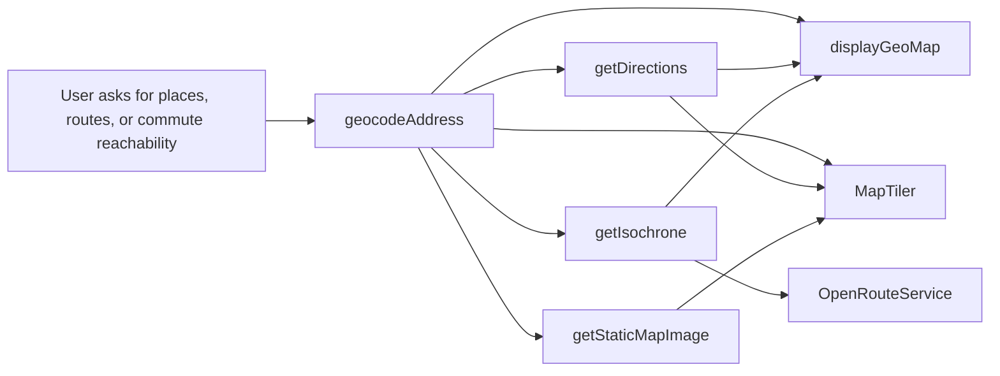
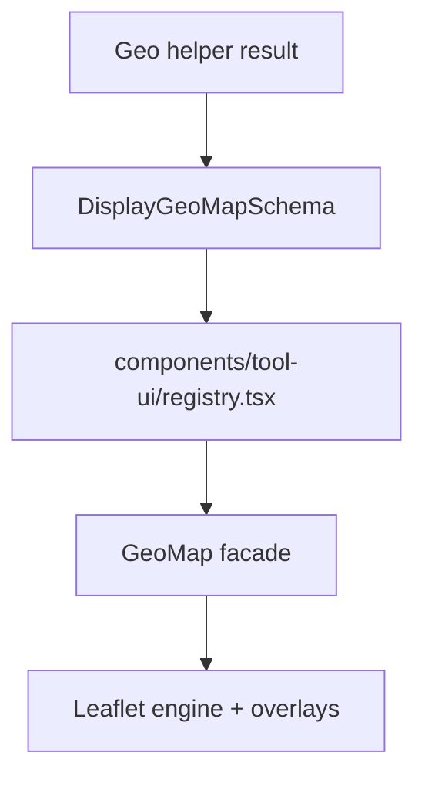

# Geo & Spatial Tools

> **Audience:** Architect | Contributor
> **Prerequisites:** [Architecture Overview](OVERVIEW.md), [Research Agent](RESEARCH-AGENT.md), [Generative UI](GENERATIVE-UI.md)

This document explains Polymorph's geo and spatial toolchain: how place names are resolved into coordinates, how routes and reachability polygons are computed, and how those results are rendered either as interactive `displayGeoMap` cards or shareable static map images.

## Overview

The geo surface is intentionally **compose-first**:

- `geocodeAddress` resolves a place name or address into coordinates.
- `getDirections` turns coordinates into a road-following route.
- `getIsochrone` turns a center point into a reachability polygon.
- `getStaticMapImage` produces a public PNG URL when a static image is preferable to an interactive card.
- `displayGeoMap` renders the final interactive map in-chat with markers, routes, polygons, clustering, and viewport controls.

All four helper tools are available in both backend search modes. The UI's `build` mode maps onto backend chat mode with `intent='build'`, so geo helpers remain available there as well.

## Tool Inventory

| Tool                | Source                              | What it returns                                                     | Typical use                                                               |
| ------------------- | ----------------------------------- | ------------------------------------------------------------------- | ------------------------------------------------------------------------- |
| `geocodeAddress`    | `lib/tools/geocode-address.ts`      | Ranked `lat` / `lng` candidates plus place labels                   | "Pin the Eiffel Tower", "map coffee shops near Wrigley Field"             |
| `getDirections`     | `lib/tools/get-directions.ts`       | Ordered route points plus distance and duration labels              | "Drive from Austin to San Antonio", "bike route between these trailheads" |
| `getIsochrone`      | `lib/tools/get-isochrone.ts`        | Polygon ring points for a travel-time boundary                      | "Show everywhere I can reach in 20 minutes"                               |
| `getStaticMapImage` | `lib/tools/get-static-map-image.ts` | Public HTTPS PNG URL                                                | "Give me a shareable map image for email or docs"                         |
| `displayGeoMap`     | `lib/tools/display-geo-map.ts`      | Passthrough structured map payload rendered by the Tool UI registry | Final in-chat interactive map                                             |

## `displayGeoMap` Contract

The interactive map renderer in `components/tool-ui/geo-map/` supports more than basic pins:

- **Markers:** default dots, emoji icons, or image-backed markers, each with optional labels, descriptions, and tooltip behavior.
- **Routes:** ordered polyline points with label, description, stroke color, dash pattern, opacity, and width controls.
- **Polygons:** filled regions for isochrones or administrative boundaries, with independent fill and border styling.
- **Clustering:** optional supercluster-based marker aggregation for dense point sets.
- **Viewport control:** either fit all/markers/routes or lock the map to a specific center and zoom.
- **Theme:** light or dark basemap styling.

## Static vs Interactive Output

Use `displayGeoMap` when the answer benefits from pan/zoom, hover labels, clustered points, or multiple overlays in the chat history.

Use `getStaticMapImage` when the user explicitly wants:

- a shareable PNG,
- a map embedded into email/social/docs,
- a canvas artifact or other surface that needs a stable image URL,
- or a lightweight snapshot instead of a live map widget.

## Configuration

The geo surface depends on three environment variables documented in [Environment Reference](../getting-started/ENVIRONMENT.md#map-tiles-geo-map-tool-ui):

- `NEXT_PUBLIC_MAPTILER_API_KEY` for client-side tiles and the public static map URLs returned by `getStaticMapImage`.
- `MAPTILER_API_KEY` for server-side geocoding, directions, and other server-only MapTiler calls. If it is unset, the server can fall back to `NEXT_PUBLIC_MAPTILER_API_KEY` for those requests, but client-visible URLs still require the public key.
- `ORS_API_KEY` for isochrones.

The app degrades gracefully when some keys are absent: client maps fall back to CARTO Voyager, and `getIsochrone` returns a structured error if `ORS_API_KEY` is not set.

## Key Files

- [`lib/agents/chat/factory.ts`](../../lib/agents/chat/factory.ts), [`lib/agents/chat/registry.ts`](../../lib/agents/chat/registry.ts), [`lib/agents/chat/toolset.ts`](../../lib/agents/chat/toolset.ts)
- [`lib/agents/prompts/search-mode-prompts.ts`](../../lib/agents/prompts/search-mode-prompts.ts)
- [`lib/tools/display-geo-map.ts`](../../lib/tools/display-geo-map.ts)
- [`lib/tools/geocode-address.ts`](../../lib/tools/geocode-address.ts)
- [`lib/tools/get-directions.ts`](../../lib/tools/get-directions.ts)
- [`lib/tools/get-isochrone.ts`](../../lib/tools/get-isochrone.ts)
- [`lib/tools/get-static-map-image.ts`](../../lib/tools/get-static-map-image.ts)
- [`components/tool-ui/geo-map/geo-map.tsx`](../../components/tool-ui/geo-map/geo-map.tsx)
- [`components/tool-ui/geo-map/geo-map-engine.tsx`](../../components/tool-ui/geo-map/geo-map-engine.tsx)
