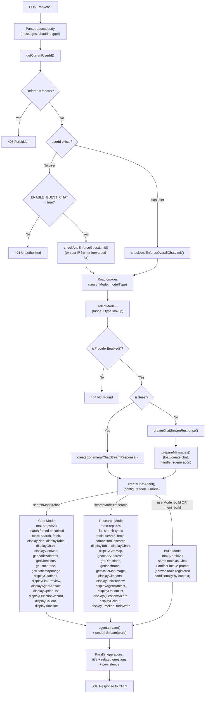

# Architecture Agent Pipeline

> **Audience:** Architect | Contributor
> **Prerequisites:** [Architecture](OVERVIEW.md)

This leaf traces a chat request through auth, model selection, agent selection, streaming, and SSE response creation.

## Agent Pipeline

Every chat request follows a single path through the API route into the streaming infrastructure. The route authenticates the user (or validates guest access), selects a model, and delegates to either the authenticated or ephemeral stream handler. New guest sessions default to the `speed` model tier in the UI, but the backend does not currently hard-reject a guest `quality` cookie.

Three agents — `search`, `research`, and `build` — share a common factory at [`lib/agents/chat/factory.ts`](../../lib/agents/chat/factory.ts) and a shared toolset at [`lib/agents/chat/toolset.ts`](../../lib/agents/chat/toolset.ts). Each agent declares its own `*_AGENT_ACTIVE_TOOLS` array, system prompt, step limit, and `configureSearchTool` wrapper. [`lib/agents/chat/registry.ts`](../../lib/agents/chat/registry.ts) resolves the active agent and dispatches to the per-agent module.

The agent is selected by [`resolveChatAgentId()`](../../lib/agents/chat/registry.ts): `searchMode === 'research'` routes to the research agent, `userMode === 'build'` (or `intent === 'build'`) routes to the build agent, and everything else routes to the search agent. The search and build agents force `type: 'optimized'` via `wrapSearchToolForChatMode` and run up to 20 steps; the research agent accepts the full search type set, runs up to 50 steps, and gains the `todoWrite` and `competitorResearch` tools. Canvas tools (`createCanvasArtifact`, `updateCanvasArtifact`, `readCanvasArtifact`) and `generateImage` are registered conditionally inside the factory when the matching context is present, regardless of agent.

**Request body fields:**

| Field              | Purpose                                                |
| ------------------ | ------------------------------------------------------ |
| `messages`         | Full AI SDK v6 `UIMessage[]` history                   |
| `chatId`           | Chat identifier                                        |
| `trigger`          | `submit-message` or `regenerate-message`               |
| `messageId`        | Target message ID (required for `regenerate-message`)  |
| `isNewChat`        | Optimization flag to skip loading existing chat        |
| `guestCanvasToken` | HMAC-signed token for guest canvas artifact continuity |

---
