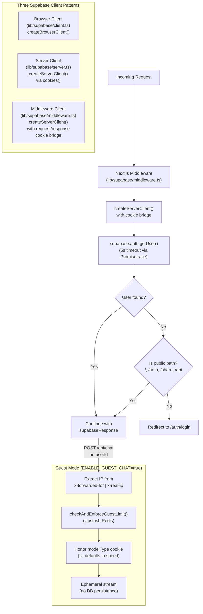

# Architecture Authentication Flow

> **Audience:** Architect | Contributor
> **Prerequisites:** [Architecture](OVERVIEW.md)

This leaf documents Supabase auth flow, client creation patterns, middleware behavior, and guest-mode handling.

## Authentication Flow

Supabase Auth is used with three client creation patterns depending on the execution context. The middleware intercepts every request to refresh sessions and enforce authentication on protected routes.

### Client pattern details

| Pattern    | File                         | Context                       | Cookie Access                   |
| ---------- | ---------------------------- | ----------------------------- | ------------------------------- |
| Browser    | `lib/supabase/client.ts`     | Client components             | Browser cookies (automatic)     |
| Server     | `lib/supabase/server.ts`     | Server components, API routes | `cookies()` from `next/headers` |
| Middleware | `lib/supabase/middleware.ts` | Request middleware            | Request/response cookie bridge  |

The middleware cookie bridge is critical: it creates a Supabase server client that can read request cookies and write updated session tokens back to the response. The source code warns not to add code between `createServerClient` and `getUser()` to avoid session desync.

The `getUser` call in middleware uses `Promise.race` with a 5-second timeout to avoid blocking on slow Supabase responses. If the timeout fires, the user is treated as unauthenticated.

**Source files:** [`lib/supabase/client.ts`](../../lib/supabase/client.ts), [`lib/supabase/server.ts`](../../lib/supabase/server.ts), [`lib/supabase/middleware.ts`](../../lib/supabase/middleware.ts)

---
