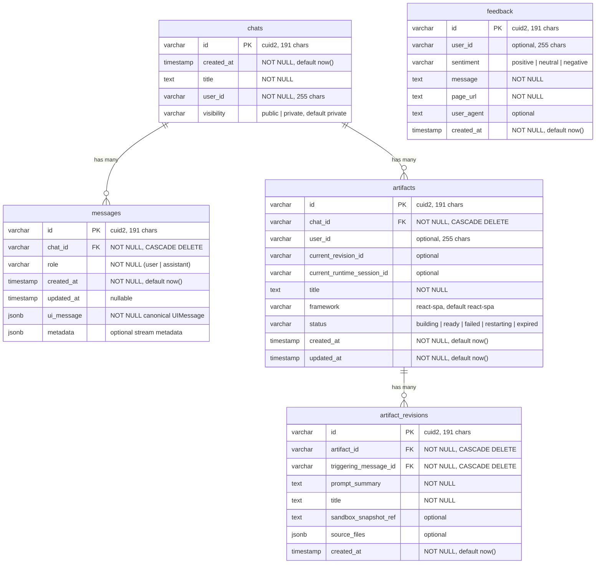

# Architecture Database Schema

> **Audience:** Architect | Contributor
> **Prerequisites:** [Architecture](OVERVIEW.md)

This leaf summarizes the active Drizzle/Supabase schema, indexes, and canonical message persistence contract.

## Database Schema

The database uses Drizzle ORM with Supabase PostgreSQL. The active chat schema stores **chats** and their canonical **messages**. Each message row owns a non-null `ui_message` JSONB payload containing the AI SDK `UIMessage`; there is no sidecar message-part table in the active contract. A separate **feedback** table stores user feedback.

### Schema details

- `messages.ui_message` is the canonical persisted AI SDK `UIMessage` and is enforced as `NOT NULL`.

- IDs are generated with **cuid2** (191 char max) via `@paralleldrive/cuid2`

- **Cascade deletes** propagate from chats through messages

- All tables use **Row-Level Security** (see [RLS Policy Chain](#rls-policy-chain))

### Indexes

| Table              | Index                                           | Purpose                        |
| ------------------ | ----------------------------------------------- | ------------------------------ |
| chats              | `chats_user_id_idx`                             | User's chat list               |
| chats              | `chats_user_id_created_at_idx`                  | Sorted chat list               |
| chats              | `chats_created_at_idx`                          | Global recency ordering        |
| chats              | `chats_id_user_id_idx`                          | RLS subquery from messages     |
| messages           | `messages_chat_id_idx`                          | Load messages by chat          |
| messages           | `messages_chat_id_created_at_idx`               | Ordered message load           |
| artifacts          | `artifacts_chat_id_idx`                         | Artifacts by chat              |
| artifact_revisions | `artifact_revisions_artifact_id_created_at_idx` | Ordered revisions per artifact |
| feedback           | `feedback_user_id_idx`                          | Feedback by user               |
| feedback           | `feedback_created_at_idx`                       | Feedback by recency            |

**Source file:** [`lib/db/schema.ts`](../../lib/db/schema.ts)

---
