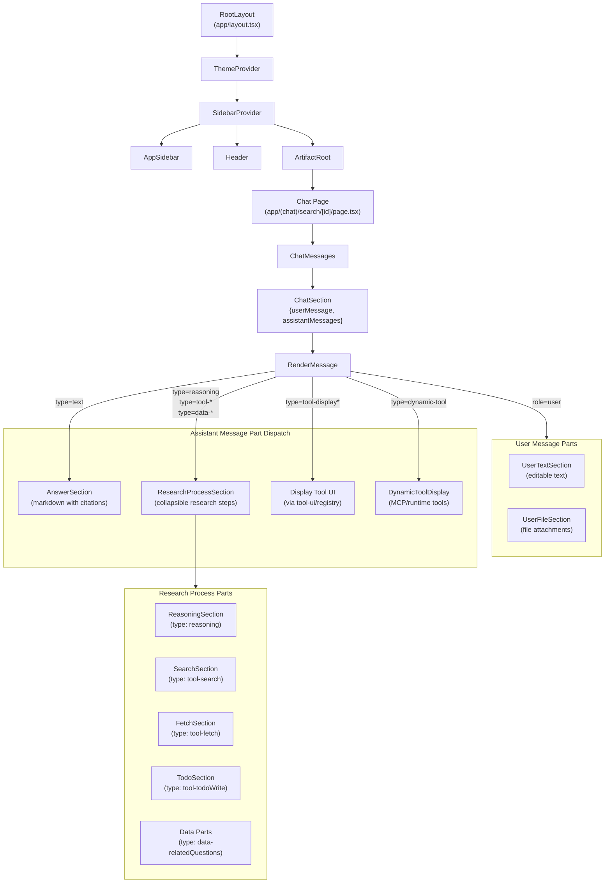

# Architecture Generative UI Component Tree

> **Audience:** Architect | Contributor
> **Prerequisites:** [Architecture](OVERVIEW.md)

This leaf summarizes chat message rendering, research sections, display tools, dynamic tools, and collapse behavior.

## Generative UI Component Tree

The UI renders chat messages as structured sections. Each section pairs a user message with its assistant response(s). The `RenderMessage` component dispatches each message part to the appropriate UI component using a buffer-and-flush strategy.

### Rendering strategy

The `RenderMessage` component in [`components/render-message.tsx`](../../components/render-message.tsx) processes assistant message parts sequentially:

1. **Buffer non-text parts** (reasoning, tool results, data) into a temporary array
2. **When a text part arrives**, flush the buffer as a `ResearchProcessSection` (with `hasSubsequentText=true`), then render the text as an `AnswerSection`
3. **Display tools** (`tool-display*` prefix) are flushed and rendered inline using `tryRenderToolUIByName` from the tool UI registry.
4. **Dynamic tools** (`dynamic-tool` type) are rendered via `DynamicToolDisplay` for MCP and runtime-defined tools
5. **After all parts**, flush any remaining buffered parts as a tail `ResearchProcessSection`

This produces an interleaved layout: research steps appear above their corresponding answer text, and display tool outputs appear inline where the agent invoked them.

### Collapsible behavior

The `ChatMessages` component manages open/close state for tool results:

- **Single tool** in a message: stays open by default
- **Multiple tools** in a message: all default to closed
- **Reasoning**: auto-collapses when followed by more content
- User clicks override all defaults

**Source files:** [`app/layout.tsx`](../../app/layout.tsx), [`components/chat-messages.tsx`](../../components/chat-messages.tsx), [`components/render-message.tsx`](../../components/render-message.tsx)

---
