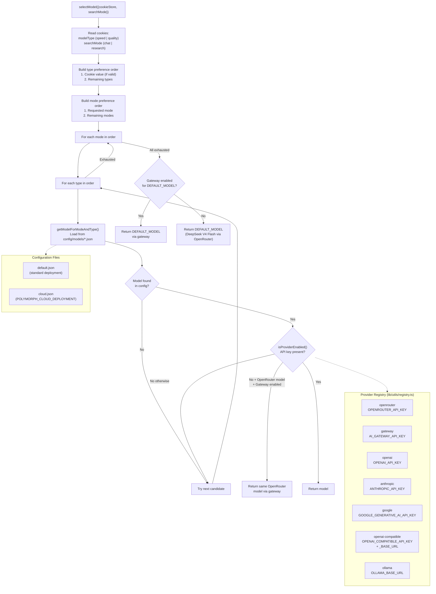
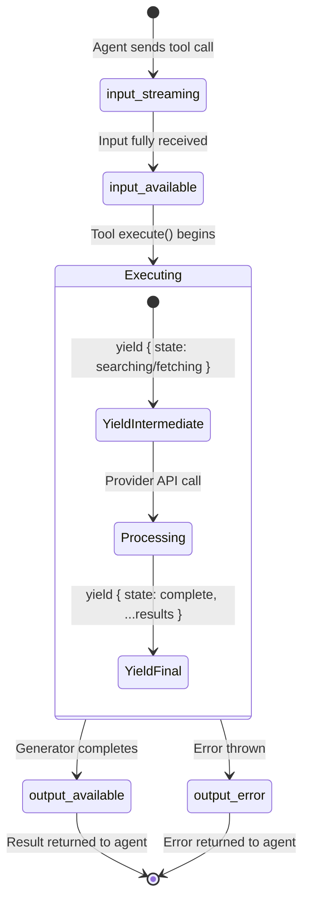

# Architecture Models and Tool State

> **Audience:** Architect | Contributor
> **Prerequisites:** [Architecture](OVERVIEW.md)

This leaf covers model selection and the AI SDK tool-state lifecycle from input streaming to output availability.

## Model Selection

Models are resolved through a layered preference system that considers the user's cookie preferences, the active search mode, and provider availability. New guest UI sessions default to the speed model tier, but the backend uses the same selection path for guest and authenticated requests and honors a valid `modelType` cookie before falling back to configured defaults.

### Default model configuration

From [`config/models/default.json`](../../config/models/default.json):

| Mode              | Type    | Model                        | Provider   |
| ----------------- | ------- | ---------------------------- | ---------- |
| Chat              | Speed   | `deepseek/deepseek-v4-flash` | OpenRouter |
| Chat              | Quality | `deepseek/deepseek-v4-pro`   | OpenRouter |
| Research          | Speed   | `deepseek/deepseek-v4-flash` | OpenRouter |
| Research          | Quality | `deepseek/deepseek-v4-pro`   | OpenRouter |
| Related Questions | --      | `deepseek/deepseek-v4-flash` | OpenRouter |

**Cloud deployment behavior:** The `POLYMORPH_CLOUD_DEPLOYMENT` flag controls config profile selection (uses `cloud.json` instead of `default.json`), rate limiting enforcement, and analytics event tracking.

If an OpenRouter candidate is selected from config but OpenRouter is disabled and Gateway is enabled, `selectModel()` returns the same model ID with `providerId: 'gateway'` before trying later candidates. The hardcoded `DEFAULT_MODEL` uses the same Gateway fallback after all configured candidates are exhausted.

**Source files:** [`lib/utils/model-selection.ts`](../../lib/utils/model-selection.ts), [`lib/utils/registry.ts`](../../lib/utils/registry.ts), [`lib/config/model-types.ts`](../../lib/config/model-types.ts), [`config/models/default.json`](../../config/models/default.json)

---

## Tool State Lifecycle

Each tool invocation progresses through AI SDK tool-part states inside the canonical `UIMessage.parts` array. The search and fetch tools use the `async *execute` generator pattern to yield intermediate states.

### UI rendering per state

| State              | UI Representation                                        |
| ------------------ | -------------------------------------------------------- |
| `input-streaming`  | Skeleton/shimmer loading animation                       |
| `input-available`  | Shows tool input parameters                              |
| `output-available` | Full result rendered (SearchSection, FetchSection, etc.) |
| `output-error`     | Error message with `tool_error_text`                     |

**Display tools** have a simpler lifecycle — their `execute` function simply returns the input as output, so they transition quickly through `input-streaming` -> `input-available` -> `output-available`.

---
