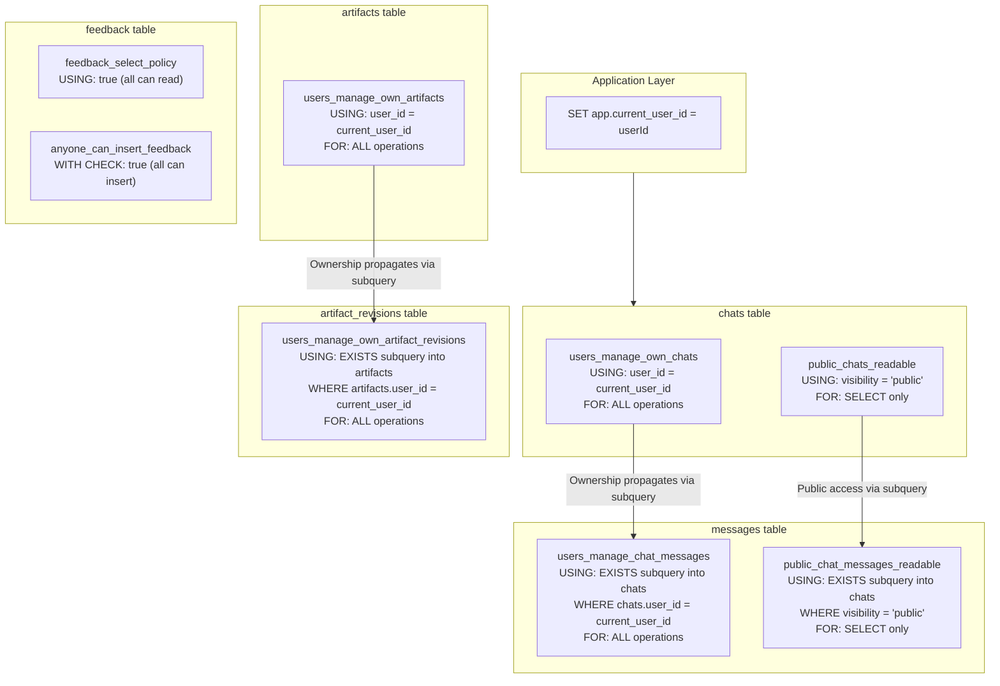

# Architecture RLS Policy Chain

> **Audience:** Architect | Contributor
> **Prerequisites:** [Architecture](OVERVIEW.md)

This leaf explains user-scoped Row-Level Security, the app.current_user_id session GUC, and public chat reads.

## RLS Policy Chain

Row-Level Security (RLS) is enabled on the user-owned application tables. Policies use `current_setting('app.current_user_id', true)` to identify the current user, which is set by the application layer before each database operation.

### Policy details

The RLS chain cascades through the table hierarchy:

1. **chats**: Users can perform all operations on their own chats (`user_id = current_user_id`). Public chats are readable by anyone (`visibility = 'public'`).

2. **messages**: Access is granted via `EXISTS` subquery checking if the parent chat belongs to the current user. Public chat messages are readable via a similar subquery checking `visibility = 'public'`.

3. **artifacts**: Users can perform all operations on artifacts where `user_id = current_user_id`.

4. **artifact_revisions**: Access is granted via `EXISTS` subquery checking if the parent artifact belongs to the current user.

5. **feedback**: Open access — anyone can insert and read feedback.

### Implementation details

The `current_setting('app.current_user_id', true)` call uses `true` as the second argument, which returns `NULL` instead of erroring when the setting is not set. This is required for the public access path where no user ID is available.

**Performance indexes** support the RLS subqueries:

- `chats_id_user_id_idx` — composite index on `(id, user_id)` for fast ownership checks from messages
- `messages_chat_id_idx` — supports ordered message loads by chat

**Source file:** [`lib/db/schema.ts`](../../lib/db/schema.ts)

---
