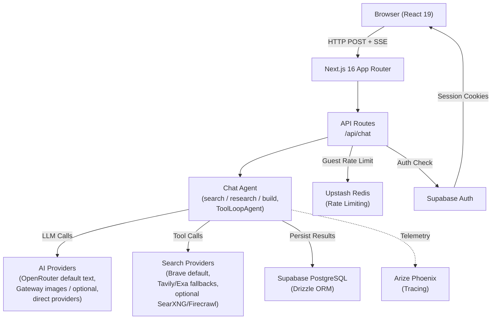

# Architecture System Overview

> **Audience:** Architect | Contributor
> **Prerequisites:** [Architecture](OVERVIEW.md)

This leaf summarizes the top-level app surfaces, route groups, provider integrations, and source files.

## System Overview

Polymorph is built on Next.js 16 (App Router) with React 19. A single chat API endpoint orchestrates an AI agent that performs multi-step research using tools (search, fetch, geo helpers, display, todo, and conditional image-generation/canvas tools) and streams structured responses back to the browser as Server-Sent Events (SSE). The generative UI layer renders each message part — text, reasoning, tool results, data attachments — using dedicated React components.

**User-mode vocabulary.** The UI exposes three modes via `components/mode-selector.tsx`: `search`, `research`, and `build`. On the server, the `searchMode` cookie stores that UI-facing value; `app/api/chat/route.ts` maps `search` and `build` onto backend `searchMode='chat'`, while `build` additionally injects `intent='build'`. `research` maps directly to backend `searchMode='research'`.

**Route structure.** The App Router uses two groups to isolate surfaces:

- `app/(chat)/` — default chat shell: `/` (root chat), `/search`, `/search/[id]`, `/demo/question-wizard`.
- `app/(admin)/` — admin surface gated by `ADMIN_USER_ID` (see `lib/auth/is-admin.ts`): currently `/admin/evals` ("Evaluation Summary" dashboard with Suites and Run history views; per-suite drilldown for Test Suite, Production Evals, and Regression Tests; URL state via `?view=suites|history` and `?suite=capability|trafficMonitor|regression`).
- `app/api/` — API routes, including chat, suggestions (+ `refresh` Vercel cron endpoint), the secret-gated `evals/run` replay endpoint, uploads, voice synthesis, canvas artifacts, and canvas asset proxying.
- `app/auth/` — Supabase auth flows (login, sign-up, forgot-password, confirm, update-password, OAuth, error).

The default chat-agent search path is Brave with Tavily and Exa fallbacks. SearXNG and Firecrawl are implemented as opt-in providers selected via `SEARCH_API`; they are not part of the default high-level search chain unless explicitly configured.

**Key source files:**

| Concern                  | File                                                                                                                                                                                                        |
| ------------------------ | ----------------------------------------------------------------------------------------------------------------------------------------------------------------------------------------------------------- |
| Chat API endpoint        | [`app/api/chat/route.ts`](../../app/api/chat/route.ts)                                                                                                                                                      |
| Suggestions refresh cron | [`app/api/suggestions/refresh/route.ts`](../../app/api/suggestions/refresh/route.ts) (Vercel cron, `CRON_SECRET`-gated)                                                                                     |
| Admin surface layout     | [`app/(admin)/layout.tsx`](<../../app/(admin)/layout.tsx>) (admin role gate)                                                                                                                                |
| Evals dashboard          | [`components/evals/dashboard-v2/dashboard.tsx`](../../components/evals/dashboard-v2/dashboard.tsx) (orchestrator) + sibling components in `components/evals/dashboard-v2/` and `components/evals/glossary/` |
| Evals queries            | [`lib/evals/queries.ts`](../../lib/evals/queries.ts) (`getEvalsDashboard`, suite-specific selectors)                                                                                                        |
| Agent factory            | [`lib/agents/chat/factory.ts`](../../lib/agents/chat/factory.ts), [`lib/agents/chat/registry.ts`](../../lib/agents/chat/registry.ts), and per-agent modules in `lib/agents/chat/`                           |
| Image generation tool    | [`lib/tools/generate-image/server.ts`](../../lib/tools/generate-image/server.ts)                                                                                                                            |
| Authenticated streaming  | [`lib/streaming/create-chat-stream-response.ts`](../../lib/streaming/create-chat-stream-response.ts)                                                                                                        |
| Guest streaming          | [`lib/streaming/create-ephemeral-chat-stream-response.ts`](../../lib/streaming/create-ephemeral-chat-stream-response.ts)                                                                                    |
| Database schema          | [`lib/db/schema.ts`](../../lib/db/schema.ts)                                                                                                                                                                |
| Provider registry        | [`lib/utils/registry.ts`](../../lib/utils/registry.ts)                                                                                                                                                      |
| Admin detection          | [`lib/auth/is-admin.ts`](../../lib/auth/is-admin.ts)                                                                                                                                                        |

---
