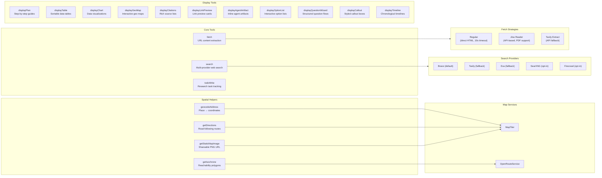

# Architecture Tool System

> **Audience:** Architect | Contributor
> **Prerequisites:** [Architecture](OVERVIEW.md)

This leaf summarizes core tools, spatial helpers, display tools, and agent-specific tool availability.

## Tool System

The chat agent system uses three categories of tools: **core tools** that perform actual research operations, **spatial helper tools** that compute map-ready data, and **display tools** that generate rich UI components inline in the chat.

### Tool Availability by Agent

| Tool                    |          Search agent          |         Research agent          |          Build agent           |
| ----------------------- | :----------------------------: | :-----------------------------: | :----------------------------: |
| `search`                | Yes (forced `type: optimized`) | Yes (full: general + optimized) | Yes (forced `type: optimized`) |
| `fetch`                 |              Yes               |               Yes               |              Yes               |
| `competitorResearch`    |               No               |               Yes               |               No               |
| `displayPlan`           |              Yes               |               No                |              Yes               |
| `displayTable`          |              Yes               |               Yes               |              Yes               |
| `displayChart`          |              Yes               |               Yes               |              Yes               |
| `displayGeoMap`         |              Yes               |               Yes               |              Yes               |
| `geocodeAddress`        |              Yes               |               Yes               |              Yes               |
| `getDirections`         |              Yes               |               Yes               |              Yes               |
| `getIsochrone`          |              Yes               |               Yes               |              Yes               |
| `getStaticMapImage`     |              Yes               |               Yes               |              Yes               |
| `displayCitations`      |              Yes               |               Yes               |              Yes               |
| `displayLinkPreview`    |              Yes               |               Yes               |              Yes               |
| `displayAgentArtifact`  |              Yes               |               Yes               |              Yes               |
| `displayOptionList`     |              Yes               |               Yes               |              Yes               |
| `displayQuestionWizard` |              Yes               |               Yes               |              Yes               |
| `displayCallout`        |              Yes               |               Yes               |              Yes               |
| `displayTimeline`       |              Yes               |               Yes               |              Yes               |
| `todoWrite`             |               No               |   Yes (when writer available)   |               No               |
| `createCanvasArtifact`  |  Conditional (canvas context)  |  Conditional (canvas context)   |  Conditional (canvas context)  |
| `updateCanvasArtifact`  |  Conditional (canvas context)  |  Conditional (canvas context)   |  Conditional (canvas context)  |
| `readCanvasArtifact`    |  Conditional (canvas context)  |  Conditional (canvas context)   |  Conditional (canvas context)  |
| `generateImage`         |  Conditional (image context)   |   Conditional (image context)   |  Conditional (image context)   |

The search and build agents share `SEARCH_AGENT_ACTIVE_TOOLS`; build adds the artifact-intake protocol to its system prompt but keeps the same active tool set.

**Tool implementation details:**

- **search** (`lib/tools/search.ts`): Uses `async *execute` generator pattern. Yields `{ state: 'searching', query }` immediately, then calls the configured search provider, and yields `{ state: 'complete', ...results }` with citation mapping. The search provider is selected by `SEARCH_API` env var (default: `brave`). For `type: 'general'`, a dedicated general search provider can be configured separately.

- **fetch** (`lib/tools/fetch.ts`): Also uses streaming generator. Has two modes: `regular` (direct HTTP fetch with HTML parsing, 50k char limit, 10s timeout) and `api` (Jina Reader or Tavily Extract for JavaScript-rendered pages and PDFs).

- **Spatial helpers** (`lib/tools/geocode-address.ts`, `lib/tools/get-directions.ts`, `lib/tools/get-isochrone.ts`, `lib/tools/get-static-map-image.ts`): Compose-first geo utilities. `geocodeAddress` resolves place names into coordinates before mapping, `getDirections` returns route points plus duration/distance labels, `getIsochrone` returns polygon points for reachability overlays, and `getStaticMapImage` returns a public PNG URL when the user needs a shareable image rather than an interactive card.

- **todoWrite** (`lib/tools/todo.ts`): Session-scoped task tracking. Uses content-based merge logic — sending a todo with the same content as an existing one updates it rather than creating a duplicate. Returns `completedCount` and `totalCount` for progress tracking.

- **Display tools** (`lib/tools/display-*.ts`): All display tools simply return their input as output (`execute: async params => params`). They exist to structure data for the frontend — the actual rendering happens in `components/tool-ui/registry.tsx`.

For the full spatial flow and renderer contract, see [Geo & Spatial Tools](GEO-TOOLS.md).

**Source files:** [`lib/tools/`](../../lib/tools/), [`lib/tools/search/providers/`](../../lib/tools/search/providers/)

---
