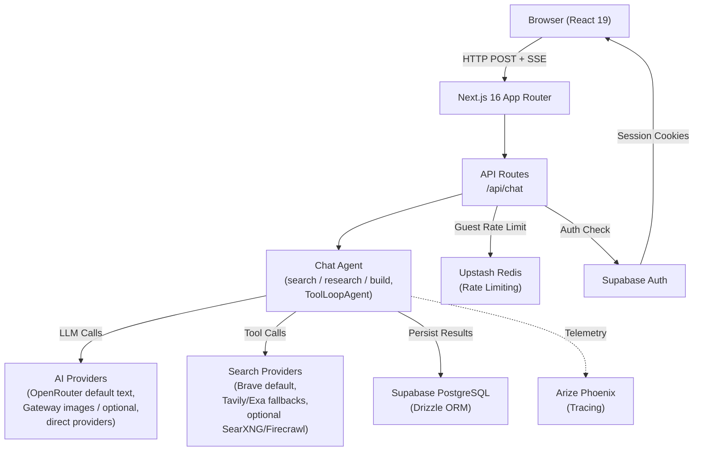
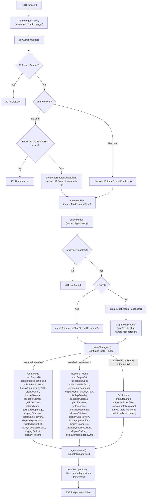
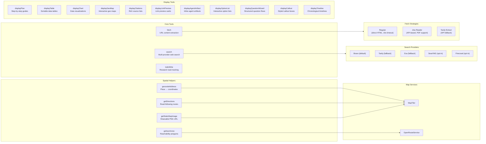
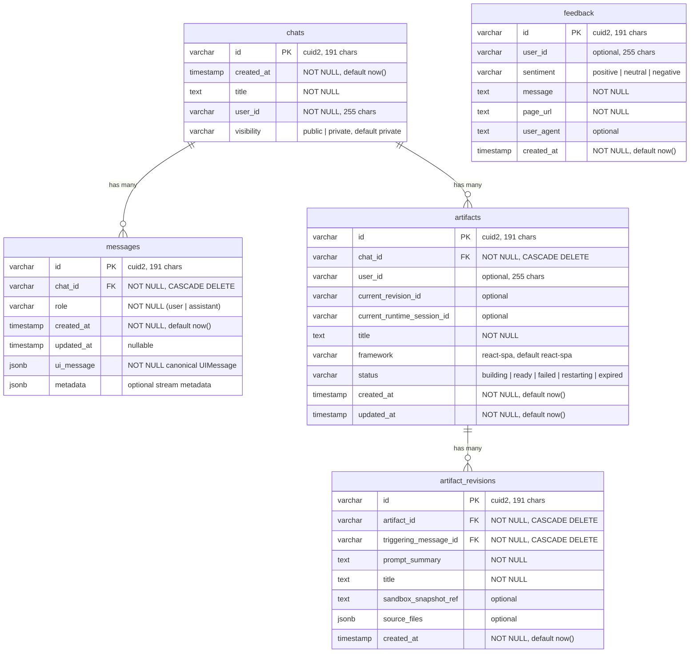
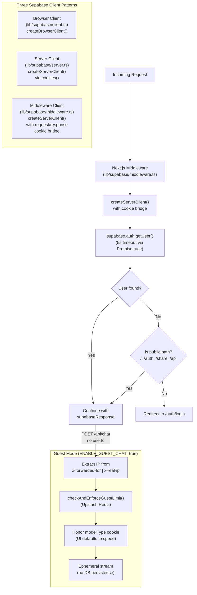
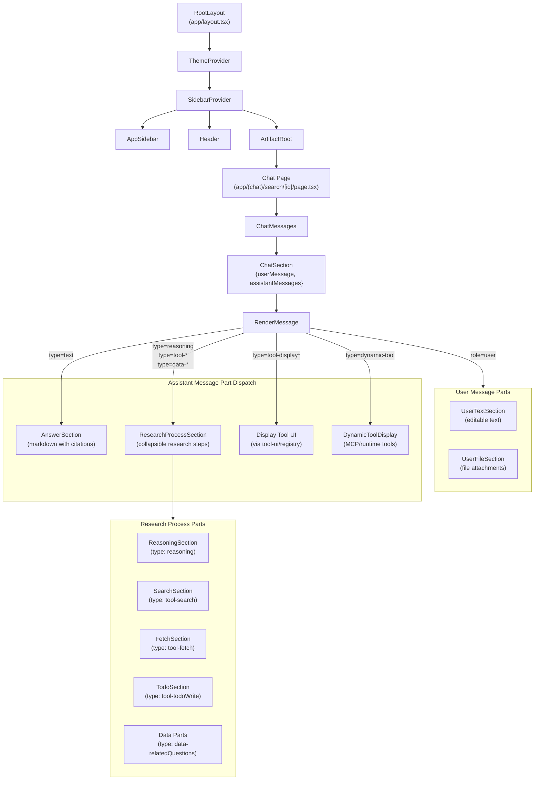
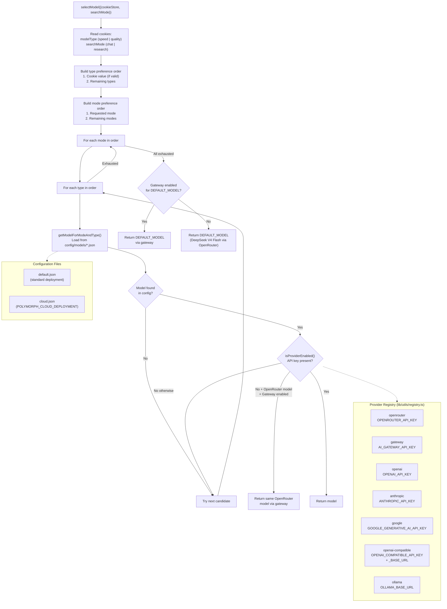
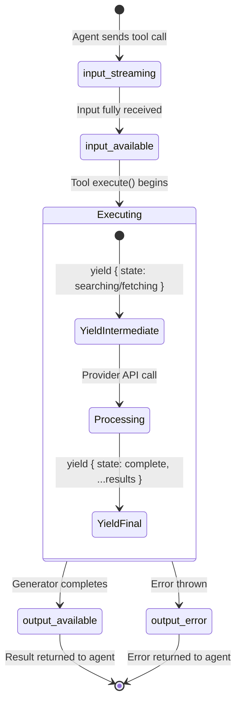
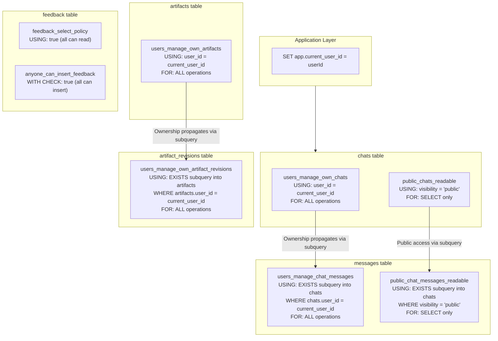

# Architecture

> **Audience:** Architect | Contributor
> **Prerequisites:** [Quickstart Guide](../getting-started/QUICKSTART.md)

This document describes the internal architecture of Polymorph — an AI platform with generative UI. It covers the agent pipeline, tool system, streaming infrastructure, database schema, authentication, UI rendering, and model selection.

## Tech Stack

| Category  | Technology                                                                                                                                         |
| --------- | -------------------------------------------------------------------------------------------------------------------------------------------------- |
| Framework | Next.js 16 (App Router)                                                                                                                            |
| Runtime   | Bun                                                                                                                                                |
| Language  | TypeScript (strict mode)                                                                                                                           |
| Database  | PostgreSQL via Supabase + Drizzle ORM                                                                                                              |
| Auth      | Supabase Auth                                                                                                                                      |
| AI        | Vercel AI SDK + OpenRouter text defaults; Vercel AI Gateway for image generation and optional routes                                               |
| Search    | Brave (default), Tavily/Exa fallbacks, optional SearXNG/Firecrawl providers                                                                        |
| Artifacts | Canvas artifact compiler + workspace (single-file HTML preview/export)                                                                             |
| Styling   | Tailwind CSS v4 + shadcn/ui                                                                                                                        |
| Testing   | Vitest                                                                                                                                             |
| Tracing   | Arize Phoenix                                                                                                                                      |
| Gen UI    | 11 display tools (tables, charts, geo maps, timelines, citations, callouts, plans, link previews, agent artifacts, option lists, question wizards) |

## Table of Contents

- [System Overview](#system-overview)
- [Agent Pipeline](#agent-pipeline)
- [Tool System](#tool-system)
- [Streaming Architecture](#streaming-architecture)
- [Database Schema](#database-schema)
- [Authentication Flow](#authentication-flow)
- [Generative UI Component Tree](#generative-ui-component-tree)
- [Model Selection](#model-selection)
- [Tool State Lifecycle](#tool-state-lifecycle)
- [RLS Policy Chain](#rls-policy-chain)
- [Key File Reference](#key-file-reference)

---

## System Overview

Polymorph is built on Next.js 16 (App Router) with React 19. A single chat API endpoint orchestrates an AI agent that performs multi-step research using tools (search, fetch, geo helpers, display, todo, and conditional image-generation/canvas tools) and streams structured responses back to the browser as Server-Sent Events (SSE). The generative UI layer renders each message part — text, reasoning, tool results, data attachments — using dedicated React components.

**User-mode vocabulary.** The UI exposes three modes via `components/mode-selector.tsx`: `search`, `research`, and `build`. On the server, the `searchMode` cookie stores that UI-facing value; `app/api/chat/route.ts` maps `search` and `build` onto backend `searchMode='chat'`, while `build` additionally injects `intent='build'`. `research` maps directly to backend `searchMode='research'`.

**Route structure.** The App Router uses two groups to isolate surfaces:

- `app/(chat)/` — default chat shell: `/` (root chat), `/search`, `/search/[id]`, `/demo/question-wizard`.
- `app/(admin)/` — admin surface gated by `ADMIN_USER_ID` (see `lib/auth/is-admin.ts`): currently `/admin/evals` ("Evaluation Summary" dashboard with Suites and Run history views; per-suite drilldown for Test Suite, Production Evals, and Regression Tests; URL state via `?view=suites|history` and `?suite=capability|trafficMonitor|regression`).
- `app/api/` — API routes, including chat, suggestions (+ `refresh` Vercel cron endpoint), the secret-gated `evals/run` replay endpoint, uploads, voice synthesis, canvas artifacts, and canvas asset proxying.
- `app/auth/` — Supabase auth flows (login, sign-up, forgot-password, confirm, update-password, OAuth, error).



The default chat-agent search path is Brave with Tavily and Exa fallbacks. SearXNG and Firecrawl are implemented as opt-in providers selected via `SEARCH_API`; they are not part of the default high-level search chain unless explicitly configured.

**Key source files:**

| Concern                  | File                                                                                                                                                                                                        |
| ------------------------ | ----------------------------------------------------------------------------------------------------------------------------------------------------------------------------------------------------------- |
| Chat API endpoint        | [`app/api/chat/route.ts`](../../app/api/chat/route.ts)                                                                                                                                                      |
| Suggestions refresh cron | [`app/api/suggestions/refresh/route.ts`](../../app/api/suggestions/refresh/route.ts) (Vercel cron, `CRON_SECRET`-gated)                                                                                     |
| Admin surface layout     | [`app/(admin)/layout.tsx`](<../../app/(admin)/layout.tsx>) (admin role gate)                                                                                                                                |
| Evals dashboard          | [`components/evals/dashboard-v2/dashboard.tsx`](../../components/evals/dashboard-v2/dashboard.tsx) (orchestrator) + sibling components in `components/evals/dashboard-v2/` and `components/evals/glossary/` |
| Evals queries            | [`lib/evals/queries.ts`](../../lib/evals/queries.ts) (`getEvalsDashboard`, suite-specific selectors)                                                                                                        |
| Agent factory            | [`lib/agents/chat/factory.ts`](../../lib/agents/chat/factory.ts), [`lib/agents/chat/registry.ts`](../../lib/agents/chat/registry.ts), and per-agent modules in `lib/agents/chat/`                           |
| Image generation tool    | [`lib/tools/generate-image/server.ts`](../../lib/tools/generate-image/server.ts)                                                                                                                            |
| Authenticated streaming  | [`lib/streaming/create-chat-stream-response.ts`](../../lib/streaming/create-chat-stream-response.ts)                                                                                                        |
| Guest streaming          | [`lib/streaming/create-ephemeral-chat-stream-response.ts`](../../lib/streaming/create-ephemeral-chat-stream-response.ts)                                                                                    |
| Database schema          | [`lib/db/schema.ts`](../../lib/db/schema.ts)                                                                                                                                                                |
| Provider registry        | [`lib/utils/registry.ts`](../../lib/utils/registry.ts)                                                                                                                                                      |
| Admin detection          | [`lib/auth/is-admin.ts`](../../lib/auth/is-admin.ts)                                                                                                                                                        |

---

## Agent Pipeline

Every chat request follows a single path through the API route into the streaming infrastructure. The route authenticates the user (or validates guest access), selects a model, and delegates to either the authenticated or ephemeral stream handler. New guest sessions default to the `speed` model tier in the UI, but the backend does not currently hard-reject a guest `quality` cookie.



Three agents — `search`, `research`, and `build` — share a common factory at [`lib/agents/chat/factory.ts`](../../lib/agents/chat/factory.ts) and a shared toolset at [`lib/agents/chat/toolset.ts`](../../lib/agents/chat/toolset.ts). Each agent declares its own `*_AGENT_ACTIVE_TOOLS` array, system prompt, step limit, and `configureSearchTool` wrapper. [`lib/agents/chat/registry.ts`](../../lib/agents/chat/registry.ts) resolves the active agent and dispatches to the per-agent module.

The agent is selected by [`resolveChatAgentId()`](../../lib/agents/chat/registry.ts): `searchMode === 'research'` routes to the research agent, `userMode === 'build'` (or `intent === 'build'`) routes to the build agent, and everything else routes to the search agent. The search and build agents force `type: 'optimized'` via `wrapSearchToolForChatMode` and run up to 20 steps; the research agent accepts the full search type set, runs up to 50 steps, and gains the `todoWrite` and `competitorResearch` tools. Canvas tools (`createCanvasArtifact`, `updateCanvasArtifact`, `readCanvasArtifact`) and `generateImage` are registered conditionally inside the factory when the matching context is present, regardless of agent.

**Request body fields:**

| Field              | Purpose                                                |
| ------------------ | ------------------------------------------------------ |
| `messages`         | Full AI SDK v6 `UIMessage[]` history                   |
| `chatId`           | Chat identifier                                        |
| `trigger`          | `submit-message` or `regenerate-message`               |
| `messageId`        | Target message ID (required for `regenerate-message`)  |
| `isNewChat`        | Optimization flag to skip loading existing chat        |
| `guestCanvasToken` | HMAC-signed token for guest canvas artifact continuity |

---

## Tool System

The chat agent system uses three categories of tools: **core tools** that perform actual research operations, **spatial helper tools** that compute map-ready data, and **display tools** that generate rich UI components inline in the chat.



### Tool Availability by Agent

| Tool                    |          Search agent          |         Research agent          |          Build agent           |
| ----------------------- | :----------------------------: | :-----------------------------: | :----------------------------: |
| `search`                | Yes (forced `type: optimized`) | Yes (full: general + optimized) | Yes (forced `type: optimized`) |
| `fetch`                 |              Yes               |               Yes               |              Yes               |
| `competitorResearch`    |               No               |               Yes               |               No               |
| `displayPlan`           |              Yes               |               No                |              Yes               |
| `displayTable`          |              Yes               |               Yes               |              Yes               |
| `displayChart`          |              Yes               |               Yes               |              Yes               |
| `displayGeoMap`         |              Yes               |               Yes               |              Yes               |
| `geocodeAddress`        |              Yes               |               Yes               |              Yes               |
| `getDirections`         |              Yes               |               Yes               |              Yes               |
| `getIsochrone`          |              Yes               |               Yes               |              Yes               |
| `getStaticMapImage`     |              Yes               |               Yes               |              Yes               |
| `displayCitations`      |              Yes               |               Yes               |              Yes               |
| `displayLinkPreview`    |              Yes               |               Yes               |              Yes               |
| `displayAgentArtifact`  |              Yes               |               Yes               |              Yes               |
| `displayOptionList`     |              Yes               |               Yes               |              Yes               |
| `displayQuestionWizard` |              Yes               |               Yes               |              Yes               |
| `displayCallout`        |              Yes               |               Yes               |              Yes               |
| `displayTimeline`       |              Yes               |               Yes               |              Yes               |
| `todoWrite`             |               No               |   Yes (when writer available)   |               No               |
| `createCanvasArtifact`  |  Conditional (canvas context)  |  Conditional (canvas context)   |  Conditional (canvas context)  |
| `updateCanvasArtifact`  |  Conditional (canvas context)  |  Conditional (canvas context)   |  Conditional (canvas context)  |
| `readCanvasArtifact`    |  Conditional (canvas context)  |  Conditional (canvas context)   |  Conditional (canvas context)  |
| `generateImage`         |  Conditional (image context)   |   Conditional (image context)   |  Conditional (image context)   |

The search and build agents share `SEARCH_AGENT_ACTIVE_TOOLS`; build adds the artifact-intake protocol to its system prompt but keeps the same active tool set.

**Tool implementation details:**

- **search** (`lib/tools/search.ts`): Uses `async *execute` generator pattern. Yields `{ state: 'searching', query }` immediately, then calls the configured search provider, and yields `{ state: 'complete', ...results }` with citation mapping. The search provider is selected by `SEARCH_API` env var (default: `brave`). For `type: 'general'`, a dedicated general search provider can be configured separately.

- **fetch** (`lib/tools/fetch.ts`): Also uses streaming generator. Has two modes: `regular` (direct HTTP fetch with HTML parsing, 50k char limit, 10s timeout) and `api` (Jina Reader or Tavily Extract for JavaScript-rendered pages and PDFs).

- **Spatial helpers** (`lib/tools/geocode-address.ts`, `lib/tools/get-directions.ts`, `lib/tools/get-isochrone.ts`, `lib/tools/get-static-map-image.ts`): Compose-first geo utilities. `geocodeAddress` resolves place names into coordinates before mapping, `getDirections` returns route points plus duration/distance labels, `getIsochrone` returns polygon points for reachability overlays, and `getStaticMapImage` returns a public PNG URL when the user needs a shareable image rather than an interactive card.

- **todoWrite** (`lib/tools/todo.ts`): Session-scoped task tracking. Uses content-based merge logic — sending a todo with the same content as an existing one updates it rather than creating a duplicate. Returns `completedCount` and `totalCount` for progress tracking.

- **Display tools** (`lib/tools/display-*.ts`): All display tools simply return their input as output (`execute: async params => params`). They exist to structure data for the frontend — the actual rendering happens in `components/tool-ui/registry.tsx`.

For the full spatial flow and renderer contract, see [Geo & Spatial Tools](GEO-TOOLS.md).

**Source files:** [`lib/tools/`](../../lib/tools/), [`lib/tools/search/providers/`](../../lib/tools/search/providers/)

---

## Streaming Architecture

Both authenticated and ephemeral streams follow the same core pattern: create a `UIMessageStream`, run the agent inside it, merge the agent's output stream, and return an SSE response. The authenticated path adds message preparation, persistence, and title generation.

```mermaid
sequenceDiagram
    participant Client as Browser
    participant API as POST /api/chat
    participant Stream as createUIMessageStream
    participant Prep as prepareMessages()
    participant Agent as ToolLoopAgent
    participant Smooth as smoothStream(word)
    participant LLM as AI Provider
    participant Title as Title Generator
    participant Related as Related Questions
    participant DB as PostgreSQL

    Client->>API: HTTP POST (messages, chatId)
    API->>Stream: createUIMessageStream()

    rect rgb(240, 248, 255)
        Note over Stream,Agent: Stream execute callback
        Stream->>Prep: Prepare messages (load chat, handle regen)
        Prep-->>Stream: UIMessage[]
        Stream->>Stream: convertToModelMessages()
        Stream->>Stream: pruneMessages() + truncateMessages()
        Stream->>Agent: createResearcher({model, writer, searchMode})
        Agent->>LLM: agent.stream(messages)

        loop Tool Loop (up to 20/50 steps)
            LLM-->>Agent: Tool call (search/fetch/etc.)
            Agent-->>Stream: yield { state: 'searching' }
            Agent-->>LLM: yield { state: 'complete', results }
        end

        LLM-->>Agent: Final text response
        Agent->>Smooth: Transform chunks
        Smooth-->>Stream: Word-chunked tokens
        Stream->>Stream: writer.merge(toUIMessageStream)
    end

    par Parallel Post-Processing
        Stream->>Title: generateChatTitle() (new chats only)
        Title-->>Stream: Generated title
    and
        Stream->>Related: streamRelatedQuestions()
        Related-->>Stream: data-relatedQuestions parts
        Note over Related: loading -> streaming -> success
    end

    Stream-->>Client: SSE (UIMessageStreamResponse)

    Note over Stream,DB: onFinish callback
    Stream->>DB: persistStreamResults()
    Stream->>DB: updateChatTitle()
```

### Key implementation details

- **Smooth streaming** uses `smoothStream({ chunking: 'word' })` to deliver text token-by-token at word boundaries, avoiding partial-word flicker in the UI.

- **Title generation** runs in parallel with the agent stream for new chats only. It uses a separate LLM call and falls back to `'Untitled'` on error.

- **Related questions** are streamed incrementally as `data-relatedQuestions` parts with status transitions: `loading` -> `streaming` (with incremental question list) -> `success` (final validated list). Uses Zod schema validation via `relatedSchema`.

- **Message preparation** (`prepareMessages`) handles four scenarios:
  1. **New chat**: Creates chat + saves first message optimistically in the background via `context.pendingInitialSave`
  2. **Existing chat**: Loads history and appends the new message
  3. **Native interactive output**: Validates one registered interactive tool part moving from `input-available` to `output-available`
  4. **Regeneration**: Deletes messages from the target index and returns truncated history

- **Context window management**: Before sending to the LLM, messages pass through `pruneMessages` (removes old reasoning and tool calls) and `truncateMessages` (enforces model-specific token limits).

- **OpenAI compatibility**: For OpenAI models, reasoning parts are stripped before conversion to model messages, due to the Responses API requiring reasoning items and following items to be kept together.

- **Persistence** happens in the `onFinish` callback with retry logic via `retryDatabaseOperation`. Metadata (`correlationId`, optional `otelTraceId`, `userMode`, `modelType`, `modelId`) is attached to the response message before saving.

- **Ephemeral streams** (guest mode) skip persistence entirely — no database writes, no title generation, no analytics.

### Two stream paths

| Feature            |  Authenticated  |     Ephemeral (Guest)     |
| ------------------ | :-------------: | :-----------------------: |
| Load chat history  |       Yes       | No (uses passed messages) |
| Save to database   |       Yes       |            No             |
| Generate title     | Yes (new chats) |            No             |
| Related questions  |       Yes       |            Yes            |
| Analytics tracking |       Yes       |            No             |
| Smooth streaming   |       Yes       |            Yes            |
| Context pruning    |       Yes       |            Yes            |

**Source files:** [`lib/streaming/create-chat-stream-response.ts`](../../lib/streaming/create-chat-stream-response.ts), [`lib/streaming/create-ephemeral-chat-stream-response.ts`](../../lib/streaming/create-ephemeral-chat-stream-response.ts), [`lib/streaming/helpers/`](../../lib/streaming/helpers/)

---

## Database Schema

The database uses Drizzle ORM with Supabase PostgreSQL. The active chat schema stores **chats** and their canonical **messages**. Each message row owns a non-null `ui_message` JSONB payload containing the AI SDK `UIMessage`; there is no sidecar message-part table in the active contract. A separate **feedback** table stores user feedback.



### Schema details

- `messages.ui_message` is the canonical persisted AI SDK `UIMessage` and is enforced as `NOT NULL`.

- IDs are generated with **cuid2** (191 char max) via `@paralleldrive/cuid2`

- **Cascade deletes** propagate from chats through messages

- All tables use **Row-Level Security** (see [RLS Policy Chain](#rls-policy-chain))

### Indexes

| Table              | Index                                           | Purpose                        |
| ------------------ | ----------------------------------------------- | ------------------------------ |
| chats              | `chats_user_id_idx`                             | User's chat list               |
| chats              | `chats_user_id_created_at_idx`                  | Sorted chat list               |
| chats              | `chats_created_at_idx`                          | Global recency ordering        |
| chats              | `chats_id_user_id_idx`                          | RLS subquery from messages     |
| messages           | `messages_chat_id_idx`                          | Load messages by chat          |
| messages           | `messages_chat_id_created_at_idx`               | Ordered message load           |
| artifacts          | `artifacts_chat_id_idx`                         | Artifacts by chat              |
| artifact_revisions | `artifact_revisions_artifact_id_created_at_idx` | Ordered revisions per artifact |
| feedback           | `feedback_user_id_idx`                          | Feedback by user               |
| feedback           | `feedback_created_at_idx`                       | Feedback by recency            |

**Source file:** [`lib/db/schema.ts`](../../lib/db/schema.ts)

---

## Authentication Flow

Supabase Auth is used with three client creation patterns depending on the execution context. The middleware intercepts every request to refresh sessions and enforce authentication on protected routes.



### Client pattern details

| Pattern    | File                         | Context                       | Cookie Access                   |
| ---------- | ---------------------------- | ----------------------------- | ------------------------------- |
| Browser    | `lib/supabase/client.ts`     | Client components             | Browser cookies (automatic)     |
| Server     | `lib/supabase/server.ts`     | Server components, API routes | `cookies()` from `next/headers` |
| Middleware | `lib/supabase/middleware.ts` | Request middleware            | Request/response cookie bridge  |

The middleware cookie bridge is critical: it creates a Supabase server client that can read request cookies and write updated session tokens back to the response. The source code warns not to add code between `createServerClient` and `getUser()` to avoid session desync.

The `getUser` call in middleware uses `Promise.race` with a 5-second timeout to avoid blocking on slow Supabase responses. If the timeout fires, the user is treated as unauthenticated.

**Source files:** [`lib/supabase/client.ts`](../../lib/supabase/client.ts), [`lib/supabase/server.ts`](../../lib/supabase/server.ts), [`lib/supabase/middleware.ts`](../../lib/supabase/middleware.ts)

---

## Generative UI Component Tree

The UI renders chat messages as structured sections. Each section pairs a user message with its assistant response(s). The `RenderMessage` component dispatches each message part to the appropriate UI component using a buffer-and-flush strategy.



### Rendering strategy

The `RenderMessage` component in [`components/render-message.tsx`](../../components/render-message.tsx) processes assistant message parts sequentially:

1. **Buffer non-text parts** (reasoning, tool results, data) into a temporary array
2. **When a text part arrives**, flush the buffer as a `ResearchProcessSection` (with `hasSubsequentText=true`), then render the text as an `AnswerSection`
3. **Display tools** (`tool-display*` prefix) are flushed and rendered inline using `tryRenderToolUIByName` from the tool UI registry.
4. **Dynamic tools** (`dynamic-tool` type) are rendered via `DynamicToolDisplay` for MCP and runtime-defined tools
5. **After all parts**, flush any remaining buffered parts as a tail `ResearchProcessSection`

This produces an interleaved layout: research steps appear above their corresponding answer text, and display tool outputs appear inline where the agent invoked them.

### Collapsible behavior

The `ChatMessages` component manages open/close state for tool results:

- **Single tool** in a message: stays open by default
- **Multiple tools** in a message: all default to closed
- **Reasoning**: auto-collapses when followed by more content
- User clicks override all defaults

**Source files:** [`app/layout.tsx`](../../app/layout.tsx), [`components/chat-messages.tsx`](../../components/chat-messages.tsx), [`components/render-message.tsx`](../../components/render-message.tsx)

---

## Model Selection

Models are resolved through a layered preference system that considers the user's cookie preferences, the active search mode, and provider availability. New guest UI sessions default to the speed model tier, but the backend uses the same selection path for guest and authenticated requests and honors a valid `modelType` cookie before falling back to configured defaults.



### Default model configuration

From [`config/models/default.json`](../../config/models/default.json):

| Mode              | Type    | Model                        | Provider   |
| ----------------- | ------- | ---------------------------- | ---------- |
| Chat              | Speed   | `deepseek/deepseek-v4-flash` | OpenRouter |
| Chat              | Quality | `deepseek/deepseek-v4-pro`   | OpenRouter |
| Research          | Speed   | `deepseek/deepseek-v4-flash` | OpenRouter |
| Research          | Quality | `deepseek/deepseek-v4-pro`   | OpenRouter |
| Related Questions | --      | `deepseek/deepseek-v4-flash` | OpenRouter |

**Cloud deployment behavior:** The `POLYMORPH_CLOUD_DEPLOYMENT` flag controls config profile selection (uses `cloud.json` instead of `default.json`), rate limiting enforcement, and analytics event tracking.

If an OpenRouter candidate is selected from config but OpenRouter is disabled and Gateway is enabled, `selectModel()` returns the same model ID with `providerId: 'gateway'` before trying later candidates. The hardcoded `DEFAULT_MODEL` uses the same Gateway fallback after all configured candidates are exhausted.

**Source files:** [`lib/utils/model-selection.ts`](../../lib/utils/model-selection.ts), [`lib/utils/registry.ts`](../../lib/utils/registry.ts), [`lib/config/model-types.ts`](../../lib/config/model-types.ts), [`config/models/default.json`](../../config/models/default.json)

---

## Tool State Lifecycle

Each tool invocation progresses through AI SDK tool-part states inside the canonical `UIMessage.parts` array. The search and fetch tools use the `async *execute` generator pattern to yield intermediate states.



### UI rendering per state

| State              | UI Representation                                        |
| ------------------ | -------------------------------------------------------- |
| `input-streaming`  | Skeleton/shimmer loading animation                       |
| `input-available`  | Shows tool input parameters                              |
| `output-available` | Full result rendered (SearchSection, FetchSection, etc.) |
| `output-error`     | Error message with `tool_error_text`                     |

**Display tools** have a simpler lifecycle — their `execute` function simply returns the input as output, so they transition quickly through `input-streaming` -> `input-available` -> `output-available`.

---

## RLS Policy Chain

Row-Level Security (RLS) is enabled on the user-owned application tables. Policies use `current_setting('app.current_user_id', true)` to identify the current user, which is set by the application layer before each database operation.



### Policy details

The RLS chain cascades through the table hierarchy:

1. **chats**: Users can perform all operations on their own chats (`user_id = current_user_id`). Public chats are readable by anyone (`visibility = 'public'`).

2. **messages**: Access is granted via `EXISTS` subquery checking if the parent chat belongs to the current user. Public chat messages are readable via a similar subquery checking `visibility = 'public'`.

3. **artifacts**: Users can perform all operations on artifacts where `user_id = current_user_id`.

4. **artifact_revisions**: Access is granted via `EXISTS` subquery checking if the parent artifact belongs to the current user.

5. **feedback**: Open access — anyone can insert and read feedback.

### Implementation details

The `current_setting('app.current_user_id', true)` call uses `true` as the second argument, which returns `NULL` instead of erroring when the setting is not set. This is required for the public access path where no user ID is available.

**Performance indexes** support the RLS subqueries:

- `chats_id_user_id_idx` — composite index on `(id, user_id)` for fast ownership checks from messages
- `messages_chat_id_idx` — supports ordered message loads by chat

**Source file:** [`lib/db/schema.ts`](../../lib/db/schema.ts)

---

## Key File Reference

| File                                                     | Purpose                                                                                                      |
| -------------------------------------------------------- | ------------------------------------------------------------------------------------------------------------ |
| `app/api/chat/route.ts`                                  | Main chat API endpoint (300s timeout, `force-dynamic`)                                                       |
| `lib/agents/chat/factory.ts`                             | Shared `ToolLoopAgent` factory; canvas/image tools registered conditionally by context                       |
| `lib/agents/chat/registry.ts`                            | Agent ID resolution (`resolveChatAgentId`) and dispatch (`createChatAgent`)                                  |
| `lib/agents/chat/{search,research,build}.ts`             | Per-agent definitions: system prompt, active tools, step limit, search-tool wrapping                         |
| `lib/agents/chat/toolset.ts`                             | `ChatAgentTools` type and the `createChatAgentTools()` factory shared by all three agents                    |
| `lib/agents/prompts/search-mode-prompts.ts`              | System prompts for chat/research modes                                                                       |
| `lib/tools/search.ts`                                    | Multi-provider search tool with streaming generator                                                          |
| `lib/tools/fetch.ts`                                     | Web content extraction (regular + API-based)                                                                 |
| `lib/tools/todo.ts`                                      | Session-scoped task tracking with content-based merge                                                        |
| `lib/tools/display-*.ts`                                 | Display tools (plan, table, chart, citations, link preview, option list, question wizard, callout, timeline) |
| `lib/tools/search/providers/`                            | Search provider implementations (tavily, brave, exa, searxng, firecrawl)                                     |
| `lib/streaming/create-chat-stream-response.ts`           | Authenticated chat streaming with persistence                                                                |
| `lib/streaming/create-ephemeral-chat-stream-response.ts` | Guest/anonymous streaming (stateless)                                                                        |
| `lib/streaming/helpers/persist-stream-results.ts`        | Database persistence with retry logic                                                                        |
| `lib/streaming/helpers/prepare-messages.ts`              | Message preparation (new chat, existing chat, regeneration)                                                  |
| `lib/streaming/helpers/stream-related-questions.ts`      | Related questions streaming with status transitions                                                          |
| `lib/db/schema.ts`                                       | Drizzle schema with RLS policies and check constraints                                                       |
| `lib/supabase/client.ts`                                 | Browser Supabase client                                                                                      |
| `lib/supabase/server.ts`                                 | Server Supabase client (cookies-based)                                                                       |
| `lib/supabase/middleware.ts`                             | Session refresh middleware with 5s timeout                                                                   |
| `lib/utils/model-selection.ts`                           | Model resolution with fallback chain                                                                         |
| `lib/utils/registry.ts`                                  | AI provider registry (6 providers)                                                                           |
| `lib/config/model-types.ts`                              | Config-to-model resolution                                                                                   |
| `config/models/default.json`                             | Default model assignments per mode/type                                                                      |
| `components/chat-messages.tsx`                           | Section-based message rendering with collapse logic                                                          |
| `components/render-message.tsx`                          | Part-type dispatch with buffer-and-flush strategy                                                            |
