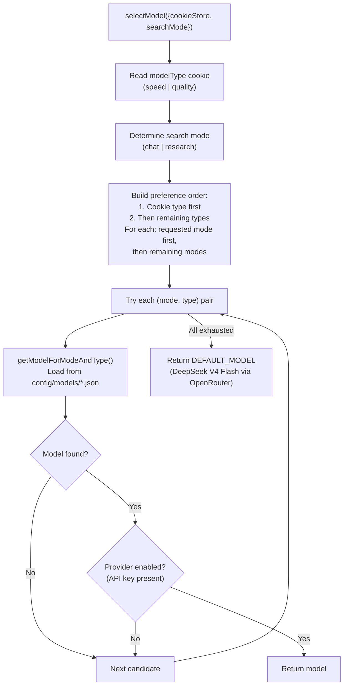

# Research Agent Models and Context

> **Audience:** Architect | Contributor
> **Prerequisites:** [Research Agent](RESEARCH-AGENT.md)

This leaf covers model resolution and context-window management before messages reach the LLM.

## Model Selection

The model selection system resolves which LLM to use for each request based on three factors: search mode, model type preference, and provider availability.



### Default Model Assignments

From `config/models/default.json`:

| Mode     | Type    | Model                        | Provider   |
| -------- | ------- | ---------------------------- | ---------- |
| Chat     | Speed   | `deepseek/deepseek-v4-flash` | OpenRouter |
| Chat     | Quality | `deepseek/deepseek-v4-pro`   | OpenRouter |
| Research | Speed   | `deepseek/deepseek-v4-flash` | OpenRouter |
| Research | Quality | `deepseek/deepseek-v4-pro`   | OpenRouter |

### Provider Registry

The provider registry ([`lib/utils/registry.ts`](../../lib/utils/registry.ts)) wraps seven AI providers via `createProviderRegistry`:

| Provider ID         | SDK                                | Env var required                                               |
| ------------------- | ---------------------------------- | -------------------------------------------------------------- |
| `openrouter`        | `@openrouter/ai-sdk-provider`      | `OPENROUTER_API_KEY`                                           |
| `gateway`           | `@ai-sdk/gateway`                  | `AI_GATEWAY_API_KEY`                                           |
| `openai`            | `@ai-sdk/openai`                   | `OPENAI_API_KEY`                                               |
| `anthropic`         | `@ai-sdk/anthropic`                | `ANTHROPIC_API_KEY`                                            |
| `google`            | `@ai-sdk/google`                   | `GOOGLE_GENERATIVE_AI_API_KEY`                                 |
| `openai-compatible` | `@ai-sdk/openai` (custom base URL) | `OPENAI_COMPATIBLE_API_KEY` + `OPENAI_COMPATIBLE_API_BASE_URL` |
| `ollama`            | `ollama-ai-provider-v2`            | `OLLAMA_BASE_URL`                                              |

The `getModel(modelString)` function takes a `providerId:modelId` string (e.g., `openrouter:deepseek/deepseek-v4-flash`) and returns a `LanguageModel` instance from the registry.

### Cloud Deployment Behavior

The `POLYMORPH_CLOUD_DEPLOYMENT` flag controls config profile selection (uses `cloud.json` instead of `default.json`), rate limiting enforcement, and analytics event tracking.

---

## Context Window Management

Before messages are sent to the LLM, they pass through a multi-stage processing pipeline to fit within the model's context window.

**Source:** [`lib/utils/context-window.ts`](../../lib/utils/context-window.ts)

### Processing Stages

1. **Reasoning part stripping** (OpenAI only): Removes `reasoning` parts from assistant messages to avoid OpenAI Responses API compatibility issues.

2. **Model message conversion**: Transforms `UIMessage[]` (SDK UI format with `parts`) into `ModelMessage[]` (LLM-facing format with `content`).

3. **Message pruning** (`pruneMessages`):
   - Reasoning: removed from all messages except the last
   - Tool calls: removed from all messages except the last 2
   - Empty messages: removed entirely

4. **Token-based truncation** (`truncateMessages`): If total tokens exceed the model's limit, older messages are dropped while preserving the first user message (up to 30% of budget) and as many recent messages as possible.

### Token Counting

Token estimation uses `js-tiktoken` with the `cl100k_base` encoding (GPT-4 tokenizer) as an approximation for all model families. A fallback of ~4 characters per token is used if tiktoken fails.

### Model Context Windows

| Model Family                         | Context Window | Output Tokens |
| ------------------------------------ | -------------- | ------------- |
| GPT-4.1 / GPT-4o-mini                | 128,000        | 16,384        |
| Claude Opus 4 / Sonnet 4             | 680,000        | 8,192         |
| Claude 3.7 Sonnet / 3.5 Haiku        | 200,000        | 8,192         |
| Gemini 3 Flash / 2.5 Flash / 2.5 Pro | 1,048,576      | 65,536        |
| DeepSeek V4 Flash / Pro              | 1,048,576      | 65,536        |

A 10% safety buffer is reserved for system prompts and formatting overhead. The formula is:

```
maxInputTokens = contextWindow - outputTokens - (contextWindow * 0.1)
```

### Truncation Strategy

When messages exceed the limit:

1. Reserve space for the first user message (if it does not exceed 30% of budget)
2. Add messages from the end (most recent first)
3. If a user message cannot fit, try evicting older assistant messages to make room
4. Ensure the final message list starts with a `user` role message

---
