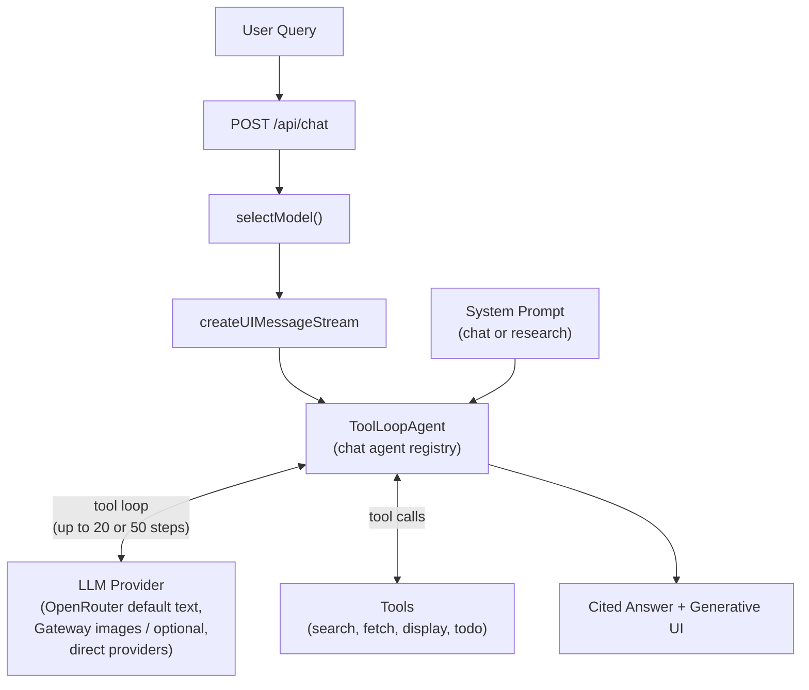
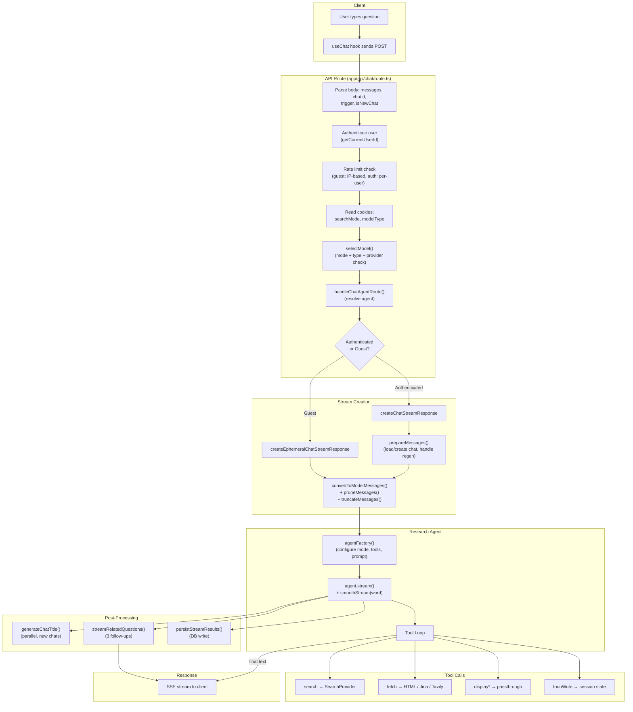

# Research Agent Pipeline

> **Audience:** Architect | Contributor
> **Prerequisites:** [Research Agent](RESEARCH-AGENT.md)

This leaf traces a user request through the research agent pipeline from API route to streamed response.

## Overview

The research agent is the research subsystem of Polymorph. When a user submits a question, the agent autonomously plans a research strategy, executes web searches, fetches page content, tracks progress through tasks, composes geo helper calls when the answer needs a map or route, can run the live `competitorResearch` specialist for structured market comparisons, and synthesizes findings into a cited answer with inline generative UI components (tables, charts, geo maps, citations, plans, link previews, option lists, question wizards, callouts, timelines).

The agent is built on the Vercel AI SDK's `ToolLoopAgent` — a construct that runs an LLM in a loop, allowing it to call tools repeatedly until it decides to produce a final answer or hits a step limit. Two operating modes (chat and research) control the agent's behavior, tool availability, and depth of research.

**Source files:** [`lib/agents/chat/registry.ts`](../../lib/agents/chat/registry.ts), [`lib/agents/chat/route-handler.ts`](../../lib/agents/chat/route-handler.ts), [`lib/agents/chat/search.ts`](../../lib/agents/chat/search.ts), [`lib/agents/chat/research.ts`](../../lib/agents/chat/research.ts), [`lib/agents/chat/build.ts`](../../lib/agents/chat/build.ts)

---

## End-to-End Pipeline

This section traces a single user query from HTTP request to streamed response, showing every system it passes through.

### Pipeline Steps

1. **HTTP Request**: The client sends `POST /api/chat` with the full AI SDK `UIMessage[]` history, chat ID, trigger type, and search mode/model type from cookies.

2. **Authentication & Rate Limiting**: The API route authenticates the user via Supabase. Guest users are rate-limited by IP (Upstash Redis); authenticated users by overall chat limits.

3. **Model Selection**: `selectModel()` reads cookie preferences for model type (`speed` or `quality`) and search mode (`chat` or `research`), looks up the model in `config/models/*.json`, and verifies the provider is enabled (API key present). Falls back to DeepSeek V4 Flash via OpenRouter.

4. **Stream Dispatch**: Authenticated users go through `createChatStreamResponse` (with DB persistence and title generation); guests go through `createEphemeralChatStreamResponse` (stateless).

5. **Message Preparation**: Conversation history is loaded, converted to model messages, pruned (old reasoning/tool calls removed), and truncated to fit the model's context window.

6. **Agent Creation**: `handleChatAgentRoute()` resolves `search`, `research`, or `build` from `userMode`, `searchMode`, and `intent`, then passes an injected `agentFactory` into the authenticated or guest stream primitive.

7. **Tool Loop Execution**: The LLM reasons about the query and calls tools (search, fetch, display, todo). Each tool call and result is streamed to the client in real time. The loop continues until the agent produces a final text answer or hits the step limit.

8. **Post-Processing**: Title generation (new chats, parallel), related questions (streamed after the main answer), and database persistence (in `onFinish` callback) run concurrently or after the main stream.

---
