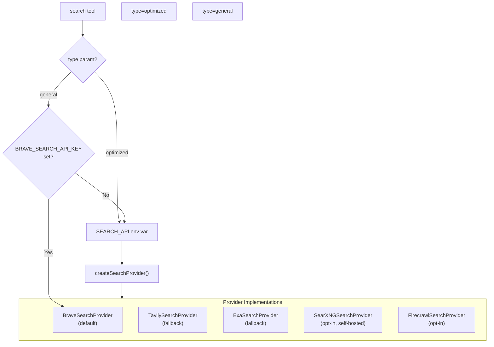

# Research Agent Search Providers

> **Audience:** Architect | Contributor
> **Prerequisites:** [Research Agent](RESEARCH-AGENT.md)

This leaf explains how the research agent delegates web search to configured provider implementations.

## Search Providers

The search tool delegates to a provider implementation selected by the `SEARCH_API` environment variable. The default runtime path is Brave with Tavily and Exa fallbacks; SearXNG and Firecrawl are opt-in alternatives rather than part of the default chain. A factory pattern (`createSearchProvider`) instantiates the appropriate provider.



### Provider Details

All providers implement the `SearchProvider` interface from [`lib/tools/search/providers/base.ts`](../../lib/tools/search/providers/base.ts):

```typescript
interface SearchProvider {
  search(
    query: string,
    maxResults: number,
    searchDepth: 'basic' | 'advanced',
    includeDomains: string[],
    excludeDomains: string[],
    options?: {
      type?: 'general' | 'optimized'
      content_types?: Array<'web' | 'video' | 'image' | 'news'>
    }
  ): Promise<SearchResults>
}
```

#### Tavily

**Source:** [`lib/tools/search/providers/tavily.ts`](../../lib/tools/search/providers/tavily.ts)

- **API:** `https://api.tavily.com/search`
- **Env var:** `TAVILY_API_KEY`
- **Features:** Content snippets, image descriptions, answers, domain filtering
- **Minimum query length:** 5 characters (padded with spaces if shorter)
- **Minimum results:** 5 (enforced by Tavily API)
- Returns results with `title`, `content`, `url` plus processed images with descriptions

#### Brave

**Source:** [`lib/tools/search/providers/brave.ts`](../../lib/tools/search/providers/brave.ts)

- **API:** `https://api.search.brave.com/res/v1/`
- **Env var:** `BRAVE_SEARCH_API_KEY`
- **Unique capability:** Multimedia content types — web, video, image searches in parallel
- **Used for:** `type='general'` when Brave is configured (the dedicated general search provider)
- Executes parallel API calls for each requested content type (`searchWeb`, `searchVideos`, `searchImages`)
- Video results are mapped to `SerperSearchResultItem` format for compatibility

#### Exa

**Source:** [`lib/tools/search/providers/exa.ts`](../../lib/tools/search/providers/exa.ts)

- **SDK:** `exa-js` client library
- **Env var:** `EXA_API_KEY`
- **Features:** Semantic search with `searchAndContents`, highlights extraction
- Returns content as joined highlights

#### SearXNG

**Source:** [`lib/tools/search/providers/searxng.ts`](../../lib/tools/search/providers/searxng.ts)

- **API:** Self-hosted instance at `SEARXNG_API_URL`
- **Features:** Multi-engine meta-search (Google, Bing, DuckDuckGo, Wikipedia)
- **Search depth affects behavior:**
  - `basic`: Google + Bing, 1-year time range, safesearch on
  - `advanced`: Google + Bing + DuckDuckGo + Wikipedia, no time range, safesearch off
- Supports an advanced search mode via a separate `/api/advanced-search` endpoint
- Separates general results from image results based on `img_src` presence

#### Firecrawl

**Source:** [`lib/tools/search/providers/firecrawl.ts`](../../lib/tools/search/providers/firecrawl.ts)

- **SDK:** Custom `FirecrawlClient`
- **Env var:** `FIRECRAWL_API_KEY`
- **Features:** Web + news + image sources, markdown content extraction
- For advanced depth, includes news sources alongside web
- Extracts markdown content (truncated to 1000 chars) from web results

### Provider Selection Logic

1. For `type='optimized'`: Use the provider from `SEARCH_API` env var (default: `brave`)
2. For `type='general'`: Check if `BRAVE_SEARCH_API_KEY` is set
   - If yes: use Brave (multimedia support)
   - If no: fall back to the `SEARCH_API` provider (same as optimized)
3. The default fallback chain is `brave -> tavily -> exa`
4. `searxng` and `firecrawl` are only used when explicitly selected via `SEARCH_API`

For error handling across providers (typed `SearchProviderError`, retry semantics, burst pacing), see [Search Providers → Error Handling and Retries](SEARCH-PROVIDERS.md#error-handling-and-retries).

The search config utility ([`lib/utils/search-config.ts`](../../lib/utils/search-config.ts)) dynamically adjusts the agent's system prompt based on which providers are available, including guidance about content types and multimedia support.

---
