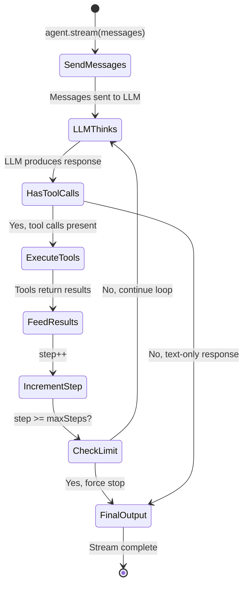

# Research Agent Tool Loop

> **Audience:** Architect | Contributor
> **Prerequisites:** [Research Agent](RESEARCH-AGENT.md)

This leaf explains the ToolLoopAgent abstraction, configuration, and invocation path.

## The ToolLoopAgent Pattern

The `ToolLoopAgent` from the Vercel AI SDK (`ai` package) is the central abstraction. It wraps a language model with a set of tools and runs in a loop: the LLM produces output, and if that output includes tool calls, the tools are executed and their results fed back into the LLM for the next iteration.

### How It Works



### Configuration

The chat agent modules configure `ToolLoopAgent` instances through [`lib/agents/chat/factory.ts`](../../lib/agents/chat/factory.ts). Agent selection and dispatch live in [`lib/agents/chat/registry.ts`](../../lib/agents/chat/registry.ts), with route-level wiring in [`lib/agents/chat/route-handler.ts`](../../lib/agents/chat/route-handler.ts).

```typescript
const agent = new ToolLoopAgent({
  model: getModel(model), // Resolved LLM from provider registry
  instructions: systemPrompt, // Mode-specific prompt + current date
  tools, // All available tools
  activeTools: activeToolsList, // Subset enabled for this mode
  stopWhen: stepCountIs(maxSteps), // 20 (chat) or 50 (research)
  providerOptions, // Model-specific options (if any)
  experimental_telemetry // Phoenix/OTel tracing config
})
```

Key concepts:

- **`tools`**: The full set of tools the agent knows about. All tools are always defined in the tools object regardless of mode.
- **`activeTools`**: A subset of tool names that the agent can actually invoke. This is what differs between modes.
- **`stopWhen`**: A predicate that terminates the loop. `stepCountIs(N)` stops after N tool-call rounds.
- **`instructions`**: The system prompt that shapes the agent's behavior, injected with the current date/time.

### Invocation

The agent is invoked via `stream()`, which returns a streamable result:

```typescript
const result = await researchAgent.stream({
  messages: modelMessages,
  abortSignal,
  experimental_transform: smoothStream({ chunking: 'word' })
})
writer.merge(result.toUIMessageStream({ messageMetadata }))
```

- `smoothStream({ chunking: 'word' })` buffers LLM output and re-emits at word boundaries for a natural typing effect.
- `toUIMessageStream()` converts the agent's output into UI message stream events.
- `writer.merge()` is the sole consumer — it pipes these events into the SSE response. (`result.consumeStream()` must NOT be called — `toUIMessageStream()` already consumes the stream internally, making an additional `consumeStream()` call redundant.)

---
