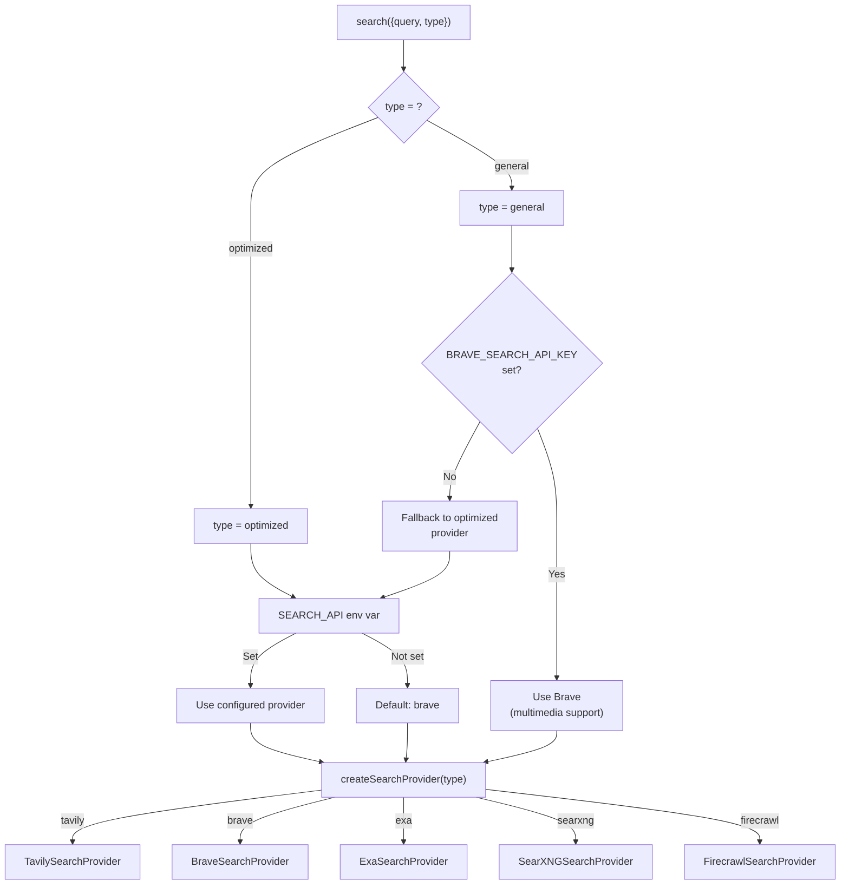

# Search Provider Selection

> **Audience:** Contributor | Operator
> **Prerequisites:** [Search Providers](SEARCH-PROVIDERS.md)

This leaf covers provider comparison, routing, and retry/error behavior for the search tool.

## Provider Comparison

| Provider      | Env Variable           | Content Snippets                        | Images                  | Videos                      | Search Depth                   | Domain Filtering     | Self-Hosted |
| ------------- | ---------------------- | --------------------------------------- | ----------------------- | --------------------------- | ------------------------------ | -------------------- | ----------- |
| **Brave**     | `BRAVE_SEARCH_API_KEY` | Basic descriptions                      | Yes (thumbnails)        | Yes (thumbnails + duration) | No                             | No                   | No          |
| **Tavily**    | `TAVILY_API_KEY`       | Yes (with answers)                      | Yes (with descriptions) | No                          | basic / advanced               | Include + Exclude    | No          |
| **Exa**       | `EXA_API_KEY`          | Yes (highlights)                        | No                      | No                          | Ignored                        | Include + Exclude    | No          |
| **SearXNG**   | `SEARXNG_API_URL`      | Yes                                     | Yes                     | No                          | basic / advanced               | Include only (site:) | Yes         |
| **Firecrawl** | `FIRECRAWL_API_KEY`    | Yes (markdown, truncated to 1000 chars) | Yes                     | No                          | basic (web) / advanced (+news) | No                   | No          |

**Recommended setup:** Brave as the primary (default) provider with Tavily and Exa as automatic fallbacks. SearXNG and Firecrawl are selectable alternatives, not part of the default fallback chain unless `SEARCH_API` is set to one of them.

---

## Provider Selection Logic

The search tool determines which provider to use based on the `type` parameter (optimized vs general) and available API keys.

In Chat Mode, the search type is always forced to `optimized` regardless of what the model requests. In Research Mode, the model can freely choose between `optimized` and `general`.

---

## Error Handling and Retries

Provider failures throw a typed `SearchProviderError` (`lib/tools/search/providers/errors.ts`) so callers can branch on `retryable` and `retryAfterMs` without string-matching. Every provider call is wrapped by `retrySearchOperation()` (`lib/utils/retry.ts`) with jittered exponential backoff, honoring `Retry-After` when present. Terminal 4xx (other than 429), config errors, and invalid keys propagate immediately. When multiple Brave content types are requested, the provider executes them sequentially to reduce burst rate-limit hits; the separate trending-suggestions job adds its own per-query delay in `lib/agents/generate-trending-suggestions.ts`.

---
