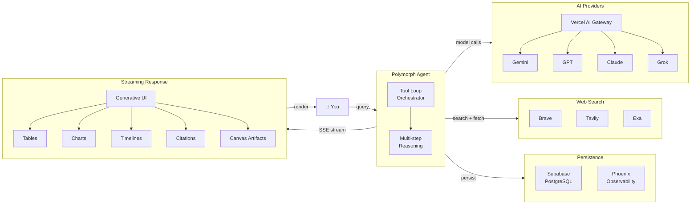

# Architecture Diagram — Mermaid Source

Upload this file (or paste the diagram) to Gemini as a structural reference when generating the visual architecture image.

```mermaid
graph LR
    User["👤 You"]

    subgraph Agent["Polymorph Agent"]
        direction TB
        Orchestrator["Tool Loop\nOrchestrator"]
        Reasoning["Multi-step\nReasoning"]
        Orchestrator --> Reasoning
    end

    subgraph Providers["AI Providers"]
        direction TB
        Gateway["Vercel AI Gateway"]
        Gemini["Gemini"]
        GPT["GPT"]
        Claude["Claude"]
        Grok["Grok"]
        Gateway --> Gemini
        Gateway --> GPT
        Gateway --> Claude
        Gateway --> Grok
    end

    subgraph Search["Web Search"]
        direction TB
        Brave["Brave"]
        Tavily["Tavily"]
        Exa["Exa"]
    end

    subgraph Response["Streaming Response"]
        direction TB
        GenUI["Generative UI"]
        Tables["Tables"]
        Charts["Charts"]
        Timelines["Timelines"]
        Citations["Citations"]
        Canvas["Canvas Artifacts"]
        GenUI --> Tables
        GenUI --> Charts
        GenUI --> Timelines
        GenUI --> Citations
        GenUI --> Canvas
    end

    subgraph Data["Persistence"]
        direction TB
        Supabase["Supabase\nPostgreSQL"]
        Phoenix["Phoenix\nObservability"]
    end

    User -->|query| Agent
    Agent -->|model calls| Providers
    Agent -->|search + fetch| Search
    Agent -->|SSE stream| Response
    Agent -->|persist| Data
    Response -->|render| User
```
