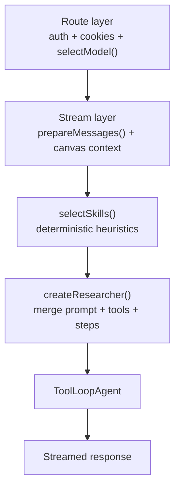

# Skills Routing

> **Audience:** Architect | Contributor
> **Prerequisites:** [Architecture Overview](OVERVIEW.md), [Research Agent](RESEARCH-AGENT.md), [Streaming](STREAMING.md)
> **Status:** Proposal — not yet implemented. The file plan, types, and runtime described below describe a design under consideration, not shipped code.

This document specifies a skills-based routing layer for Polymorph's researcher agent. The goal is to inject domain-specific instructions only when they are relevant to the current request while preserving the current agent pipeline, tool model, and streaming behavior.

## Table of Contents

- [Context](#context)
- [Goals](#goals)
- [Non-Goals](#non-goals)
- [Why Skills Fit Polymorph](#why-skills-fit-polymorph)
- [V1 Architecture](#v1-architecture)
- [File Plan](#file-plan)
- [Skill Format](#skill-format)
- [Runtime Types](#runtime-types)
- [Registry and Selection](#registry-and-selection)
- [Integration Details](#integration-details)
- [Behavior Rules](#behavior-rules)
- [Validation and Rollout](#validation-and-rollout)
- [Observability](#observability)
- [V2 Scope](#v2-scope)
- [Success Criteria](#success-criteria)

---

## Context

Polymorph's researcher agent currently relies on a static mode-based prompt system. Chat mode and research mode change prompt depth, tool availability, and step limits, but every request within a mode receives the same top-level instructions.

That works well for broad research behavior, but it does not distinguish between requests like:

- "Compare React and Vue for an internal dashboard"
- "Give me a concise answer"
- "Teach me this step by step"
- "Investigate this deeply and cite everything"
- "Build me a dashboard"

The current architecture already contains some intent routing inside the prompt, especially for canvas artifacts, but that routing is still embedded inside large static prompts rather than being driven by a reusable domain-instruction system.

This repository is a personal project being developed on non-production infrastructure. That changes the rollout strategy: validation should be driven by local evaluation and regression detection rather than staged live exposure or end-user feedback collection.

---

## Goals

V1 should:

- improve answer quality by appending domain-specific instructions only when they match the user's intent
- preserve the current model-selection and search-mode pipeline
- work the same way for authenticated and guest chat flows
- fail closed to the current baseline behavior if the skills layer breaks
- remain deterministic and easy to debug locally

---

## Non-Goals

V1 does **not** include:

- LLM-based skill selection
- dynamic tool registration
- model overrides
- `searchMode` overrides
- appending a full skill catalog to every request
- a production-style staged rollout based on live user telemetry

These are deferred because the current codebase selects model and `searchMode` before the agent is created, and because this project does not need production rollout complexity yet.

---

## Why Skills Fit Polymorph

The current agent pipeline already has a clean place to attach a skills layer:

1. the route selects model and mode
2. the stream layer prepares messages and runtime context
3. `createResearcher()` assembles the final instructions, active tools, and step limit

That means a skills system can be introduced as a pre-agent enrichment step without rewriting the broader architecture.

The best insertion point is the streaming layer, not the route:

- [create-chat-stream-response.ts](../../lib/streaming/create-chat-stream-response.ts)
- [create-ephemeral-chat-stream-response.ts](../../lib/streaming/create-ephemeral-chat-stream-response.ts)

These two files already have the prepared conversation context and resolved canvas state immediately before they call `researcher(...)`. By contrast, [route.ts](../../app/api/chat/route.ts) should remain focused on auth, rate limiting, cookies, and model selection.

This also avoids a common failure mode: if skills tried to override mode later in [researcher.ts](../../lib/agents/researcher.ts), the prompt would diverge from the model that was already selected earlier in [model-selection.ts](../../lib/utils/model-selection.ts).

---

## V1 Architecture

V1 is a deterministic, feature-flagged prompt enrichment system.



The new logic is:

1. Prepare conversation messages exactly as today.
2. Resolve canvas context exactly as today.
3. Call `selectSkills(...)` with normalized recent message context.
4. Pass `skillSelection` into `createResearcher(...)`.
5. Merge selected skill instructions into the final prompt.
6. Optionally prefer already-registered tools and modestly raise the step cap.
7. Fall back to the current baseline behavior on any error.

V1 should not change how tools are defined. The researcher still operates over the static `ResearcherTools` union in [lib/types/agent.ts](../../lib/types/agent.ts).

---

## File Plan

### Add

| File                               | Purpose                                                                      |
| ---------------------------------- | ---------------------------------------------------------------------------- |
| `skills/deep-research/SKILL.md`    | Research methodology, source evaluation, citation guidance                   |
| `skills/comparison/SKILL.md`       | Comparison structure, tradeoff framing, table guidance                       |
| `skills/tutorial/SKILL.md`         | Step-by-step teaching and progressive explanation guidance                   |
| `skills/quick-answer/SKILL.md`     | Concise, direct-answer behavior                                              |
| `skills/artifact-quality/SKILL.md` | Artifact-specific quality guidance without duplicating base artifact routing |
| `lib/skills/types.ts`              | Runtime interfaces for skills, selection input, and selection output         |
| `lib/skills/manifest.ts`           | Explicit list of shipped skills and their file paths                         |
| `lib/skills/registry.ts`           | Cached loader and parser for `SKILL.md` files                                |
| `lib/skills/selector.ts`           | Deterministic intent-to-skill selection logic                                |
| `lib/skills/instructions.ts`       | Prompt append builder with token-budget trimming                             |

### Modify

| File                                                     | Change                                                                      |
| -------------------------------------------------------- | --------------------------------------------------------------------------- |
| `lib/streaming/create-chat-stream-response.ts`           | Run skills selection before `researcher(...)`                               |
| `lib/streaming/create-ephemeral-chat-stream-response.ts` | Mirror the same skills selection for guest flows                            |
| `lib/agents/researcher.ts`                               | Accept `skillSelection` and merge instructions, tools, and step adjustments |
| `lib/agents/prompts/search-mode-prompts.ts`              | Add a minimal note that active skill instructions may be appended           |
| `lib/agents/__tests__/researcher.test.ts`                | Cover researcher behavior when skills are present                           |
| `package.json`                                           | Add `gray-matter` for frontmatter parsing                                   |
| `docs/getting-started/CONFIGURATION.md`                  | Document the `ENABLE_SKILLS_ROUTING` flag and local evaluation workflow     |
| `docs/reference/FILE-INDEX.md`                           | Register this document in the documentation index                           |

### Do Not Change in V1

| File                           | Reason                                                   |
| ------------------------------ | -------------------------------------------------------- |
| `app/api/chat/route.ts`        | Route should remain thin and should not own skills logic |
| `lib/utils/model-selection.ts` | Skills must not influence model choice in v1             |
| `lib/types/agent.ts`           | No dynamic tool registration or new tool union in v1     |

---

## Skill Format

Skill files should follow a portable `SKILL.md` structure with required `name` and `description` fields. Polymorph-specific behavior should live under `metadata.polymorph` rather than claiming those fields are part of the portable standard.

Example:

```yaml
---
name: deep-research
description: Use when the user wants thorough multi-source research or a deep dive.
metadata:
  polymorph:
    triggers:
      - research
      - investigate
      - deep dive
      - comprehensive analysis
    tools:
      require:
        - search
        - fetch
        - displayCitations
      prefer:
        - displayTable
        - displayTimeline
    maxAdditionalSteps: 10
---

# Deep Research

## Goal
Help the agent perform structured, multi-source research with careful synthesis.

## Guidelines
- Prefer multiple independent sources.
- Surface disagreement between sources.
- Cite evidence consistently.
- Use tables and timelines when they improve clarity.
```

The initial skill set should be intentionally small and high-signal. Avoid a broad `artifact-creation` skill in v1 because the base prompts already contain substantial artifact-routing and canvas guidance.

---

## Runtime Types

Suggested runtime interfaces:

```ts
import type { UIMessage } from '@/lib/types/ai'
import type { ResearcherToolName } from '@/lib/types/agent'
import type { SearchMode } from '@/lib/types/search'

export type SkillName = string

export interface SkillMetadata {
  name: SkillName
  description: string
  metadata?: {
    polymorph?: {
      triggers?: string[]
      tools?: {
        require?: ResearcherToolName[]
        prefer?: ResearcherToolName[]
      }
      maxAdditionalSteps?: number
    }
  }
}

export interface SkillDefinition {
  metadata: SkillMetadata
  content: string
  sourcePath: string
}

export interface SkillSelectionInput {
  messages: UIMessage[]
  searchMode: SearchMode
  hasCanvasArtifact: boolean
  isGuest: boolean
  trigger?: 'submit-message' | 'regenerate-message'
}

export interface SkillSelectionResult {
  skills: SkillDefinition[]
  requestedTools: ResearcherToolName[]
  additionalSteps: number
  diagnostics: {
    matchedSkillNames: SkillName[]
    strategy: 'heuristic' | 'none'
    truncatedForBudget: boolean
  }
}
```

---

## Registry and Selection

### Manifest

V1 should use an explicit manifest rather than open-ended filesystem discovery. This is simpler, easier to reason about, and avoids assuming too much about runtime packaging.

`manifest.ts` should export a static list of known skill directories.

### Registry

`registry.ts` should:

- load only the skills declared in the manifest
- parse frontmatter with `gray-matter`
- validate that `name` and `description` exist
- cache parsed skills in module scope
- skip invalid skills with a warning
- degrade to an empty registry on fatal failure

The registry should not expose a global metadata-summary prompt in v1 because the agent itself is not doing skill discovery from a catalog prompt. Skill selection happens in code, before prompt assembly.

### Selector

`selector.ts` should implement deterministic matching only. It should examine:

- the latest user-authored turn
- a small bounded recent-history window
- `searchMode`
- whether a canvas artifact exists
- whether the flow is guest or authenticated
- trigger type

Suggested initial matching behavior:

- `deep-research`: explicit deep-research intent, technical investigation, multi-source analysis
- `comparison`: compare, versus, ranking, tradeoffs, alternatives
- `tutorial`: how-to, walk-through, learn, step-by-step instruction
- `quick-answer`: concise/direct answer requests
- `artifact-quality`: build/create requests where artifact-oriented quality guidance is useful

The selector should return at most 2-3 skills in stable relevance order. If nothing matches, it should return an empty selection and preserve baseline behavior.

Interactive tool-output continuations should be handled carefully: the selector should reason from the latest user-authored turn rather than trying to classify the assistant tool payload itself.

---

## Integration Details

### Stream Layer

Add skills selection to both stream creators so authenticated and guest flows remain aligned:

- [create-chat-stream-response.ts](../../lib/streaming/create-chat-stream-response.ts)
- [create-ephemeral-chat-stream-response.ts](../../lib/streaming/create-ephemeral-chat-stream-response.ts)

The flow inside each should be:

1. prepare or normalize messages
2. resolve canvas context
3. call `selectSkills(...)`
4. pass `skillSelection` into `researcher(...)`

Guest flow must not require extra database reads for skills selection.

### Researcher

Extend `createResearcher(...)` to accept:

```ts
skillSelection?: SkillSelectionResult
```

Then, after the existing mode-based defaults are built:

- append selected skill instructions to the assembled prompt
- merge requested tools only if those tools are already available in the current runtime context
- increase step count only within hard per-mode caps

Suggested instruction append format:

```md
## Active Skills

### deep-research

[skill body]

### comparison

[skill body]
```

The instruction builder should also enforce a soft prompt budget and drop lower-priority skills if needed.

### Prompt Files

Make only a minimal change in [search-mode-prompts.ts](../../lib/agents/prompts/search-mode-prompts.ts): add a short note that active skill instructions may be appended. Do not append full skill metadata to the base prompts.

---

## Behavior Rules

V1 safety rules:

- skills cannot change `searchMode`
- skills cannot change the selected model
- skills cannot register new tools
- skills cannot activate canvas tools unless canvas context exists
- skills cannot activate `todoWrite` unless writer-backed todo tools exist
- skills can only request tools that already exist in `ResearcherTools`

Step-count limits:

- chat mode: base 20, allow `+0..10`
- research mode: base 50, allow `+0..20`

On any parse, registry, selector, or instruction-build failure:

- log the failure
- set a fallback reason
- continue with the current baseline prompt and tool configuration

---

## Validation and Rollout

Because this is a personal non-production project, rollout should be evaluation-driven rather than traffic-driven.

### Feature Flag

Introduce a single kill switch:

- `ENABLE_SKILLS_ROUTING=false` by default

When the flag is off, the skills layer should be skipped entirely and current behavior should remain unchanged.

The implementation should also update [Configuration](../getting-started/CONFIGURATION.md) to document the new flag and its intended use in local development.

### Testing

Add:

- `lib/skills/__tests__/registry.test.ts`
- `lib/skills/__tests__/selector.test.ts`
- `lib/skills/__tests__/instructions.test.ts`

Extend:

- `lib/agents/__tests__/researcher.test.ts`

Required coverage:

- valid and invalid skill parsing
- duplicate skill names
- empty registry fallback
- deterministic selection behavior
- no-match and multi-match cases
- stable ordering
- prompt-budget trimming
- safe tool merging
- step-cap enforcement
- guest/auth stream integration
- interactive tool-output continuation behavior
- flag-off baseline behavior

### Local Evaluation

Instead of a staged live rollout, maintain a fixed local evaluation corpus of roughly 20-40 prompts spanning:

- deep research
- comparisons
- tutorials
- concise factual answers
- artifact/build requests
- ambiguous routing
- follow-up turns
- interactive tool-output continuations

For each prompt, compare baseline vs skills-enabled behavior and inspect:

- selected skills
- prompt overhead
- tool usage
- answer quality
- regressions in routing, verbosity, or correctness

### Rollout Phases

**Phase A: Build and Verify**

- implement full v1 behind the flag
- add tests
- confirm flag-off behavior is identical to baseline

**Phase B: Local Evaluation**

- enable the flag locally
- run the evaluation corpus
- compare baseline vs skills-enabled outputs

**Phase C: Heuristic Tuning**

- refine triggers and skill content based on eval failures
- keep selection deterministic

**Phase D: Default in Dev**

- if the eval corpus shows clear improvement without serious regressions, enable skills routing by default in development
- keep the flag as a fallback

This rollout intentionally avoids production-style shadow mode, user segmentation, and adoption-based metrics because those are not useful for the current project context.

---

## Observability

Even in a local or non-production environment, the skills layer needs lightweight debugging signals.

Log per request:

- `selectedSkills`
- `selectionLatencyMs`
- `skillPromptTokens`
- `fallbackReason`
- `isGuest`
- `searchMode`
- `trigger`
- `selectorVersion`

If tracing is enabled, include these in trace metadata.

Track locally:

- no-match rate
- parse-error rate
- fallback rate

These metrics are for debugging and heuristic tuning, not for adoption analysis.

---

## V2 Scope

Only after v1 is stable should Polymorph consider:

- LLM fallback selection when heuristic confidence is low
- a route-level or pre-model-selection profile resolution step
- `effectiveSearchMode` separate from cookie `searchMode`
- richer skill composition
- on-demand support-file loading
- dynamic tool registration after a separate type-system refactor

V2 should be treated as a separate design because it changes responsibilities across the route layer, model selection, and tool typing.

---

## Success Criteria

V1 is successful if:

- flag-off behavior remains unchanged
- the local evaluation corpus shows improved output quality on targeted intent classes
- guest and authenticated paths behave consistently
- prompt growth remains bounded
- failures in parsing, selection, or instruction injection cleanly fall back to current behavior

---

## References

- [Anthropic Skills](https://github.com/anthropics/skills)
- [Agent Skills Specification](https://agentskills.io/specification)
- [Vercel Labs Skills](https://github.com/vercel-labs/skills)
- [ByteDance DeerFlow](https://github.com/bytedance/deer-flow)
