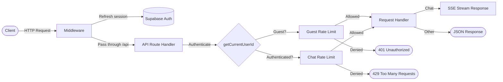

# Chat API

> **Audience:** Contributor | Operator
> **Prerequisites:** [API Reference](API.md)

This leaf covers request flow, authentication modes, and the streaming chat endpoint.

## Request Flow



## Authentication

Polymorph uses **Supabase Auth** with cookie-based sessions. The middleware (`lib/supabase/middleware.ts`) refreshes the session on every request using `@supabase/ssr`.

| Mode              | Behavior                                                                                                                                                           |
| ----------------- | ------------------------------------------------------------------------------------------------------------------------------------------------------------------ |
| **Authenticated** | Supabase JWT stored in HTTP-only cookies. User ID extracted via `supabase.auth.getUser()`.                                                                         |
| **Guest**         | Allowed when `ENABLE_GUEST_CHAT=true`. Identified by IP address. Chats are ephemeral (not persisted), and new guest UI sessions default to the `speed` model tier. |
| **Auth Disabled** | When `ENABLE_AUTH=false` (non-cloud only). All requests use a shared anonymous user ID. For personal/Docker deployments only.                                      |

Unauthenticated requests to protected endpoints receive a `401 Unauthorized` response.

---

## POST `/api/chat`

The primary chat endpoint. Accepts the AI SDK `UIMessage[]` history and returns a Server-Sent Events (SSE) stream containing the AI-generated response with tool outputs, search data, and reasoning.

**Authentication:** Required (or guest mode enabled)
**Timeout:** 300 seconds (`maxDuration = 300`)
**Dynamic:** `force-dynamic` (no caching)

#### Request Body

```typescript
{
  messages: UIMessage[]        // Required full UIMessage history
  chatId: string               // Chat session identifier
  trigger?: string             // "submit-message" | "regenerate-message"
  messageId?: string           // Required for trigger="regenerate-message"
  isNewChat?: boolean          // Whether this is the first message in a chat
  guestCanvasToken?: string    // HMAC-signed token for guest canvas artifact continuity
}
```

| Field              | Type          | Required    | Description                                                                                                                        |
| ------------------ | ------------- | ----------- | ---------------------------------------------------------------------------------------------------------------------------------- |
| `messages`         | `UIMessage[]` | Yes         | Full AI SDK v6 conversation history. Interactive tool continuations use the updated assistant message produced by `addToolOutput`. |
| `chatId`           | `string`      | Yes         | Unique identifier for the chat session.                                                                                            |
| `trigger`          | `string`      | No          | Action type: `"submit-message"` or `"regenerate-message"`. Defaults to `"submit-message"`.                                         |
| `messageId`        | `string`      | Conditional | ID of the message to regenerate. Required when `trigger` is `"regenerate-message"`.                                                |
| `isNewChat`        | `boolean`     | No          | Indicates a new chat session. Affects analytics tracking.                                                                          |
| `guestCanvasToken` | `string`      | No          | HMAC-SHA256 signed token for guest canvas artifact continuity. Passed through to canvas tools for guest session verification.      |

#### Cookies Read

| Cookie       | Values                              | Default    | Description                                                                                                               |
| ------------ | ----------------------------------- | ---------- | ------------------------------------------------------------------------------------------------------------------------- |
| `searchMode` | `"search"`, `"research"`, `"build"` | `"search"` | UI-facing mode. Server code maps `search` and `build` to backend chat mode, while `build` also carries `intent='build'`.  |
| `modelType`  | `"speed"`, `"quality"`              | `"speed"`  | Model selection preference. The route honors a valid cookie value and otherwise falls back to the configured model order. |

#### Response

**Content-Type:** `text/event-stream` (SSE)

The response is a streaming SSE connection. Message parts (text, search results, reasoning, tool calls) are streamed incrementally using the Vercel AI SDK data protocol.

#### Error Responses

| Status                      | Condition                                                                                                                                             |
| --------------------------- | ----------------------------------------------------------------------------------------------------------------------------------------------------- |
| `400 Bad Request`           | Missing/non-array `messages`, singular-message payloads, retired tool-continuation payloads, unknown triggers, or missing `messageId` for regenerate. |
| `401 Unauthorized`          | No authenticated user and guest mode is disabled.                                                                                                     |
| `403 Forbidden`             | Request originated from a `/share/` page. Chat API is blocked on share pages.                                                                         |
| `404 Not Found`             | Selected AI provider is not enabled in the registry.                                                                                                  |
| `429 Too Many Requests`     | Authenticated user exceeded daily chat limit or guest rate limit exceeded in cloud deployments.                                                       |
| `500 Internal Server Error` | Unexpected server error during processing.                                                                                                            |

#### Example

```bash
curl -X POST http://localhost:43100/api/chat \
  -H "Content-Type: application/json" \
  -H "Cookie: <supabase-auth-cookies>" \
  -d '{
    "messages": [
      {
        "id": "msg_user_1",
        "role": "user",
        "parts": [{ "type": "text", "text": "What is quantum computing?" }]
      }
    ],
    "chatId": "clx1abc123def456",
    "trigger": "submit-message",
    "isNewChat": true
  }'
```

---
