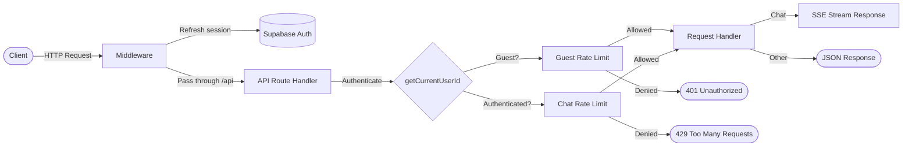

# API Reference

> **Audience:** Contributor | Operator
> **Prerequisites:** [Quickstart Guide](../getting-started/QUICKSTART.md)

Complete REST API reference for Polymorph. All endpoints are served from the Next.js application under the `/api` path prefix.

**Base URL:** `http://localhost:43100` (development) or your deployed domain.

## Request Flow



## Authentication

Polymorph uses **Supabase Auth** with cookie-based sessions. The middleware (`lib/supabase/middleware.ts`) refreshes the session on every request using `@supabase/ssr`.

| Mode              | Behavior                                                                                                                                                           |
| ----------------- | ------------------------------------------------------------------------------------------------------------------------------------------------------------------ |
| **Authenticated** | Supabase JWT stored in HTTP-only cookies. User ID extracted via `supabase.auth.getUser()`.                                                                         |
| **Guest**         | Allowed when `ENABLE_GUEST_CHAT=true`. Identified by IP address. Chats are ephemeral (not persisted), and new guest UI sessions default to the `speed` model tier. |
| **Auth Disabled** | When `ENABLE_AUTH=false` (non-cloud only). All requests use a shared anonymous user ID. For personal/Docker deployments only.                                      |

Unauthenticated requests to protected endpoints receive a `401 Unauthorized` response.

---

## Endpoints

### POST `/api/chat`

The primary chat endpoint. Accepts the AI SDK `UIMessage[]` history and returns a Server-Sent Events (SSE) stream containing the AI-generated response with tool outputs, search data, and reasoning.

**Authentication:** Required (or guest mode enabled)
**Timeout:** 300 seconds (`maxDuration = 300`)
**Dynamic:** `force-dynamic` (no caching)

#### Request Body

```typescript
{
  messages: UIMessage[]        // Required full UIMessage history
  chatId: string               // Chat session identifier
  trigger?: string             // "submit-message" | "regenerate-message"
  messageId?: string           // Required for trigger="regenerate-message"
  isNewChat?: boolean          // Whether this is the first message in a chat
  guestCanvasToken?: string    // HMAC-signed token for guest canvas artifact continuity
}
```

| Field              | Type          | Required    | Description                                                                                                                        |
| ------------------ | ------------- | ----------- | ---------------------------------------------------------------------------------------------------------------------------------- |
| `messages`         | `UIMessage[]` | Yes         | Full AI SDK v6 conversation history. Interactive tool continuations use the updated assistant message produced by `addToolOutput`. |
| `chatId`           | `string`      | Yes         | Unique identifier for the chat session.                                                                                            |
| `trigger`          | `string`      | No          | Action type: `"submit-message"` or `"regenerate-message"`. Defaults to `"submit-message"`.                                         |
| `messageId`        | `string`      | Conditional | ID of the message to regenerate. Required when `trigger` is `"regenerate-message"`.                                                |
| `isNewChat`        | `boolean`     | No          | Indicates a new chat session. Affects analytics tracking.                                                                          |
| `guestCanvasToken` | `string`      | No          | HMAC-SHA256 signed token for guest canvas artifact continuity. Passed through to canvas tools for guest session verification.      |

#### Cookies Read

| Cookie       | Values                              | Default    | Description                                                                                                               |
| ------------ | ----------------------------------- | ---------- | ------------------------------------------------------------------------------------------------------------------------- |
| `searchMode` | `"search"`, `"research"`, `"build"` | `"search"` | UI-facing mode. Server code maps `search` and `build` to backend chat mode, while `build` also carries `intent='build'`.  |
| `modelType`  | `"speed"`, `"quality"`              | `"speed"`  | Model selection preference. The route honors a valid cookie value and otherwise falls back to the configured model order. |

#### Response

**Content-Type:** `text/event-stream` (SSE)

The response is a streaming SSE connection. Message parts (text, search results, reasoning, tool calls) are streamed incrementally using the Vercel AI SDK data protocol.

#### Error Responses

| Status                      | Condition                                                                                                                                             |
| --------------------------- | ----------------------------------------------------------------------------------------------------------------------------------------------------- |
| `400 Bad Request`           | Missing/non-array `messages`, singular-message payloads, retired tool-continuation payloads, unknown triggers, or missing `messageId` for regenerate. |
| `401 Unauthorized`          | No authenticated user and guest mode is disabled.                                                                                                     |
| `403 Forbidden`             | Request originated from a `/share/` page. Chat API is blocked on share pages.                                                                         |
| `404 Not Found`             | Selected AI provider is not enabled in the registry.                                                                                                  |
| `429 Too Many Requests`     | Authenticated user exceeded daily chat limit or guest rate limit exceeded in cloud deployments.                                                       |
| `500 Internal Server Error` | Unexpected server error during processing.                                                                                                            |

#### Example

```bash
curl -X POST http://localhost:43100/api/chat \
  -H "Content-Type: application/json" \
  -H "Cookie: <supabase-auth-cookies>" \
  -d '{
    "messages": [
      {
        "id": "msg_user_1",
        "role": "user",
        "parts": [{ "type": "text", "text": "What is quantum computing?" }]
      }
    ],
    "chatId": "clx1abc123def456",
    "trigger": "submit-message",
    "isNewChat": true
  }'
```

---

### GET `/api/chats`

Retrieves a paginated list of chats for the currently authenticated user.

**Authentication:** Required (via Supabase session in `getChatsPage` server action)
**Dynamic:** `force-dynamic`

#### Query Parameters

| Parameter | Type      | Default | Description                                 |
| --------- | --------- | ------- | ------------------------------------------- |
| `offset`  | `integer` | `0`     | Number of chats to skip for pagination.     |
| `limit`   | `integer` | `20`    | Maximum number of chats to return per page. |

#### Response

**Content-Type:** `application/json`

```typescript
{
  chats: Chat[]            // Array of chat objects
  nextOffset: number | null // Offset for the next page, or null if no more results
}
```

Each `Chat` object:

```typescript
{
  id: string // Unique chat identifier (CUID2)
  createdAt: string // ISO 8601 timestamp
  title: string // Chat title (auto-generated or "Untitled")
  userId: string // Owner's user ID
  visibility: 'public' | 'private'
}
```

#### Error Responses

| Status                      | Condition                                                         |
| --------------------------- | ----------------------------------------------------------------- |
| `500 Internal Server Error` | Database query failed. Returns `{ chats: [], nextOffset: null }`. |

#### Example

```bash
curl "http://localhost:43100/api/chats?offset=0&limit=10" \
  -H "Cookie: <supabase-auth-cookies>"
```

```json
{
  "chats": [
    {
      "id": "clx1abc123def456",
      "createdAt": "2025-01-15T10:30:00.000Z",
      "title": "Quantum Computing Explained",
      "userId": "user-uuid-here",
      "visibility": "private"
    }
  ],
  "nextOffset": 10
}
```

---

### POST `/api/upload`

Uploads a file (image, PDF, or Word document) to Supabase Storage, scoped to a specific chat.

**Authentication:** Required

#### Request

**Content-Type:** `multipart/form-data`

| Field    | Type     | Required | Description                         |
| -------- | -------- | -------- | ----------------------------------- |
| `file`   | `File`   | Yes      | The file to upload.                 |
| `chatId` | `string` | Yes      | Chat ID to associate the file with. |

#### Constraints

| Constraint         | Value                                                                                                                                                                    |
| ------------------ | ------------------------------------------------------------------------------------------------------------------------------------------------------------------------ |
| Max file size      | 5 MB                                                                                                                                                                     |
| Allowed MIME types | `image/jpeg`, `image/png`, `image/gif`, `image/webp`, `application/pdf`, `application/msword`, `application/vnd.openxmlformats-officedocument.wordprocessingml.document` |

#### Response

**Content-Type:** `application/json`

**Success (200):**

```typescript
{
  success: true
  file: {
    filename: string // Original filename
    url: string // Public URL of the uploaded file
    mediaType: string // MIME type (e.g., "image/png")
    type: 'file'
  }
}
```

#### Error Responses

| Status | Body                                         | Condition                             |
| ------ | -------------------------------------------- | ------------------------------------- |
| `400`  | `{ error: "Invalid content type" }`          | Request is not `multipart/form-data`. |
| `400`  | `{ error: "File is required" }`              | No `file` field in form data.         |
| `400`  | `{ error: "File too large (max 5MB)" }`      | File exceeds 5 MB.                    |
| `400`  | `{ error: "Unsupported file type" }`         | MIME type not in allowed list.        |
| `401`  | `{ error: "Unauthorized" }`                  | User is not authenticated.            |
| `500`  | `{ error: "Upload failed", message: "..." }` | Supabase storage error.               |

#### Example

```bash
curl -X POST http://localhost:43100/api/upload \
  -H "Cookie: <supabase-auth-cookies>" \
  -F "file=@screenshot.png" \
  -F "chatId=clx1abc123def456"
```

---

### POST `/api/feedback`

Records user feedback (thumbs up/down) on an AI response. If `messageId` is provided, the route updates the message metadata; database update failures are logged and do not fail the request.

**Authentication:** Optional (if Supabase auth is configured, the current user is passed through for RLS)
**Dynamic:** `force-dynamic`

#### Request Body

```typescript
{
  score: 1 | -1            // 1 = positive (thumbs up), -1 = negative (thumbs down)
  messageId?: string       // Optional database message ID to update metadata
}
```

| Field       | Type      | Required | Description                                                    |
| ----------- | --------- | -------- | -------------------------------------------------------------- |
| `score`     | `1 \| -1` | Yes      | Feedback score. Must be exactly `1` or `-1`.                   |
| `messageId` | `string`  | No       | Optional message ID whose `metadata.feedbackScore` is updated. |

#### Response

**Content-Type:** `text/plain`

| Status | Body                                   | Condition                                                                 |
| ------ | -------------------------------------- | ------------------------------------------------------------------------- |
| `200`  | `"Feedback recorded successfully"`     | Feedback accepted; message metadata updated when `messageId` is provided. |
| `400`  | `"score must be 1 (good) or -1 (bad)"` | Invalid score value.                                                      |
| `500`  | `"Error recording feedback"`           | Unexpected error during processing.                                       |

#### Example

```bash
curl -X POST http://localhost:43100/api/feedback \
  -H "Content-Type: application/json" \
  -d '{
    "score": 1,
    "messageId": "msg-xyz789"
  }'
```

---

### POST `/api/advanced-search`

Performs a SearXNG-powered web search with optional deep crawling and relevance scoring. Results are cached in Redis for 1 hour.

**Authentication:** None

> **Note:** This endpoint requires a self-hosted SearXNG instance. It is separate from the primary Brave search (and Tavily/Exa fallbacks) used by the chat agent tools.

#### Request Body

```typescript
{
  query: string                // Search query
  maxResults?: number          // Max results to return (capped at SEARXNG_MAX_RESULTS)
  searchDepth?: "basic" | "advanced"  // "advanced" enables page crawling
  includeDomains?: string[]    // Only include results from these domains
  excludeDomains?: string[]    // Exclude results from these domains
}
```

| Field            | Type       | Required | Description                                                                                                                                            |
| ---------------- | ---------- | -------- | ------------------------------------------------------------------------------------------------------------------------------------------------------ |
| `query`          | `string`   | Yes      | The search query string.                                                                                                                               |
| `maxResults`     | `number`   | No       | Maximum number of results. Capped by `SEARXNG_MAX_RESULTS` env var (default 50).                                                                       |
| `searchDepth`    | `string`   | No       | `"basic"` returns SearXNG snippets; `"advanced"` crawls pages, extracts content, and ranks by relevance. Default from `SEARXNG_DEFAULT_DEPTH` env var. |
| `includeDomains` | `string[]` | No       | Filter results to only these domains.                                                                                                                  |
| `excludeDomains` | `string[]` | No       | Exclude results from these domains.                                                                                                                    |

#### Response

**Content-Type:** `application/json`

```typescript
{
  results: Array<{
    title: string            // Page title
    url: string              // Page URL
    content: string          // Snippet or extracted content
  }>
  query: string              // Echo of the search query
  images: string[]           // Array of image URLs from results
  number_of_results: number  // Total number of results found
}
```

#### Error Responses

| Status | Body                                                                                                       | Condition                                   |
| ------ | ---------------------------------------------------------------------------------------------------------- | ------------------------------------------- |
| `500`  | `{ message: "Internal Server Error", error: "...", query, results: [], images: [], number_of_results: 0 }` | SearXNG API failure or configuration error. |

#### Environment Variables

| Variable                   | Default                              | Description                                             |
| -------------------------- | ------------------------------------ | ------------------------------------------------------- |
| `SEARXNG_API_URL`          | (required)                           | Base URL of the SearXNG instance.                       |
| `SEARXNG_MAX_RESULTS`      | `50`                                 | Maximum results cap (10-100).                           |
| `SEARXNG_DEFAULT_DEPTH`    | `"basic"`                            | Default search depth.                                   |
| `SEARXNG_ENGINES`          | `"google,bing,duckduckgo,wikipedia"` | Comma-separated search engines.                         |
| `SEARXNG_TIME_RANGE`       | `"None"`                             | Time range filter (e.g., `"day"`, `"week"`, `"month"`). |
| `SEARXNG_SAFESEARCH`       | `"0"`                                | Safe search level (0=off, 1=moderate, 2=strict).        |
| `SEARXNG_CRAWL_MULTIPLIER` | `"4"`                                | Multiplier for pages to crawl in advanced mode.         |

---

### GET `/api/suggestions`

Returns trending topic suggestions for the homepage, grouped by category. Reads the `trending_suggestions_cache` Postgres singleton (updated daily by the Vercel cron at `/api/suggestions/refresh`) and blends dynamic suggestions with a static rotation fallback.

**Authentication:** None

#### Response

**Content-Type:** `application/json`

```typescript
{
  research: string[]
  compare: string[]
  creative: string[]
  technical: string[]
}
```

**Headers:**

- `x-suggestions-source` -- Source of suggestions (`dynamic-blend` when cached dynamic suggestions are blended with static rotation, otherwise `static-rotation`)
- `Cache-Control` / `CDN-Cache-Control` -- CDN cache headers with stale-while-revalidate behavior

---

### GET `/api/suggestions/refresh`

Vercel-cron-only endpoint that regenerates the `trending_suggestions_cache` singleton via the privileged DB client. Bearer-auth gated by `CRON_SECRET`. Schedule and operational details live in [Deployment → Vercel cron](../operations/DEPLOYMENT.md#vercel-cron--trending-suggestions-refresh); env vars in [Environment → Vercel cron jobs](../getting-started/ENVIRONMENT.md#vercel-cron-jobs).

---

### POST `/api/voice/synthesize`

Synthesizes text-to-speech audio using a server-side TTS provider (OpenAI or ElevenLabs).

**Authentication:** Required (or guest mode enabled)
**Dynamic:** `force-dynamic`

#### Request Body

```typescript
{
  text: string              // Text to synthesize (truncated to max chars limit)
  provider?: string         // Preferred TTS provider ("openai" or "elevenlabs")
  voiceId?: string          // Voice ID for the selected provider
}
```

#### Response

**Content-Type:** `audio/mpeg`

Returns a streaming audio response.

#### Error Responses

| Status | Condition                                                             |
| ------ | --------------------------------------------------------------------- |
| `400`  | Missing or invalid `text` field.                                      |
| `401`  | User not authenticated and guest mode disabled.                       |
| `404`  | Voice feature not enabled (`NEXT_PUBLIC_ENABLE_VOICE` is not `true`). |
| `422`  | No server-side TTS provider configured.                               |

---

### GET `/api/health`

Health check endpoint for monitoring and load balancers. Verifies database connectivity with a 5-second timeout. Optionally checks Phoenix collector connectivity.

**Authentication:** None
**Dynamic:** `force-dynamic`

For Vercel monitoring, use the canonical production alias (`https://polymorph.fyi/api/health`). Raw deployment URLs may be protected by Vercel Authentication even when the application route itself is public.

#### Query Parameters

| Parameter | Values           | Description                                                        |
| --------- | ---------------- | ------------------------------------------------------------------ |
| `check`   | `phoenix`, `all` | Include optional Phoenix collector connectivity check (3s timeout) |

#### Response

**Content-Type:** `application/json`

**Healthy (200):**

```json
{
  "status": "ok",
  "timestamp": "2025-01-15T10:30:00.000Z",
  "db": "connected"
}
```

**Healthy with Phoenix check (200):**

```json
{
  "status": "ok",
  "timestamp": "2025-01-15T10:30:00.000Z",
  "db": "connected",
  "phoenix": "ok"
}
```

**Unhealthy (503):**

```json
{
  "status": "error",
  "timestamp": "2025-01-15T10:30:00.000Z",
  "db": "error",
  "dbError": "unreachable"
}
```

> **Note:** Phoenix status is advisory-only and does not affect the HTTP status code. The endpoint returns 503 only when the database is unreachable.

---

## Canvas Artifact Endpoints

Canvas artifact endpoints manage the lifecycle of canvas artifacts (one per chat). All write endpoints support both Supabase session auth and HMAC-signed guest tokens. Write endpoints rotate the guest token on success.

### GET `/api/canvas-artifacts/[artifactId]`

Loads the full canvas artifact state including current draft source, compiled draft HTML, diagnostics, version history, and current version metadata.

**Authentication:** Required (Supabase session or guest canvas token via `?guestCanvasToken=` query param)
**Dynamic:** `force-dynamic`

#### Response

**Content-Type:** `application/json`

Returns the full artifact state object with `artifactId`, `chatId`, `title`, `status`, `draftSource`, `draftCompiledHtml`, `draftDiagnostics`, `draftRevision`, `currentVersionId`, `versions`, and `updatedAt`.

#### Error Responses

| Status | Condition                                                    |
| ------ | ------------------------------------------------------------ |
| `401`  | No authenticated user and no guest token provided.           |
| `403`  | Guest token is invalid, expired, or does not match artifact. |
| `404`  | Artifact not found.                                          |
| `500`  | Unexpected server error.                                     |

---

### PATCH `/api/canvas-artifacts/[artifactId]/draft`

Updates the artifact's draft source. The server validates, compiles (esbuild + Tailwind v4), and persists the result. Uses optimistic concurrency via `baseRevision`.

**Authentication:** Required (Supabase session or guest canvas token in body)
**Dynamic:** `force-dynamic`

#### Request Body

```typescript
{
  baseRevision: number                    // Current revision for optimistic concurrency
  draftSource: Record<string, string>     // File map (filename → source code) for the canvas artifact
  guestCanvasToken?: string               // Guest access token (if not authenticated)
}
```

#### Response

**Content-Type:** `application/json`

Returns the updated artifact state. For guest requests, includes a rotated `guestCanvasToken`.

#### Error Responses

| Status | Condition                                                      |
| ------ | -------------------------------------------------------------- |
| `400`  | Missing `baseRevision` or `draftSource`.                       |
| `401`  | No authenticated user and no guest token provided.             |
| `403`  | Guest token is invalid, expired, or does not match artifact.   |
| `409`  | Stale revision (another update happened since `baseRevision`). |
| `422`  | Compilation failed (esbuild or validation error).              |
| `429`  | Rate limit exceeded.                                           |
| `500`  | Unexpected server error.                                       |

---

### POST `/api/canvas-artifacts/[artifactId]/versions`

Creates an immutable version snapshot of the current draft.

**Authentication:** Required (Supabase session or guest canvas token in body)
**Dynamic:** `force-dynamic`

#### Request Body

```typescript
{
  guestCanvasToken?: string     // Guest access token (if not authenticated)
}
```

#### Response

**Content-Type:** `application/json`

Returns the updated artifact state with the new version appended. For guest requests, includes a rotated `guestCanvasToken`.

#### Error Responses

| Status | Condition                                                    |
| ------ | ------------------------------------------------------------ |
| `401`  | No authenticated user and no guest token provided.           |
| `403`  | Guest token is invalid, expired, or does not match artifact. |
| `404`  | Artifact not found.                                          |
| `422`  | Version creation failed.                                     |
| `429`  | Rate limit exceeded.                                         |
| `500`  | Unexpected server error.                                     |

---

### POST `/api/canvas-artifacts/[artifactId]/restore`

Restores a previous version as the current draft. Uses optimistic concurrency via `baseRevision`.

**Authentication:** Required (Supabase session or guest canvas token in body)
**Dynamic:** `force-dynamic`

#### Request Body

```typescript
{
  versionId: string             // ID of the version to restore
  baseRevision: number          // Current revision for optimistic concurrency
  guestCanvasToken?: string     // Guest access token (if not authenticated)
}
```

#### Response

**Content-Type:** `application/json`

Returns the updated artifact state with the restored source. For guest requests, includes a rotated `guestCanvasToken`.

#### Error Responses

| Status | Condition                                                      |
| ------ | -------------------------------------------------------------- |
| `400`  | Missing `versionId` or `baseRevision`.                         |
| `401`  | No authenticated user and no guest token provided.             |
| `403`  | Guest token is invalid, expired, or does not match artifact.   |
| `404`  | Artifact or version not found.                                 |
| `409`  | Stale revision (another update happened since `baseRevision`). |
| `422`  | Restore failed.                                                |
| `429`  | Rate limit exceeded.                                           |
| `500`  | Unexpected server error.                                       |

---

### GET `/api/canvas-artifacts/[artifactId]/export`

Downloads the compiled HTML as a self-contained `.html` file attachment.

**Authentication:** Required (Supabase session or guest canvas token via `?guestCanvasToken=` query param)
**Dynamic:** `force-dynamic`

#### Response

**Content-Type:** `text/html; charset=utf-8`

Returns the compiled HTML as a file download.

**Headers:**

- `Content-Disposition` -- `attachment; filename="<slug>.html"`
- `X-Canvas-Executes-JavaScript` -- `true` (advisory: the exported file runs JS)
- `X-Canvas-External-Dependencies` -- `present` or `none`

#### Error Responses

| Status | Condition                                                    |
| ------ | ------------------------------------------------------------ |
| `401`  | No authenticated user and no guest token provided.           |
| `403`  | Guest token is invalid, expired, or does not match artifact. |
| `404`  | Artifact not found.                                          |
| `422`  | Export failed (no compiled HTML available).                  |
| `500`  | Unexpected server error.                                     |

---

### POST `/api/canvas-artifacts/[artifactId]/runtime-diagnostics`

Persists runtime diagnostics (errors, warnings) captured from the preview iframe.

**Authentication:** Required (Supabase session or guest canvas token in body)
**Dynamic:** `force-dynamic`

#### Request Body

```typescript
{
  draftRevision: number         // Revision the diagnostics apply to
  diagnostics: Array<{          // Array of diagnostic entries
    severity: 'error' | 'warning' | 'info'
    message: string
    file?: string
    line?: number
    column?: number
    details?: Record<string, unknown>
  }>
  guestCanvasToken?: string     // Guest access token (if not authenticated)
}
```

#### Response

**Content-Type:** `application/json`

Returns the updated artifact state. For guest requests, includes a rotated `guestCanvasToken`.

#### Error Responses

| Status | Condition                                                    |
| ------ | ------------------------------------------------------------ |
| `400`  | Missing `draftRevision` or `diagnostics` array.              |
| `401`  | No authenticated user and no guest token provided.           |
| `403`  | Guest token is invalid, expired, or does not match artifact. |
| `404`  | Artifact not found.                                          |
| `409`  | Stale revision (diagnostics for a different revision).       |
| `429`  | Rate limit exceeded.                                         |
| `500`  | Unexpected server error.                                     |

---

### GET `/api/canvas-artifacts/[artifactId]/view`

Serves the compiled HTML for inline embedding or preview. Returns the artifact's compiled HTML as an HTML response suitable for `iframe.srcdoc` or direct viewing.

**Authentication:** Required (Supabase session or guest canvas token via `?guestCanvasToken=` query param)
**Dynamic:** `force-dynamic`

#### Response

**Content-Type:** `text/html; charset=utf-8`

Returns the compiled HTML for the canvas artifact, rendered inline (not as a download).

#### Error Responses

| Status | Condition                                                    |
| ------ | ------------------------------------------------------------ |
| `401`  | No authenticated user and no guest token provided.           |
| `403`  | Guest token is invalid, expired, or does not match artifact. |
| `404`  | Artifact not found.                                          |
| `500`  | Unexpected server error.                                     |

---

### GET `/api/canvas-assets/image-proxy`

Proxies image search results for use in canvas artifacts. Performs a Brave image search and redirects to the first safe thumbnail URL. Includes SSRF protection (blocks private IPs, requires HTTPS targets).

**Authentication:** None required (rate-limited by client IP in cloud mode)
**Dynamic:** `force-dynamic`

#### Query Parameters

| Parameter | Type     | Required | Description                                        |
| --------- | -------- | -------- | -------------------------------------------------- |
| `q`       | `string` | Yes      | Image search query. Max 200 characters, non-blank. |

#### Response

**Status:** `302 Found` — redirects to the thumbnail URL.

**Headers:**

- `Location` — Target thumbnail URL (always HTTPS, non-private IP)
- `Cache-Control` — `private, max-age=3600, stale-while-revalidate=86400`

#### Error Responses

| Status | Condition                                       |
| ------ | ----------------------------------------------- |
| `400`  | Missing, blank, or too-long `q` parameter.      |
| `404`  | No safe image thumbnail found for the query.    |
| `429`  | Rate limit exceeded (canvas image-proxy limit). |
| `502`  | Upstream search provider error.                 |

---

### POST `/api/evals/run`

Runs an evaluation chat through the chat agent pipeline without creating or mutating persisted chat rows. Used by the evals service to replay test conversations, including sampled traffic-monitor target turns, and capture agent output. The `smoke` runner normally exercises `/api/chat` instead.

**Authentication:** Required (`x-eval-runner-secret` header must match `EVAL_RUNNER_SECRET` env var)

#### Request Body

```typescript
{
  caseId: string // Unique identifier for the eval case
  suite: 'capability' | 'regression' | 'smoke' | 'traffic-monitor'
  conversation: Array<{
    // Message history to replay
    role: 'user' | 'assistant'
    parts: Array<{ type: 'text'; text: string }>
  }>
  searchMode: 'chat' | 'research'
  modelType: 'speed' | 'quality'
  userMode?: 'search' | 'research' | 'build' // Optional; carries the original UI mode through replay
  intent?: string // Optional; carried from the source chat. The traffic-monitor sampler forwards this so build-mode replays preserve `'build'`. Validated as z.string().optional() — the route does not enforce a specific value.
  corpusVersion?: string // Optional; pins the eval against a specific golden-corpus revision
}
```

| Field           | Type     | Required | Description                                                                                                                                                                                                                                   |
| --------------- | -------- | -------- | --------------------------------------------------------------------------------------------------------------------------------------------------------------------------------------------------------------------------------------------- |
| `caseId`        | `string` | Yes      | Identifier for the evaluation case.                                                                                                                                                                                                           |
| `suite`         | `string` | Yes      | Eval suite: `capability`, `regression`, `smoke`, or `traffic-monitor`.                                                                                                                                                                        |
| `conversation`  | `array`  | Yes      | Message array with `role` and `parts` for each message.                                                                                                                                                                                       |
| `searchMode`    | `string` | Yes      | Agent mode: `chat` or `research`.                                                                                                                                                                                                             |
| `modelType`     | `string` | Yes      | Model tier: `speed` or `quality`.                                                                                                                                                                                                             |
| `userMode`      | `string` | No       | Original UI mode (`search`, `research`, or `build`). Required for faithful traffic-monitor replay of `build`-mode chats.                                                                                                                      |
| `intent`        | `string` | No       | Carried through from the source chat's `intent`. The traffic-monitor sampler (`services/evals/src/sampler.ts`) forwards this so build-mode replays preserve `'build'`. Validated as any string — the route does not enforce a specific value. |
| `corpusVersion` | `string` | No       | Pins the eval against a specific golden-corpus revision; omit to use the runner's current corpus.                                                                                                                                             |

#### Response

**Content-Type:** `application/json`

Returns the eval chat result. Response is not cached (`Cache-Control: no-store`).

```typescript
{
  answerText: string
  citations: Array<{ url: string; title: string }>
  searchResults: Array<{
    query: string
    results: Array<{ title: string; url: string; snippet: string }>
  }>
  toolNames: string[]
  usedInteractiveOnlyOutput: boolean
  modelId: string
  correlationId?: string
  otelTraceId?: string
  traceId?: string // Legacy alias for correlationId
  durationMs: number
}
```

#### Error Responses

| Status | Condition                                 |
| ------ | ----------------------------------------- |
| `400`  | Invalid request body (schema validation). |
| `401`  | Missing `x-eval-runner-secret` header.    |
| `403`  | Invalid eval runner secret.               |
| `500`  | Unexpected server error during eval run.  |

---

## Rate Limiting

Rate limits are enforced only in **cloud deployments** (`POLYMORPH_CLOUD_DEPLOYMENT=true`) using Upstash Redis.

### Guest Rate Limits

| Setting    | Default                | Description                                        |
| ---------- | ---------------------- | -------------------------------------------------- |
| Limit      | 10 requests/day        | Configurable via `GUEST_CHAT_DAILY_LIMIT` env var. |
| Window     | Resets at midnight UTC | Key: `rl:guest:chat:{ip}:{date}`                   |
| Identifier | Client IP address      | From `x-forwarded-for` or `x-real-ip` headers.     |

When the guest limit is exceeded, the response is:

```json
{
  "code": "GUEST_LIMIT",
  "error": "You’ve reached your daily search limit. Create a free account for unlimited access, or come back tomorrow.",
  "remaining": 0,
  "resetAt": 1706745600000,
  "limit": 10
}
```

**Status:** `429 Too Many Requests`
**Headers:**

- `X-RateLimit-Limit` -- Daily limit
- `X-RateLimit-Remaining` -- Remaining requests
- `X-RateLimit-Reset` -- UTC timestamp (ms) when the limit resets

### Authenticated Rate Limits

| Setting    | Value                  | Description                    |
| ---------- | ---------------------- | ------------------------------ |
| Limit      | 100 requests/day       | Hardcoded `DAILY_CHAT_LIMIT`.  |
| Window     | Resets at midnight UTC | Key: `rl:chat:{userId}:{date}` |
| Identifier | Supabase user ID       | Extracted from auth session.   |

When the authenticated limit is exceeded, the response is:

```json
{
  "error": "Daily chat limit reached. Please try again tomorrow.",
  "remaining": 0,
  "resetAt": 1706745600000,
  "limit": 100
}
```

**Status:** `429 Too Many Requests`
**Headers:**

- `X-RateLimit-Limit` -- Daily limit
- `X-RateLimit-Remaining` -- Remaining requests
- `X-RateLimit-Reset` -- UTC timestamp (ms) when the limit resets

### Non-Cloud Deployments

When not in cloud deployment mode (or when Upstash Redis is not configured), all rate limits are bypassed and requests are allowed without restriction.

---

## Error Response Conventions

All API endpoints follow consistent error patterns:

| Status | Meaning                                                     |
| ------ | ----------------------------------------------------------- |
| `200`  | Success.                                                    |
| `400`  | Bad request -- missing or invalid parameters.               |
| `401`  | Unauthorized -- authentication required.                    |
| `403`  | Forbidden -- action not allowed in the current context.     |
| `404`  | Not found -- requested resource or provider does not exist. |
| `429`  | Too many requests -- rate limit exceeded.                   |
| `500`  | Internal server error -- unexpected failure.                |

Error bodies vary by endpoint:

- **Chat endpoints** return JSON error bodies; feedback returns plain text responses.
- **Upload and chats endpoints** return JSON with an `error` field.
- **Rate limit responses** return JSON with `error`, `remaining`, `resetAt`, and `limit` fields plus `X-RateLimit-*` headers.
